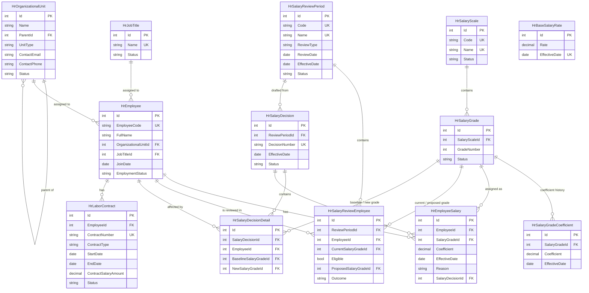

# Database Design - HRM System

> **Status:** Current · **Owner:** Sang2197 · **Last Reviewed:** 2026-09-22 · **Implementation Baseline Commit:** `77e5716`

Database design for the full HRM system as currently analyzed: **Employee Profile**, **Organization Management**, **Salary Master Data**, **Salary Grade Promotion**, and **Contract Management** — 13 tables, traced back to the Business Rules in each module's `UserStories_*.md` / `UseCase_*.md`. The backend maps all 13 tables one-to-one through EF Core (13 entity configurations across the `Initial` and `AddLaborContract` migrations in `backend/src/HRM.Infrastructure/Persistence/`); see `backend/README.md`.

## ER Diagram (Mermaid)

`HrBaseSalaryRate` has no relationships to other tables — it is a single organization-wide effective-dated value, not joined per employee or grade (see the Business Rules note in the `.dbml`).

`HrLaborContract` has no relationships to the salary tables (`HrEmployeeSalary`, `HrSalaryGrade`, `HrSalaryGradeCoefficient`, `HrSalaryDecision`) — its `ContractSalaryAmount` is independent information recorded from the labor contract, deliberately not synchronized with the salary structure (deferred question `DQ-CON-02` in `UserStories_ContractManagement.md`).

## Mapping Tables to the UI

| Table | UI Role |
|---|---|
| `HrOrganizationalUnit` | Organization Structure tree, and the Organizational Unit picker on Employee/Review screens. |
| `HrJobTitle` | Job Titles catalog, and the Job Title picker on Employee screens. |
| `HrEmployee` | Employee List/Detail, and the employee identity shown on review/history/decision screens. |
| `HrBaseSalaryRate` | Base Salary Rate screen and its effective-dated history. |
| `HrSalaryScale` | Salary Scales list and Salary Scale Detail header. |
| `HrSalaryGrade` | Salary Grades table within Salary Scale Detail. |
| `HrSalaryGradeCoefficient` | Coefficient history shown when updating a Salary Grade. |
| `HrEmployeeSalary` | Employee Salary History timeline, and the "current salary" facts on Employee Review Detail. |
| `HrSalaryReviewPeriod` | Review Period List / Review Period Detail. |
| `HrSalaryReviewEmployee` | Employee list and review results within a Review Period; Employee Review Detail. |
| `HrSalaryDecision` | Salary Decision List / Salary Decision Detail header. |
| `HrSalaryDecisionDetail` | Included-employees table within Salary Decision Detail. |
| `HrLaborContract` | Contract List / Contract Detail, including the Terminate Contract and Expiring Soon views. |

## Files

- [`HRM_System.dbml`](HRM_System.dbml) — DBML source code. Together with the Mermaid diagram above, this is the single source of truth for the schema — edit here first, then update the Mermaid diagram to match.
