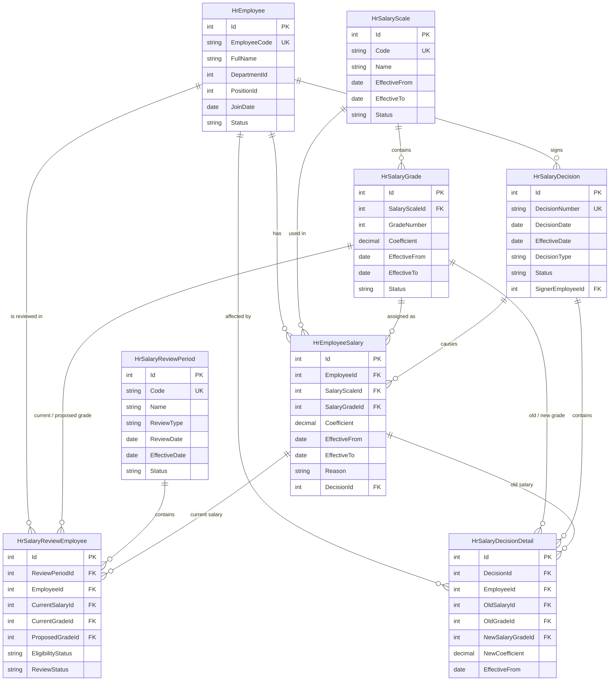

# Database Design - Salary Grade Promotion

Database design for the **Salary Grade Promotion** feature: 8 tables covering employees, salary scales/grades, salary history, review periods, and salary decisions.

## ER Diagram (Mermaid)

## Files

- [`HRM_Salary_Grade_Promotion.dbml`](HRM_Salary_Grade_Promotion.dbml) — DBML source code (from dbdiagram.io). This, together with the Mermaid diagram above, is the source of truth for the schema — edit here first, then re-export SQL/PNG if the schema changes.
- [`DB_Diagram.png`](DB_Diagram.png) — Entity-relationship diagram exported from dbdiagram.io (legacy reference; the Mermaid diagram above is the standardized version).
- [`Gen_Table.sql`](Gen_Table.sql) — SQL script (generated from dbdiagram.io) to create the 8 tables, keys, indexes, and foreign keys.
- [`HRM_Salary_Grade_Promotion_Database_Design_EN.docx`](HRM_Salary_Grade_Promotion_Database_Design_EN.docx) — Database design write-up (English): purpose, keys, indexes, and business notes per table.
- [`thiet_ke_CSDL_nang_bac_luong_8_bang.docx`](thiet_ke_CSDL_nang_bac_luong_8_bang.docx) — Same database design write-up (Vietnamese).
