# Class Diagram - HRM System

> **Status:** Current · **Owner:** Sang2197 · **Last Reviewed:** 2026-09-22 · **Implementation Baseline Commit:** `77e5716`

UML class diagrams for the full HRM system — **Employee Management**, **Organization Management**, **Salary Master Data**, **Salary Grade Promotion**, and **Contract Management** — derived from [Database Design](../Database/README.md) (entity fields), [`openapi.yaml`](../API/openapi.yaml) (operations, request/response shapes, enums), [C4 Component Diagram](../c4/README.md#3-component-diagram) (all 5 components), and [`CodeStructure/`](../CodeStructure/README.md) (class/interface names and their domain folders). The diagrams were derived from those documents, not from code; the backend in [`backend/`](../../backend/README.md) was then implemented from them for all 5 components, including Contract Management (Section 6) — see [`BackendStructure.md`](../CodeStructure/BackendStructure.md).

**Notation**

- Attributes: `name : type [multiplicity]`. A field that is nullable in [`HRM_System.dbml`](../Database/HRM_System.dbml) is given multiplicity `[0..1]`; a required field has none (implicitly `[1]`).
- Operations: `name(param : type, ...) : returnType [multiplicity]`. A lookup that may find nothing returns `[0..1]`; a method returning a collection returns `[0..*]`; a method with no return value (void) has none.
- `filter` parameters (`EmployeeFilter`, `ReviewPeriodFilter`, ...) are this document's own DTOs bundling the query parameters `openapi.yaml` lists individually for that search/list endpoint — a reasonable detail-design shape, not a literal schema name from the spec.
- Repository operations take and return **domain entities** (`Hr*`, matching `HRM.Domain/Entities/`); Controller/Service operations are written with **API DTO names** (matching `openapi.yaml` schema names, e.g. `Employee`, `CreateEmployeeRequest`) for readability. In the implementation, Controllers use the API DTOs, but Services take and return domain entities or small Application-owned input/result models (`HRM.Application/*/Models/`), so that `HRM.Application` does not depend on `HRM.Api`. Mapping between the two happens in `HRM.Api/Mappings/` (see [`BackendStructure.md`](../CodeStructure/BackendStructure.md)) and is not modeled as its own class here.
- Long business-rule/acceptance-criteria references are kept out of operation signatures and collected in a `note for <Class>` UML note on the implementing class instead, one line per constrained operation.
- Each Service and Repository is coded behind an interface (`<<interface>>`), shown explicitly with UML realization (`..|>`) — this is how [`BackendStructure.md`](../CodeStructure/BackendStructure.md)'s `Interfaces/` folders are implemented, and makes the Dependency Inversion between `HRM.Application` and `HRM.Infrastructure` visible.

## 1. Domain Model

All 13 entities from the [Database Design](../Database/README.md) (`HRM_System.dbml` is the source of truth for fields), all implemented in `backend/` — plus the 8 enums used by [`openapi.yaml`](../API/openapi.yaml), all implemented. Composition (`*--`) is used where the child row has no independent existence or business meaning outside its parent (a Salary Grade's coefficient history, a Review Period's employee snapshot, a Salary Decision's detail lines); plain association is used for ordinary foreign-key references.

```mermaid
classDiagram
    %% ---------- Employee Management ----------
    class HrEmployee {
        +Id : int
        +EmployeeCode : string
        +FullName : string
        +OrganizationalUnitId : int
        +JobTitleId : int
        +JoinDate : DateTime
        +EmploymentStatus : EmploymentStatus
        +CreatedAt : DateTime
        +UpdatedAt : DateTime
    }

    %% ---------- Organization Management ----------
    class HrOrganizationalUnit {
        +Id : int
        +Name : string
        +ParentId : int [0..1]
        +UnitType : string
        +ContactEmail : string [0..1]
        +ContactPhone : string [0..1]
        +Status : ActiveStatus
        +CreatedAt : DateTime
        +UpdatedAt : DateTime
    }
    class HrJobTitle {
        +Id : int
        +Name : string
        +Status : ActiveStatus
        +CreatedAt : DateTime
        +UpdatedAt : DateTime
    }

    %% ---------- Salary Master Data ----------
    class HrBaseSalaryRate {
        +Id : int
        +Rate : decimal
        +EffectiveDate : DateTime
        +CreatedAt : DateTime
    }
    class HrSalaryScale {
        +Id : int
        +Code : string
        +Name : string
        +Status : ActiveStatus
        +CreatedAt : DateTime
        +UpdatedAt : DateTime
    }
    class HrSalaryGrade {
        +Id : int
        +SalaryScaleId : int
        +GradeNumber : int
        +Status : ActiveStatus
        +CreatedAt : DateTime
        +UpdatedAt : DateTime
    }
    class HrSalaryGradeCoefficient {
        +Id : int
        +SalaryGradeId : int
        +Coefficient : decimal
        +EffectiveDate : DateTime
        +CreatedAt : DateTime
    }

    %% ---------- Salary Grade Promotion ----------
    class HrEmployeeSalary {
        +Id : int
        +EmployeeId : int
        +SalaryGradeId : int
        +Coefficient : decimal
        +EffectiveDate : DateTime
        +Reason : string
        +SalaryDecisionId : int [0..1]
        +CreatedAt : DateTime
    }
    class HrSalaryReviewPeriod {
        +Id : int
        +Code : string
        +Name : string
        +ReviewType : ReviewType
        +ReviewDate : DateTime
        +EffectiveDate : DateTime [0..1]
        +Description : string [0..1]
        +Status : ReviewPeriodStatus
        +CreatedAt : DateTime
        +UpdatedAt : DateTime
    }
    class HrSalaryReviewEmployee {
        +Id : int
        +ReviewPeriodId : int
        +EmployeeId : int
        +CurrentSalaryGradeId : int
        +CurrentCoefficient : decimal
        +Eligible : bool
        +ProposedSalaryGradeId : int [0..1]
        +ProposedCoefficient : decimal [0..1]
        +IneligibleReason : string [0..1]
        +Outcome : ReviewOutcome [0..1]
        +RejectionReason : string [0..1]
        +CreatedAt : DateTime
        +UpdatedAt : DateTime
    }
    class HrSalaryDecision {
        +Id : int
        +ReviewPeriodId : int
        +DecisionNumber : string
        +EffectiveDate : DateTime
        +Status : SalaryDecisionStatus
        +CreatedAt : DateTime
        +UpdatedAt : DateTime
    }
    class HrSalaryDecisionDetail {
        +Id : int
        +SalaryDecisionId : int
        +EmployeeId : int
        +BaselineSalaryGradeId : int
        +BaselineCoefficient : decimal
        +NewSalaryGradeId : int
        +NewCoefficient : decimal
        +CreatedAt : DateTime
        +UpdatedAt : DateTime
    }

    %% ---------- Contract Management ----------
    class HrLaborContract {
        +Id : int
        +EmployeeId : int
        +ContractNumber : string
        +ContractType : ContractType
        +StartDate : DateTime
        +EndDate : DateTime [0..1]
        +ContractSalaryAmount : decimal
        +SalaryNote : string [0..1]
        +Status : ContractStatus
        +TerminationDate : DateTime [0..1]
        +TerminationReason : string [0..1]
        +CreatedAt : DateTime
        +UpdatedAt : DateTime
    }

    %% ---------- Enumerations ----------
    class ActiveStatus {
        <<enumeration>>
        ACTIVE
        INACTIVE
    }
    class EmploymentStatus {
        <<enumeration>>
        ACTIVE
        ON_LEAVE
        TERMINATED
    }
    class ReviewType {
        <<enumeration>>
        ANNUAL
        MID_YEAR
        SPECIAL
    }
    class ReviewPeriodStatus {
        <<enumeration>>
        IN_PROGRESS
        SUBMITTED
        CLOSED
        CANCELLED
    }
    class ReviewOutcome {
        <<enumeration>>
        PENDING
        APPROVED
        REJECTED
    }
    class SalaryDecisionStatus {
        <<enumeration>>
        DRAFT
        APPLIED
        CANCELLED
    }
    class ContractType {
        <<enumeration>>
        PROBATION
        FIXED_TERM
        INDEFINITE_TERM
    }
    class ContractStatus {
        <<enumeration>>
        DRAFT
        ACTIVE
        EXPIRED
        TERMINATED
    }

    %% ---------- Relationships ----------
    HrOrganizationalUnit "0..1" o-- "0..*" HrOrganizationalUnit : parent of
    HrOrganizationalUnit "1" --> "0..*" HrEmployee : assigned to
    HrJobTitle "1" --> "0..*" HrEmployee : assigned to

    HrSalaryScale "1" *-- "0..*" HrSalaryGrade : contains
    HrSalaryGrade "1" *-- "0..*" HrSalaryGradeCoefficient : coefficient history

    HrEmployee "1" --> "0..*" HrEmployeeSalary : has
    HrSalaryGrade "1" --> "0..*" HrEmployeeSalary : assigned as
    HrSalaryDecision "0..1" --> "0..*" HrEmployeeSalary : causes

    HrSalaryReviewPeriod "1" *-- "0..*" HrSalaryReviewEmployee : contains (snapshot)
    HrEmployee "1" --> "0..*" HrSalaryReviewEmployee : is reviewed in
    HrSalaryGrade "1" --> "0..*" HrSalaryReviewEmployee : current grade
    HrSalaryGrade "0..1" --> "0..*" HrSalaryReviewEmployee : proposed grade

    HrSalaryReviewPeriod "1" --> "0..*" HrSalaryDecision : drafted from
    HrSalaryDecision "1" *-- "0..*" HrSalaryDecisionDetail : contains
    HrEmployee "1" --> "0..*" HrSalaryDecisionDetail : affected by
    HrSalaryGrade "1" --> "0..*" HrSalaryDecisionDetail : baseline grade
    HrSalaryGrade "1" --> "0..*" HrSalaryDecisionDetail : new grade

    HrEmployee "1" --> "0..*" HrLaborContract : has

    HrOrganizationalUnit ..> ActiveStatus
    HrJobTitle ..> ActiveStatus
    HrSalaryScale ..> ActiveStatus
    HrSalaryGrade ..> ActiveStatus
    HrEmployee ..> EmploymentStatus
    HrSalaryReviewPeriod ..> ReviewType
    HrSalaryReviewPeriod ..> ReviewPeriodStatus
    HrSalaryReviewEmployee ..> ReviewOutcome
    HrSalaryDecision ..> SalaryDecisionStatus
    HrLaborContract ..> ContractType
    HrLaborContract ..> ContractStatus
```



**Notes**

- `HrOrganizationalUnit.ParentId` is `[0..1]` both as an attribute and as the `parent of` relationship's multiplicity (a top-level unit has no parent) — modeled as aggregation (`o--`), not composition: `BR-ORG-08` requires that moving a unit carries its subtree with it, and a unit's lifecycle is independent of any specific parent (it can be re-parented — `UC-ORG-04`).
- `HrSalaryReviewEmployee`'s `proposed grade` relationship to `HrSalaryGrade` is `"0..1"`, matching `ProposedSalaryGradeId [0..1]`: a not-eligible employee has no proposed grade at all (`ineligibleReason` is populated instead). The `current grade` relationship stays `"1"` — every snapshot row has a current grade by definition.
- `HrSalaryDecision --> HrEmployeeSalary : causes` is `"0..1" --> "0..*"`, not `"1" --> "0..*"`: most `HrEmployeeSalary` rows have no causing decision (`SalaryDecisionId [0..1]`, e.g. `Reason = "Initial assignment"`) — only rows written by `ApplyDecision` do.
- `HrSalaryReviewPeriod --> HrSalaryDecision` is `"1" --> "0..*"`, not `"0..1"`: `US-SGP-10` AC04 allows a cancelled Draft to be replaced by a new Decision from the same period, so a period can accumulate several `HrSalaryDecision` rows over its lifetime — the "at most one **non-cancelled**" rule (`US-SGP-06`) is an application-layer invariant, not a structural multiplicity.
- `HrBaseSalaryRate` has no relationships — a single, organization-wide effective-dated value (see [Database Design](../Database/README.md)).
- `HrLaborContract` (Contract Management) has a single relationship, to `HrEmployee` — no relationship to any Salary Master Data / Salary Grade Promotion table, since `ContractSalaryAmount` is independent information, deliberately not synchronized with the salary structure (`DQ-CON-02` in `UserStories_ContractManagement.md`, see [Database Design](../Database/README.md)). `EndDate`, `SalaryNote`, `TerminationDate`, and `TerminationReason` are `[0..1]`: `EndDate` is absent for `INDEFINITE_TERM` (`BR-CON-04`); `TerminationDate`/`TerminationReason` are set only once `Status` becomes `TERMINATED` (`BR-CON-21`).

## 2. Employee Management

```mermaid
classDiagram
    class EmployeesController {
        +CreateEmployee(request : CreateEmployeeRequest) : Employee
        +SearchEmployees(filter : EmployeeFilter) : EmployeePage
        +GetEmployee(employeeId : int) : Employee
        +UpdateEmployee(employeeId : int, request : UpdateEmployeeRequest) : Employee
        +ChangeEmploymentStatus(employeeId : int, request : ChangeEmploymentStatusRequest) : Employee
    }

    class IEmployeeService {
        <<interface>>
        +CreateEmployee(request : CreateEmployeeRequest) : Employee
        +SearchEmployees(filter : EmployeeFilter) : EmployeePage
        +GetEmployee(employeeId : int) : Employee
        +UpdateEmployee(employeeId : int, request : UpdateEmployeeRequest) : Employee
        +ChangeEmploymentStatus(employeeId : int, newStatus : EmploymentStatus) : Employee
        +HasActiveEmployeesInUnit(unitId : int) : bool
        +GetActiveEmployees() : Employee [0..*]
    }
    class EmployeeService {
        +CreateEmployee(request : CreateEmployeeRequest) : Employee
        +SearchEmployees(filter : EmployeeFilter) : EmployeePage
        +GetEmployee(employeeId : int) : Employee
        +UpdateEmployee(employeeId : int, request : UpdateEmployeeRequest) : Employee
        +ChangeEmploymentStatus(employeeId : int, newStatus : EmploymentStatus) : Employee
        +HasActiveEmployeesInUnit(unitId : int) : bool
        +GetActiveEmployees() : Employee [0..*]
        note for EmployeeService "CreateEmployee — unique code (BR-EMP-01), unit and job title must be active (BR-EMP-04, BR-EMP-05)<br/>SearchEmployees — combinable filters by code, name, unit, title, status (BR-EMP-06, BR-EMP-07)<br/>UpdateEmployee — code stays unique (BR-EMP-08), re-validates unit or title if changed (BR-EMP-04, BR-EMP-05)<br/>ChangeEmploymentStatus — Terminated to another status is unresolved (OQ-EMP-01)<br/>HasActiveEmployeesInUnit — exposed for Organization Management's deactivate guard (BR-ORG-11)<br/>GetActiveEmployees — exposed for Salary Grade Promotion's review-period snapshot (US-SGP-01)"
    }
    EmployeeService ..|> IEmployeeService

    class IEmployeeRepository {
        <<interface>>
        +FindByCode(employeeCode : string) : HrEmployee [0..1]
        +FindById(employeeId : int) : HrEmployee [0..1]
        +Search(filter : EmployeeFilter) : HrEmployee [0..*]
        +Add(employee : HrEmployee)
        +Update(employee : HrEmployee)
        +CountActive(organizationalUnitId : int) : int
        +ListActive() : HrEmployee [0..*]
    }
    class EmployeeRepository {
        -context : HrmDbContext
    }
    EmployeeRepository ..|> IEmployeeRepository

    class IOrganizationalUnitService {
        <<interface>>
        note for IOrganizationalUnitService "Defined in Organization Management (Section 3) — shown here only as a dependency target."
    }
    class IJobTitleService {
        <<interface>>
        note for IJobTitleService "Defined in Organization Management (Section 3) — shown here only as a dependency target."
    }

    EmployeesController --> IEmployeeService
    EmployeeService --> IEmployeeRepository
    EmployeeService ..> IOrganizationalUnitService : IsUnitActive(unitId) — BR-EMP-04
    EmployeeService ..> IJobTitleService : IsJobTitleActive(jobTitleId) — BR-EMP-05
```



## 3. Organization Management

```mermaid
classDiagram
    class OrganizationalUnitsController {
        +CreateUnit(request : CreateOrganizationalUnitRequest) : OrganizationalUnit
        +GetStructure() : OrganizationalUnit [0..*]
        +UpdateUnit(unitId : int, request : UpdateOrganizationalUnitRequest) : OrganizationalUnit
        +MoveUnit(unitId : int, request : MoveOrganizationalUnitRequest) : OrganizationalUnit
        +DeactivateUnit(unitId : int) : OrganizationalUnit
        +ReactivateUnit(unitId : int) : OrganizationalUnit
    }
    class JobTitlesController {
        +CreateJobTitle(request : CreateJobTitleRequest) : JobTitle
        +ListJobTitles() : JobTitle [0..*]
        +UpdateJobTitle(jobTitleId : int, request : UpdateJobTitleRequest) : JobTitle
        +DeactivateJobTitle(jobTitleId : int) : JobTitle
        +ReactivateJobTitle(jobTitleId : int) : JobTitle
    }

    class IOrganizationalUnitService {
        <<interface>>
        +CreateUnit(request : CreateOrganizationalUnitRequest) : OrganizationalUnit
        +GetStructure() : OrganizationalUnit [0..*]
        +UpdateUnit(unitId : int, request : UpdateOrganizationalUnitRequest) : OrganizationalUnit
        +MoveUnit(unitId : int, targetParentId : int) : OrganizationalUnit
        +DeactivateUnit(unitId : int) : OrganizationalUnit
        +ReactivateUnit(unitId : int) : OrganizationalUnit
        +IsUnitActive(unitId : int) : bool
    }
    class OrganizationalUnitService {
        +CreateUnit(request : CreateOrganizationalUnitRequest) : OrganizationalUnit
        +GetStructure() : OrganizationalUnit [0..*]
        +UpdateUnit(unitId : int, request : UpdateOrganizationalUnitRequest) : OrganizationalUnit
        +MoveUnit(unitId : int, targetParentId : int) : OrganizationalUnit
        +DeactivateUnit(unitId : int) : OrganizationalUnit
        +ReactivateUnit(unitId : int) : OrganizationalUnit
        +IsUnitActive(unitId : int) : bool
        note for OrganizationalUnitService "CreateUnit — parent must be active (BR-ORG-04), name unique under parent (BR-ORG-03), email format (BR-ORG-22)<br/>GetStructure — all units, active and inactive (BR-ORG-15)<br/>UpdateUnit — name, type, contact only, parent not editable (BR-ORG-05, BR-ORG-06)<br/>MoveUnit — not self or descendant (BR-ORG-07), target active (BR-ORG-04), non-top-level only (BR-ORG-09), name unique under new parent (BR-ORG-03)<br/>DeactivateUnit — blocked by active children (BR-ORG-10) or active employees (BR-ORG-11)<br/>ReactivateUnit — blocked unless parent is active (BR-ORG-14)<br/>IsUnitActive — exposed for Employee Management (BR-EMP-04)"
    }
    OrganizationalUnitService ..|> IOrganizationalUnitService

    class IJobTitleService {
        <<interface>>
        +CreateJobTitle(request : CreateJobTitleRequest) : JobTitle
        +ListJobTitles() : JobTitle [0..*]
        +UpdateJobTitle(jobTitleId : int, request : UpdateJobTitleRequest) : JobTitle
        +DeactivateJobTitle(jobTitleId : int) : JobTitle
        +ReactivateJobTitle(jobTitleId : int) : JobTitle
        +IsJobTitleActive(jobTitleId : int) : bool
    }
    class JobTitleService {
        +CreateJobTitle(request : CreateJobTitleRequest) : JobTitle
        +ListJobTitles() : JobTitle [0..*]
        +UpdateJobTitle(jobTitleId : int, request : UpdateJobTitleRequest) : JobTitle
        +DeactivateJobTitle(jobTitleId : int) : JobTitle
        +ReactivateJobTitle(jobTitleId : int) : JobTitle
        +IsJobTitleActive(jobTitleId : int) : bool
        note for JobTitleService "CreateJobTitle — name unique catalog-wide (BR-ORG-17)<br/>UpdateJobTitle — name unique (BR-ORG-17, BR-ORG-18)<br/>DeactivateJobTitle — no guard, existing holders are unaffected (BR-ORG-19)<br/>ReactivateJobTitle — no guard (BR-ORG-20)<br/>IsJobTitleActive — exposed for Employee Management (BR-EMP-05)"
    }
    JobTitleService ..|> IJobTitleService

    class IOrganizationalUnitRepository {
        <<interface>>
        +FindById(unitId : int) : HrOrganizationalUnit [0..1]
        +FindByNameUnderParent(parentId : int [0..1], name : string) : HrOrganizationalUnit [0..1]
        +GetAll() : HrOrganizationalUnit [0..*]
        +GetDescendantIds(unitId : int) : int [0..*]
        +Add(unit : HrOrganizationalUnit)
        +Update(unit : HrOrganizationalUnit)
        +CountActiveChildren(unitId : int) : int
    }
    class OrganizationalUnitRepository {
        -context : HrmDbContext
    }
    OrganizationalUnitRepository ..|> IOrganizationalUnitRepository

    class IJobTitleRepository {
        <<interface>>
        +FindById(jobTitleId : int) : HrJobTitle [0..1]
        +FindByName(name : string) : HrJobTitle [0..1]
        +GetAll() : HrJobTitle [0..*]
        +Add(jobTitle : HrJobTitle)
        +Update(jobTitle : HrJobTitle)
    }
    class JobTitleRepository {
        -context : HrmDbContext
    }
    JobTitleRepository ..|> IJobTitleRepository

    class IEmployeeService {
        <<interface>>
        note for IEmployeeService "Defined in Employee Management (Section 2) — shown here only as a dependency target."
    }

    OrganizationalUnitsController --> IOrganizationalUnitService
    JobTitlesController --> IJobTitleService
    OrganizationalUnitService --> IOrganizationalUnitRepository
    JobTitleService --> IJobTitleRepository
    OrganizationalUnitService ..> IEmployeeService : HasActiveEmployeesInUnit(unitId) — BR-ORG-11
```



## 4. Salary Master Data

```mermaid
classDiagram
    class BaseSalaryRatesController {
        +AddRate(request : AddBaseSalaryRateRequest) : BaseSalaryRate
        +ListRates(asOfDate : DateTime [0..1]) : BaseSalaryRate [0..*]
    }
    class SalaryScalesController {
        +CreateScale(request : CreateSalaryScaleRequest) : SalaryScale
        +ListScales() : SalaryScale [0..*]
        +GetScaleDetail(scaleId : int) : SalaryScaleDetail
        +UpdateScale(scaleId : int, request : UpdateSalaryScaleRequest) : SalaryScale
        +DeactivateScale(scaleId : int) : SalaryScale
        +ReactivateScale(scaleId : int) : SalaryScale
        +CreateGrade(scaleId : int, request : CreateSalaryGradeRequest) : SalaryGrade
    }
    class SalaryGradesController {
        +AddCoefficient(gradeId : int, request : AddSalaryGradeCoefficientRequest) : SalaryGradeCoefficient
        +ListCoefficients(gradeId : int) : SalaryGradeCoefficient [0..*]
        +DeactivateGrade(gradeId : int) : SalaryGrade
        +ReactivateGrade(gradeId : int) : SalaryGrade
    }

    class IBaseSalaryRateService {
        <<interface>>
        +AddRate(request : AddBaseSalaryRateRequest) : BaseSalaryRate
        +ListRates(asOfDate : DateTime [0..1]) : BaseSalaryRate [0..*]
        +GetRateAsOf(date : DateTime) : BaseSalaryRate [0..1]
    }
    class BaseSalaryRateService {
        +AddRate(request : AddBaseSalaryRateRequest) : BaseSalaryRate
        +ListRates(asOfDate : DateTime [0..1]) : BaseSalaryRate [0..*]
        +GetRateAsOf(date : DateTime) : BaseSalaryRate [0..1]
        note for BaseSalaryRateService "AddRate — rate greater than zero (BR-SAL-04), effective date later than latest (BR-SAL-03)"
    }
    BaseSalaryRateService ..|> IBaseSalaryRateService

    class ISalaryScaleService {
        <<interface>>
        +CreateScale(request : CreateSalaryScaleRequest) : SalaryScale
        +ListScales() : SalaryScale [0..*]
        +GetScaleDetail(scaleId : int) : SalaryScaleDetail
        +UpdateScale(scaleId : int, request : UpdateSalaryScaleRequest) : SalaryScale
        +DeactivateScale(scaleId : int) : SalaryScale
        +ReactivateScale(scaleId : int) : SalaryScale
        +CreateGrade(scaleId : int, request : CreateSalaryGradeRequest) : SalaryGrade
        +IsScaleActive(scaleId : int) : bool
    }
    class SalaryScaleService {
        +CreateScale(request : CreateSalaryScaleRequest) : SalaryScale
        +ListScales() : SalaryScale [0..*]
        +GetScaleDetail(scaleId : int) : SalaryScaleDetail
        +UpdateScale(scaleId : int, request : UpdateSalaryScaleRequest) : SalaryScale
        +DeactivateScale(scaleId : int) : SalaryScale
        +ReactivateScale(scaleId : int) : SalaryScale
        +CreateGrade(scaleId : int, request : CreateSalaryGradeRequest) : SalaryGrade
        +IsScaleActive(scaleId : int) : bool
        note for SalaryScaleService "CreateScale — code and name unique (BR-SAL-05, BR-SAL-06), Active by default (BR-SAL-05A)<br/>GetScaleDetail — includes its grades<br/>UpdateScale — name only, code fixed at creation (BR-SAL-07, BR-SAL-08)<br/>DeactivateScale — blocked while any active grade remains (BR-SAL-20)<br/>CreateGrade — scale must be active (BR-SAL-11), grade number unique in scale (BR-SAL-09), coefficient greater than zero (BR-SAL-10, BR-SAL-12)<br/>IsScaleActive — exposed for SalaryGradeService.ReactivateGrade (BR-SAL-18)"
    }
    SalaryScaleService ..|> ISalaryScaleService

    class ISalaryGradeService {
        <<interface>>
        +AddCoefficient(gradeId : int, request : AddSalaryGradeCoefficientRequest) : SalaryGradeCoefficient
        +ListCoefficients(gradeId : int) : SalaryGradeCoefficient [0..*]
        +DeactivateGrade(gradeId : int) : SalaryGrade
        +ReactivateGrade(gradeId : int) : SalaryGrade
        +GetNextActiveGrade(scaleId : int, currentGradeNumber : int) : SalaryGrade [0..1]
        +GetCurrentCoefficient(gradeId : int) : decimal
    }
    class SalaryGradeService {
        +AddCoefficient(gradeId : int, request : AddSalaryGradeCoefficientRequest) : SalaryGradeCoefficient
        +ListCoefficients(gradeId : int) : SalaryGradeCoefficient [0..*]
        +DeactivateGrade(gradeId : int) : SalaryGrade
        +ReactivateGrade(gradeId : int) : SalaryGrade
        +GetNextActiveGrade(scaleId : int, currentGradeNumber : int) : SalaryGrade [0..1]
        +GetCurrentCoefficient(gradeId : int) : decimal
        note for SalaryGradeService "AddCoefficient — grade must be active (BR-SAL-13A), coefficient greater than zero (BR-SAL-10), effective date later than latest (BR-SAL-13)<br/>DeactivateGrade — blocked while an active employee is assigned (BR-SAL-15)<br/>ReactivateGrade — blocked unless the salary scale is active (BR-SAL-18)<br/>GetNextActiveGrade — first active grade above, ascending order, inactive skipped (BR-SAL-17), returns none if there is no higher active grade"
    }
    SalaryGradeService ..|> ISalaryGradeService

    class IBaseSalaryRateRepository {
        <<interface>>
        +GetLatest() : HrBaseSalaryRate [0..1]
        +GetAsOf(date : DateTime) : HrBaseSalaryRate [0..1]
        +List(asOfDate : DateTime [0..1]) : HrBaseSalaryRate [0..*]
        +Add(rate : HrBaseSalaryRate)
    }
    class BaseSalaryRateRepository {
        -context : HrmDbContext
    }
    BaseSalaryRateRepository ..|> IBaseSalaryRateRepository

    class ISalaryScaleRepository {
        <<interface>>
        +FindById(scaleId : int) : HrSalaryScale [0..1]
        +FindByCode(code : string) : HrSalaryScale [0..1]
        +FindByName(name : string) : HrSalaryScale [0..1]
        +GetAll() : HrSalaryScale [0..*]
        +Add(scale : HrSalaryScale)
        +Update(scale : HrSalaryScale)
    }
    class SalaryScaleRepository {
        -context : HrmDbContext
    }
    SalaryScaleRepository ..|> ISalaryScaleRepository

    class ISalaryGradeRepository {
        <<interface>>
        +FindById(gradeId : int) : HrSalaryGrade [0..1]
        +FindByScaleAndNumber(scaleId : int, gradeNumber : int) : HrSalaryGrade [0..1]
        +ListByScale(scaleId : int) : HrSalaryGrade [0..*]
        +CountActiveByScale(scaleId : int) : int
        +Add(grade : HrSalaryGrade)
        +Update(grade : HrSalaryGrade)
        +AddCoefficient(coefficient : HrSalaryGradeCoefficient)
        +GetLatestCoefficient(gradeId : int) : HrSalaryGradeCoefficient [0..1]
        +ListCoefficients(gradeId : int) : HrSalaryGradeCoefficient [0..*]
    }
    class SalaryGradeRepository {
        -context : HrmDbContext
    }
    SalaryGradeRepository ..|> ISalaryGradeRepository

    class ISalaryHistoryService {
        <<interface>>
        note for ISalaryHistoryService "Defined in Salary Grade Promotion (Section 5) — shown here only as a dependency target."
    }

    BaseSalaryRatesController --> IBaseSalaryRateService
    SalaryScalesController --> ISalaryScaleService
    SalaryGradesController --> ISalaryGradeService
    BaseSalaryRateService --> IBaseSalaryRateRepository
    SalaryScaleService --> ISalaryScaleRepository
    SalaryScaleService --> ISalaryGradeRepository : reads grades for the deactivate guard (BR-SAL-20) and grade-number uniqueness (BR-SAL-09)
    SalaryGradeService --> ISalaryGradeRepository
    SalaryGradeService --> ISalaryScaleService : IsScaleActive(scaleId) — BR-SAL-18
    SalaryGradeService ..> ISalaryHistoryService : HasActiveEmployeeOnGrade(gradeId) — BR-SAL-15
```



## 5. Salary Grade Promotion

```mermaid
classDiagram
    class ReviewPeriodsController {
        +CreateReviewPeriod(request : CreateReviewPeriodRequest) : ReviewPeriod
        +SearchReviewPeriods(filter : ReviewPeriodFilter) : ReviewPeriodPage
        +GetReviewPeriod(periodId : int) : ReviewPeriodDetail
        +SubmitReviewPeriod(periodId : int) : ReviewPeriod
        +CancelReviewPeriod(periodId : int) : ReviewPeriod
    }
    class ReviewPeriodEmployeesController {
        +ListReviewEmployees(periodId : int, filter : ReviewPeriodEmployeeFilter) : ReviewPeriodEmployeePage
        +GetReviewEmployee(periodId : int, employeeId : int) : ReviewPeriodEmployee
        +ApproveEmployee(periodId : int, employeeId : int) : ReviewPeriodEmployee
        +RejectEmployee(periodId : int, employeeId : int, request : RejectRequest) : ReviewPeriodEmployee
        +BulkApprove(periodId : int, request : BulkEmployeeActionRequest) : BulkActionResult
        +BulkReject(periodId : int, request : BulkRejectRequest) : BulkActionResult
    }
    class SalaryDecisionsController {
        +CreateDecision(request : CreateSalaryDecisionRequest) : SalaryDecision
        +SearchDecisions(filter : SalaryDecisionFilter) : SalaryDecisionPage
        +GetEligibleReviewPeriods() : ReviewPeriod [0..*]
        +GetDecision(decisionId : int) : SalaryDecisionDetail
        +SaveDraft(decisionId : int, request : UpdateSalaryDecisionRequest) : SalaryDecisionDetail
        +RemoveEmployee(decisionId : int, employeeId : int)
        +ApplyDecision(decisionId : int) : SalaryDecisionDetail
        +CancelDecision(decisionId : int) : SalaryDecisionDetail
    }
    class SalaryHistoryController {
        +GetSalaryHistory(employeeId : int, filter : SalaryHistoryFilter) : SalaryHistoryPage
    }

    class IReviewPeriodService {
        <<interface>>
        +CreateReviewPeriod(request : CreateReviewPeriodRequest) : ReviewPeriod
        +SearchReviewPeriods(filter : ReviewPeriodFilter) : ReviewPeriodPage
        +GetReviewPeriod(periodId : int) : ReviewPeriodDetail
        +SubmitReviewPeriod(periodId : int) : ReviewPeriod
        +CancelReviewPeriod(periodId : int) : ReviewPeriod
    }
    class ReviewPeriodService {
        +CreateReviewPeriod(request : CreateReviewPeriodRequest) : ReviewPeriod
        +SearchReviewPeriods(filter : ReviewPeriodFilter) : ReviewPeriodPage
        +GetReviewPeriod(periodId : int) : ReviewPeriodDetail
        +SubmitReviewPeriod(periodId : int) : ReviewPeriod
        +CancelReviewPeriod(periodId : int) : ReviewPeriod
        note for ReviewPeriodService "CreateReviewPeriod — unique code and name (US-SGP-01 AC02, AC03), snapshots eligibility and proposed grade for every active employee in the same operation<br/>SearchReviewPeriods — by date range, type, status (US-SGP-02)<br/>SubmitReviewPeriod — blocked while an eligible employee has no outcome (US-SGP-05)<br/>CancelReviewPeriod — blocked if CLOSED or CANCELLED, or SUBMITTED with a non-cancelled decision (US-SGP-11)"
    }
    ReviewPeriodService ..|> IReviewPeriodService

    class IReviewEmployeeService {
        <<interface>>
        +ListReviewEmployees(periodId : int, filter : ReviewPeriodEmployeeFilter) : ReviewPeriodEmployeePage
        +GetReviewEmployee(periodId : int, employeeId : int) : ReviewPeriodEmployee
        +ApproveEmployee(periodId : int, employeeId : int) : ReviewPeriodEmployee
        +RejectEmployee(periodId : int, employeeId : int, reason : string) : ReviewPeriodEmployee
        +BulkApprove(periodId : int, employeeIds : int [1..*]) : BulkActionResult
        +BulkReject(periodId : int, employeeIds : int [1..*], reason : string) : BulkActionResult
    }
    class ReviewEmployeeService {
        +ListReviewEmployees(periodId : int, filter : ReviewPeriodEmployeeFilter) : ReviewPeriodEmployeePage
        +GetReviewEmployee(periodId : int, employeeId : int) : ReviewPeriodEmployee
        +ApproveEmployee(periodId : int, employeeId : int) : ReviewPeriodEmployee
        +RejectEmployee(periodId : int, employeeId : int, reason : string) : ReviewPeriodEmployee
        +BulkApprove(periodId : int, employeeIds : int [1..*]) : BulkActionResult
        +BulkReject(periodId : int, employeeIds : int [1..*], reason : string) : BulkActionResult
        note for ReviewEmployeeService "ListReviewEmployees — filters by unit, eligibility, outcome (US-SGP-03 AC06)<br/>ApproveEmployee — period must be IN_PROGRESS, employee eligible and pending (US-SGP-04 AC01, AC10), clears any prior rejection reason (AC08)<br/>RejectEmployee — reason required (US-SGP-04 AC02, AC03)<br/>BulkApprove — each proposal validated individually, partial success (US-SGP-04 AC04, AC05)<br/>BulkReject — reason required for the whole batch, partial success retains it for successes (US-SGP-04 AC06, AC07, AC09)"
    }
    ReviewEmployeeService ..|> IReviewEmployeeService

    class ISalaryDecisionService {
        <<interface>>
        +CreateDecision(request : CreateSalaryDecisionRequest) : SalaryDecision
        +SearchDecisions(filter : SalaryDecisionFilter) : SalaryDecisionPage
        +GetEligibleReviewPeriods() : ReviewPeriod [0..*]
        +GetDecision(decisionId : int) : SalaryDecisionDetail
        +SaveDraft(decisionId : int, request : UpdateSalaryDecisionRequest) : SalaryDecisionDetail
        +RemoveEmployee(decisionId : int, employeeId : int)
        +ApplyDecision(decisionId : int) : SalaryDecisionDetail
        +CancelDecision(decisionId : int) : SalaryDecisionDetail
    }
    class SalaryDecisionService {
        +CreateDecision(request : CreateSalaryDecisionRequest) : SalaryDecision
        +SearchDecisions(filter : SalaryDecisionFilter) : SalaryDecisionPage
        +GetEligibleReviewPeriods() : ReviewPeriod [0..*]
        +GetDecision(decisionId : int) : SalaryDecisionDetail
        +SaveDraft(decisionId : int, request : UpdateSalaryDecisionRequest) : SalaryDecisionDetail
        +RemoveEmployee(decisionId : int, employeeId : int)
        +ApplyDecision(decisionId : int) : SalaryDecisionDetail
        +CancelDecision(decisionId : int) : SalaryDecisionDetail
        note for SalaryDecisionService "CreateDecision — period must be SUBMITTED with no non-cancelled decision (US-SGP-06 AC01, AC03), only Approved employees (AC02), effective date on or after the review date (AC06, AC07)<br/>GetEligibleReviewPeriods — SUBMITTED periods with no non-cancelled decision (US-SGP-09 AC04)<br/>SaveDraft — effective date only, Draft only<br/>RemoveEmployee — Draft only, employees cannot be added back (US-SGP-06 AC04, AC05)<br/>ApplyDecision — all-or-nothing, revalidates each BaselineSalaryGradeId against the employee's current grade (US-SGP-07 AC02, AC04)<br/>CancelDecision — Draft only (US-SGP-10)"
    }
    SalaryDecisionService ..|> ISalaryDecisionService

    class ISalaryHistoryService {
        <<interface>>
        +GetHistory(employeeId : int, filter : SalaryHistoryFilter) : SalaryHistoryPage
        +HasActiveEmployeeOnGrade(gradeId : int) : bool
    }
    class SalaryHistoryService {
        +GetHistory(employeeId : int, filter : SalaryHistoryFilter) : SalaryHistoryPage
        +HasActiveEmployeeOnGrade(gradeId : int) : bool
        note for SalaryHistoryService "GetHistory — newest first, links back to the causing decision (US-SGP-08)<br/>HasActiveEmployeeOnGrade — exposed for Salary Master Data's deactivate-grade guard (BR-SAL-15)"
    }
    SalaryHistoryService ..|> ISalaryHistoryService

    class SalaryPromotionEligibilityRule {
        +DetermineEligibility(employee : Employee, currentGrade : SalaryGrade, reviewDate : DateTime) : EligibilityResult
        note for SalaryPromotionEligibilityRule "24 months on current grade as of the review date (US-SGP-03 AC02), requires a higher active grade in the same scale (AC03), proposed grade is the first active grade above, ascending, inactive grades skipped (AC04)"
    }

    class IReviewPeriodRepository {
        <<interface>>
        +FindById(periodId : int) : HrSalaryReviewPeriod [0..1]
        +FindByCode(code : string) : HrSalaryReviewPeriod [0..1]
        +FindByName(name : string) : HrSalaryReviewPeriod [0..1]
        +Search(filter : ReviewPeriodFilter) : HrSalaryReviewPeriod [0..*]
        +Add(period : HrSalaryReviewPeriod)
        +Update(period : HrSalaryReviewPeriod)
    }
    class ReviewPeriodRepository {
        -context : HrmDbContext
    }
    ReviewPeriodRepository ..|> IReviewPeriodRepository

    class IReviewEmployeeRepository {
        <<interface>>
        +ListByPeriod(periodId : int, filter : ReviewPeriodEmployeeFilter) : HrSalaryReviewEmployee [0..*]
        +FindByPeriodAndEmployee(periodId : int, employeeId : int) : HrSalaryReviewEmployee [0..1]
        +AddRange(reviewEmployees : HrSalaryReviewEmployee [1..*])
        +Update(reviewEmployee : HrSalaryReviewEmployee)
        +CountUnprocessedEligible(periodId : int) : int
    }
    class ReviewEmployeeRepository {
        -context : HrmDbContext
    }
    ReviewEmployeeRepository ..|> IReviewEmployeeRepository

    class ISalaryDecisionRepository {
        <<interface>>
        +FindById(decisionId : int) : HrSalaryDecision [0..1]
        +FindNonCancelledByPeriod(periodId : int) : HrSalaryDecision [0..1]
        +Search(filter : SalaryDecisionFilter) : HrSalaryDecision [0..*]
        +Add(decision : HrSalaryDecision)
        +Update(decision : HrSalaryDecision)
        +AddDetail(detail : HrSalaryDecisionDetail)
        +RemoveDetail(decisionId : int, employeeId : int)
        +ListDetails(decisionId : int) : HrSalaryDecisionDetail [0..*]
        +NextDecisionNumber() : string
    }
    class SalaryDecisionRepository {
        -context : HrmDbContext
    }
    SalaryDecisionRepository ..|> ISalaryDecisionRepository

    class IEmployeeSalaryRepository {
        <<interface>>
        +GetCurrent(employeeId : int) : HrEmployeeSalary [0..1]
        +GetHistory(employeeId : int, filter : SalaryHistoryFilter) : HrEmployeeSalary [0..*]
        +Add(employeeSalary : HrEmployeeSalary)
        +HasActiveEmployeeOnGrade(gradeId : int) : bool
    }
    class EmployeeSalaryRepository {
        -context : HrmDbContext
    }
    EmployeeSalaryRepository ..|> IEmployeeSalaryRepository

    class IEmployeeService {
        <<interface>>
        note for IEmployeeService "Defined in Employee Management (Section 2) — shown here only as a dependency target."
    }
    class ISalaryGradeService {
        <<interface>>
        note for ISalaryGradeService "Defined in Salary Master Data (Section 4) — shown here only as a dependency target."
    }

    ReviewPeriodsController --> IReviewPeriodService
    ReviewPeriodEmployeesController --> IReviewEmployeeService
    SalaryDecisionsController --> ISalaryDecisionService
    SalaryHistoryController --> ISalaryHistoryService

    ReviewPeriodService --> IReviewPeriodRepository
    ReviewPeriodService --> IReviewEmployeeRepository : writes the snapshot rows created on CreateReviewPeriod, reads them for the submit guard
    ReviewPeriodService --> ISalaryDecisionRepository : checks no non-cancelled decision exists before cancelling (US-SGP-11)
    ReviewPeriodService --> SalaryPromotionEligibilityRule
    ReviewPeriodService ..> IEmployeeService : GetActiveEmployees() — US-SGP-01
    ReviewPeriodService ..> ISalaryGradeService : GetNextActiveGrade(), GetCurrentCoefficient() — US-SGP-03, BR-SAL-17

    ReviewEmployeeService --> IReviewEmployeeRepository
    ReviewEmployeeService --> IReviewPeriodRepository : reads period status guard (US-SGP-04 AC10)

    SalaryDecisionService --> ISalaryDecisionRepository
    SalaryDecisionService --> IReviewPeriodRepository : validates SUBMITTED status and review date (US-SGP-06 AC01, AC06)
    SalaryDecisionService --> IReviewEmployeeRepository : validates employees are Approved in the period (US-SGP-06 AC02)
    SalaryDecisionService --> IEmployeeSalaryRepository : reads the current grade, then appends new HrEmployeeSalary rows on ApplyDecision (US-SGP-07; history is append-only)

    SalaryHistoryService --> IEmployeeSalaryRepository
```

## 6. Contract Management

The C4 model's fifth component — see the [Component Diagram](../c4/README.md#3-component-diagram), [`HrLaborContract`](../Database/HRM_System.dbml) in the Database Design, and the `Contracts` tag in [`openapi.yaml`](../API/openapi.yaml). Implemented in `backend/` following the same Controller → Service → Repository pattern as Sections 2–5 ([ADR-04](../Arc42/09-architecture-decisions.md#adr-04-layered-design-inside-each-backend-component)).

```mermaid
classDiagram
    class ContractsController {
        +CreateContract(request : CreateContractRequest) : ContractDetail
        +SearchContracts(filter : ContractFilter) : ContractPage
        +GetContract(contractId : int) : ContractDetail
        +UpdateContract(contractId : int, request : UpdateContractRequest) : ContractDetail
        +DeleteContract(contractId : int)
        +ActivateContract(contractId : int) : ContractDetail
        +ExpireContract(contractId : int) : ContractDetail
        +TerminateContract(contractId : int, request : TerminateContractRequest) : ContractDetail
    }

    class IContractService {
        <<interface>>
        +CreateContract(request : CreateContractRequest) : ContractDetail
        +SearchContracts(filter : ContractFilter) : ContractPage
        +GetContract(contractId : int) : ContractDetail
        +UpdateContract(contractId : int, request : UpdateContractRequest) : ContractDetail
        +DeleteContract(contractId : int)
        +ActivateContract(contractId : int) : ContractDetail
        +ExpireContract(contractId : int) : ContractDetail
        +TerminateContract(contractId : int, request : TerminateContractRequest) : ContractDetail
    }
    class ContractService {
        +CreateContract(request : CreateContractRequest) : ContractDetail
        +SearchContracts(filter : ContractFilter) : ContractPage
        +GetContract(contractId : int) : ContractDetail
        +UpdateContract(contractId : int, request : UpdateContractRequest) : ContractDetail
        +DeleteContract(contractId : int)
        +ActivateContract(contractId : int) : ContractDetail
        +ExpireContract(contractId : int) : ContractDetail
        +TerminateContract(contractId : int, request : TerminateContractRequest) : ContractDetail
        note for ContractService "CreateContract — employeeId must reference an existing, non-Terminated employee (BR-CON-07); contractType, contractNumber, startDate, contractSalaryAmount required (BR-CON-02); contractNumber unique (BR-CON-01); endDate required for PROBATION/FIXED_TERM, forbidden for INDEFINITE_TERM (BR-CON-04); endDate later than startDate (BR-CON-05); contractSalaryAmount greater than zero (BR-CON-06); status is DRAFT or ACTIVE (BR-CON-08), ACTIVE additionally requires startDate on or before today and no other Active contract for the employee (BR-CON-09, BR-CON-10)<br/>SearchContracts — search by employee code/name or contractNumber, combinable with contractType/status/date-range filters (BR-CON-11, BR-CON-12, BR-CON-14); a time-period filter matches by term overlap, open-ended when endDate is null (BR-CON-13); expiringSoon lists Active contracts ending within the window plus overdue ones, ordered by endDate, combinable with the other filters (BR-CON-25–27, BR-CON-32)<br/>GetContract — employee fields (code, name, unit, job title) are read live via ContractRepository's own Employee navigation include, not frozen at contract creation (BR-CON-15)<br/>UpdateContract — DRAFT only (BR-CON-28); employeeId and status are not editable (BR-CON-29); the same validation rules as CreateContract apply to the changed fields (BR-CON-30)<br/>DeleteContract — DRAFT only (BR-CON-28); removes the row and frees its contractNumber for reuse, the only hard delete among all 5 components (BR-CON-31)<br/>ActivateContract — DRAFT only, startDate on or before today, no other Active contract for the employee, employee not Terminated (BR-CON-18)<br/>ExpireContract — ACTIVE only, endDate set and earlier than today (BR-CON-19)<br/>TerminateContract — ACTIVE only, terminationDate and terminationReason required, terminationDate within [startDate, endDate] (BR-CON-21, BR-CON-22)"
    }
    ContractService ..|> IContractService

    class IContractRepository {
        <<interface>>
        +FindById(contractId : int) : HrLaborContract [0..1]
        +FindByNumber(contractNumber : string) : HrLaborContract [0..1]
        +Search(filter : ContractFilter) : HrLaborContract [0..*]
        +Add(contract : HrLaborContract)
        +Update(contract : HrLaborContract)
        +Remove(contract : HrLaborContract)
        +HasOtherActiveForEmployee(employeeId : int, exceptContractId : int [0..1]) : bool
    }
    class ContractRepository {
        -context : HrmDbContext
        note for ContractRepository "FindById and Search both include the Employee navigation (ThenInclude OrganizationalUnit, ThenInclude JobTitle) — the same repository-level cross-domain read-hydration pattern EmployeeRepository already uses for OrganizationalUnit/JobTitle. This is a repository's own EF join, not a Service-to-Repository dependency, so it does not violate ADR-03."
    }
    ContractRepository ..|> IContractRepository

    class IEmployeeService {
        <<interface>>
        note for IEmployeeService "Defined in Employee Management (Section 2) — shown here only as a dependency target."
    }

    ContractsController --> IContractService
    ContractService --> IContractRepository
    ContractService ..> IEmployeeService : GetEmployee(employeeId) — existence and EmploymentStatus for the business-rule checks only (BR-CON-07, BR-CON-18); the live profile fields shown on ContractDetail (BR-CON-15) come from ContractRepository's own Employee include, not this call
```

`ContractRepository.HasOtherActiveForEmployee` backs `BR-CON-10` at both `CreateContract` (when `status` is `ACTIVE`) and `ActivateContract` — the same check, exposed once. Unlike the cross-domain guards in Sections 2–5, this dependency needs no new method on `IEmployeeService`: the already-implemented `GetEmployee(employeeId) : Employee` returns `employmentStatus` directly, so `ContractService` reads it from there instead of requiring a change to Employee Management's real, already-shipped interface.

## Traceability

- Every Controller matches an [`openapi.yaml`](../API/openapi.yaml) tag, and every operation on it matches one endpoint under that tag — see the [API README's coverage table](../API/README.md#coverage).
- The 5 sections (2–6) match the 5 `HRM.Application`/`Controllers`/`Repositories` folders and all 5 [C4 components](../c4/README.md#3-component-diagram) — all 5 sections are implemented in `backend/`, matching [`BackendStructure.md`](../CodeStructure/BackendStructure.md).
- Cross-domain dependencies are drawn as dependency arrows (`..>`) to an interface defined in another section, never as a direct dependency on another domain's Repository — consistent with [ADR-03](../Arc42/09-architecture-decisions.md#adr-03-split-the-backend-by-business-domain)'s consequence that "any cross-domain read ... requires a call to another component instead of a single local query." Within one domain, a Service may depend on another Repository/Service in the same section directly (e.g. `SalaryDecisionService --> IReviewPeriodRepository`). A Repository's own EF `Include()` of a cross-domain navigation property (e.g. `ContractRepository` including `Employee`) is not drawn as a cross-domain dependency arrow, since it is a repository's own join, not a Service-to-Repository call — see the `ContractRepository` note in Section 6.
- The [C4 diagrams](../c4/README.md#cross-component-data-dependencies) list 4 cross-component data dependencies (Employee Management ← Organization Management; Salary Grade Promotion ← Employee Management; Salary Grade Promotion ← Salary Master Data; Contract Management ← Employee Management) but explicitly deferred naming the actual classes/interfaces to the detailed design stage. This diagram names them (`EmployeeService ..> IOrganizationalUnitService`/`IJobTitleService`, `ReviewPeriodService ..> IEmployeeService`/`ISalaryGradeService`, `ContractService ..> IEmployeeService`) and additionally surfaces **2 dependencies the C4 diagrams did not list**, found while working through the Use Cases' guard conditions:
  - `OrganizationalUnitService ..> IEmployeeService` — `BR-ORG-11` blocks deactivating a unit with active employees assigned, which Organization Management cannot determine from its own data.
  - `SalaryGradeService ..> ISalaryHistoryService` — `BR-SAL-15` blocks deactivating a salary grade with an active employee currently assigned to it, which Salary Master Data cannot determine from its own data (the current assignment lives in Salary Grade Promotion's `HrEmployeeSalary`).
- `SalaryPromotionEligibilityRule` matches the `Rules/` folder in `HRM.Application/SalaryGradePromotion/` from [`BackendStructure.md`](../CodeStructure/BackendStructure.md).
- `ContractService`'s use of the existing `IEmployeeService.GetEmployee` (Section 6) — rather than a new purpose-built method, unlike the 2 dependencies above — is a design choice, not a requirement: Employee Management's real, already-implemented interface did not need to change to build Contract Management.
