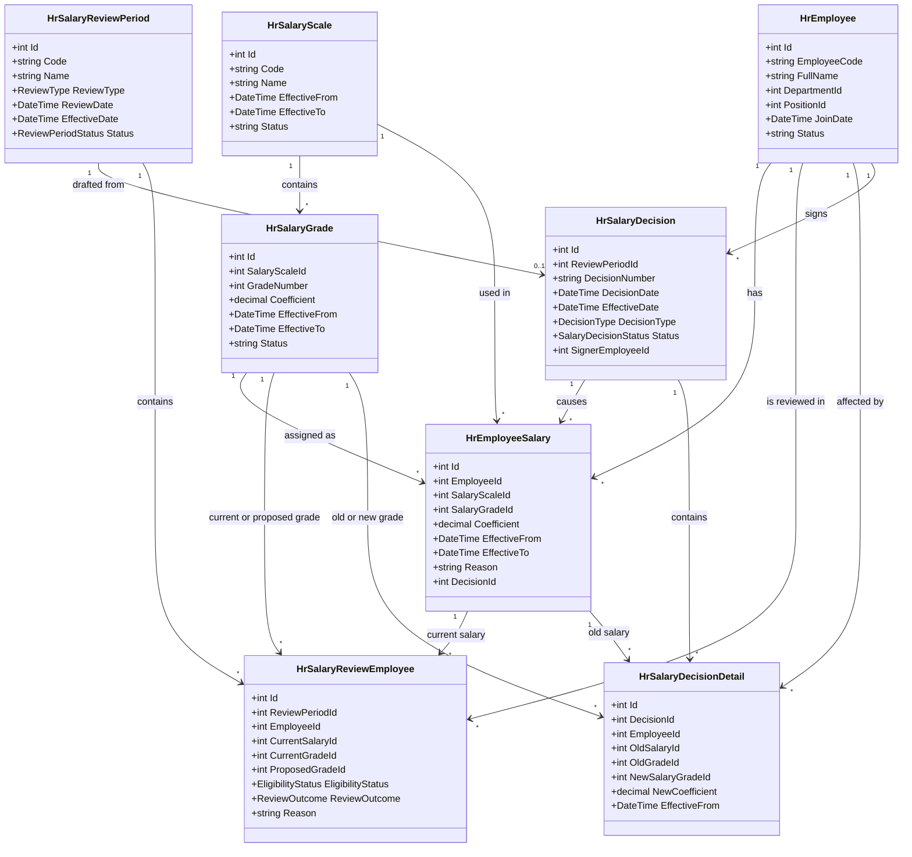
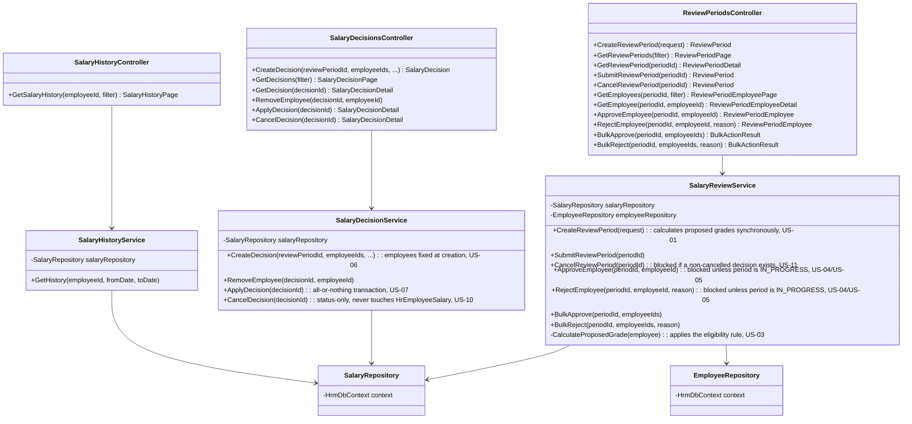

# Class Diagram - Salary Grade Promotion

Derived from [Database Design](../Database/README.md) (fields), [Code Structure](../CodeStructure/README.md) (class/interface names), and [C4 Component/Code diagrams](../c4/README.md).

## 1. Domain Model

The 8 entities from the [Database Design](../Database/README.md), shown as domain classes with their relationships (same relationships as the [Mermaid ER diagram](../Database/README.md#er-diagram-mermaid), plus the enums used by the [OpenAPI spec](../API/openapi.yaml)).

## 2. API / Service / Repository Layer (Salary Management)

Matches [`BackendStructure.md`](../CodeStructure/BackendStructure.md) — Controller → Service → Repository per [ADR-04](../Arc42/09-architecture-decisions.md#adr-04-layered-design-inside-salary-management). Controller methods map directly to [`openapi.yaml`](../API/openapi.yaml) operations.

> Each Service/Repository is coded behind an interface (`ISalaryReviewService`, `ISalaryRepository`, etc. — see [`BackendStructure.md`](../CodeStructure/BackendStructure.md)) for dependency injection. Those interfaces are real in the code but omitted here as separate boxes — they add no fields/methods of their own and only made this diagram wider without adding information.

