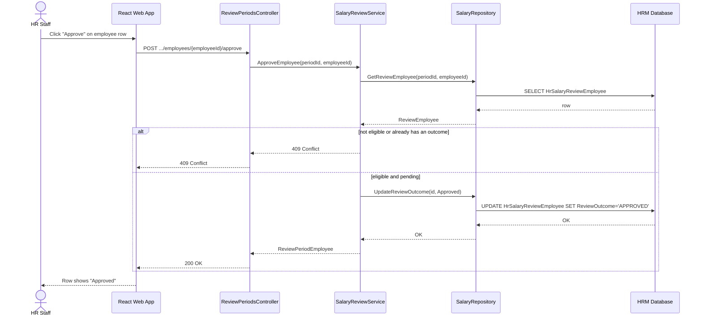
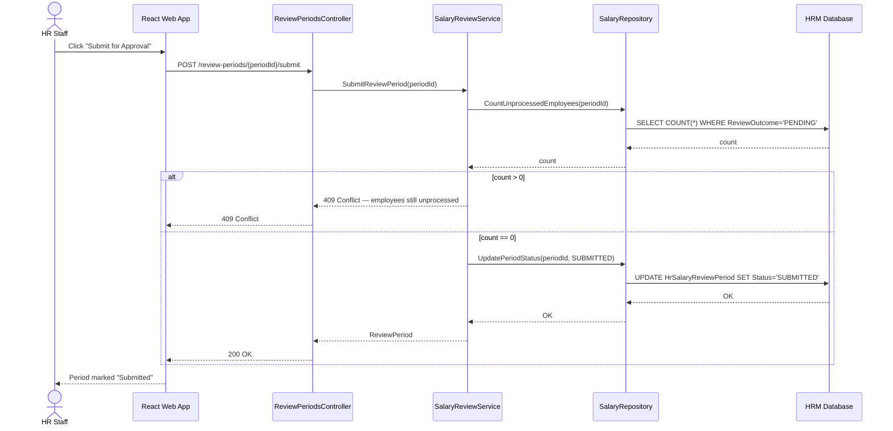
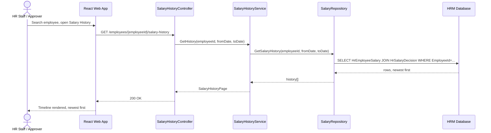

# Sequence Diagrams - Salary Grade Promotion

Four key flows, matching the [Runtime View](../Arc42/06-runtime-view.md) scenarios and the [User Stories](../Requirements/UserStories_SalaryGradePromotion.md) / [OpenAPI spec](../API/openapi.yaml) they implement. Class names match [ClassDiagram.md](ClassDiagram.md).

## 1. Approve an employee's proposed grade (US-04)

`POST /review-periods/{periodId}/employees/{employeeId}/approve`



## 2. Submit a review period (US-05)

`POST /review-periods/{periodId}/submit`



## 3. Apply a salary decision — all-or-nothing (US-07)

`POST /salary-decisions/{decisionId}/apply` — the transaction rule from [Runtime View 6.2](../Arc42/06-runtime-view.md#62-errorrecovery--applying-a-decision-fails-partway).

```mermaid
sequenceDiagram
    actor APR as Approver
    participant FE as React Web App
    participant API as SalaryDecisionsController
    participant SVC as SalaryDecisionService
    participant REPO as SalaryRepository
    participant DB as HRM Database

    APR->>FE: Click "Apply Decision" and confirm
    FE->>API: POST /salary-decisions/{decisionId}/apply
    API->>SVC: ApplyDecision(decisionId)
    SVC->>REPO: BeginTransaction()
    SVC->>REPO: GetDecisionDetails(decisionId)
    REPO->>DB: SELECT HrSalaryDecisionDetail WHERE DecisionId=...
    DB-->>REPO: rows
    REPO-->>SVC: details[]
    loop for each employee in details
        SVC->>REPO: CheckEffectiveDateConflict(employeeId, effectiveFrom)
        REPO->>DB: SELECT HrEmployeeSalary WHERE date range overlaps
        DB-->>REPO: conflict? yes/no
        REPO-->>SVC: result
    end
    alt any conflict found
        SVC->>REPO: RollbackTransaction()
        SVC-->>API: 409 Conflict (employee X, reason)
        API-->>FE: 409 Conflict
        FE-->>APR: Error shown — no employee updated
    else no conflicts
        loop for each employee in details
            SVC->>REPO: CloseCurrentSalary(employeeId, effectiveFrom)
            REPO->>DB: UPDATE HrEmployeeSalary SET EffectiveTo=...
            SVC->>REPO: CreateNewSalary(employeeId, newGrade, decisionId)
            REPO->>DB: INSERT HrEmployeeSalary
        end
        SVC->>REPO: UpdateDecisionStatus(decisionId, APPLIED)
        REPO->>DB: UPDATE HrSalaryDecision SET Status='APPLIED'
        SVC->>REPO: CommitTransaction()
        REPO-->>SVC: OK
        SVC-->>API: SalaryDecisionDetail
        API-->>FE: 200 OK
        FE-->>APR: Decision applied; salaries updated
    end
```

## 4. Look up an employee's salary history (US-08)

`GET /employees/{employeeId}/salary-history`


