# Sequence Diagrams - HRM System

> **Status:** Current · **Owner:** Sang2197 · **Last Reviewed:** 2026-09-18 · **Implementation Baseline Commit:** `77e5716`

UML sequence diagrams for the full HRM system's key business-rule flows — the ones with validation, guard conditions, branching, or a transaction, one per module. Simple unguarded CRUD (plain create/update/list/view with only "required field" validation — e.g. creating a Job Title or a Salary Scale, updating a Salary Scale's name, reactivating a Salary Scale, or opening/resuming a Salary Decision by id) is intentionally not diagrammed; its request/response shape is already fully specified in [`openapi.yaml`](../API/openapi.yaml) and its class/method is in [ClassDiagram.md](ClassDiagram.md).

Class, interface, and repository names match [ClassDiagram.md](ClassDiagram.md). Endpoints match [`openapi.yaml`](../API/openapi.yaml). A cross-domain call (per [ADR-03](../Arc42/09-architecture-decisions.md#adr-03-split-the-backend-by-business-domain)) always targets another domain's Service interface, never its Repository — see the Traceability note in [ClassDiagram.md](ClassDiagram.md#traceability).

**Notation**

- Guard conditions on `alt`/`else`/`opt`/`break`/`loop` fragments are written in UML's `[condition]` form.
- `break [condition] ... end` marks a validation failure that ends the interaction right there, used instead of nesting further `alt`/`else`. The messages that follow a chain of `break` blocks are the success path, reached only when none of them fired. `alt`/`else` is kept for a genuine branch between two valid, non-error outcomes that both continue (e.g. "Deactivate requested" vs. "Reactivate requested" were previously modeled that way — see the "split" note below).
- Activation bars (`+`/`-` on the triggering/replying arrow) mark Controller, Service, and Repository (and cross-domain Service) participants for as long as they are doing work for their caller. A `break` block's error reply does not close the Controller/Service's outer activation early — the bar closes once, at the diagram's actual final reply — matching how Mermaid renders activation continuously across `alt`/`break` fragments.
- A transaction (`BeginTransaction`/`CommitTransaction`/`RollbackTransaction`) is owned by the shared `HrmDbContext` (participant `UOW`, used only in the 2 flows below that write across more than one repository), never by a single Repository. Every repository in [ClassDiagram.md](ClassDiagram.md) already shares one injected `HrmDbContext` instance per request, so the context — not an arbitrarily chosen repository — is what's actually able to coordinate a transaction spanning more than one of them. In the implementation, Services reach it through the Application-owned `IUnitOfWork` abstraction (implemented in `HRM.Infrastructure` by a class wrapping `HrmDbContext`), so `HRM.Application` never references the DbContext directly.
- Diagrams that used to bundle independent scenarios behind a top-level `alt` (Deactivate vs. Reactivate; Approve vs. Reject; list/resume/create) are now split one scenario per diagram, each numbered separately.

---

## 1. Employee Management

### 1.1 Create Employee Profile (US-EMP-01)

`POST /employees`

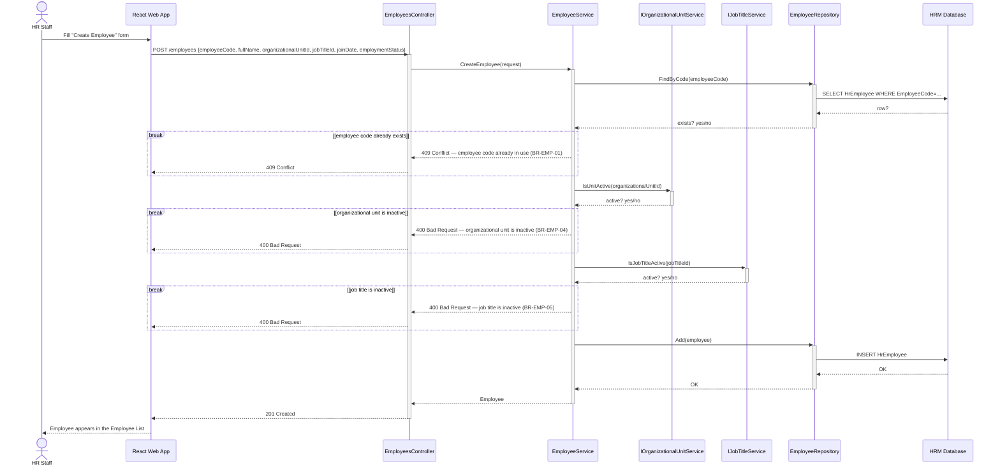

### 1.2 Change Employment Status (US-EMP-05)

`POST /employees/{employeeId}/employment-status`

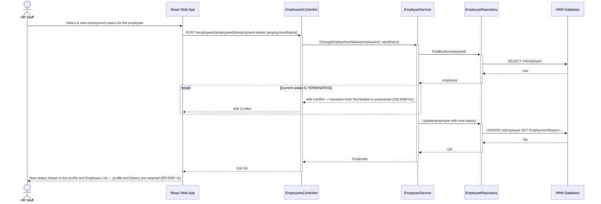

---

## 2. Organization Management

### 2.1 Create Organizational Unit (US-ORG-01)

`POST /organizational-units`

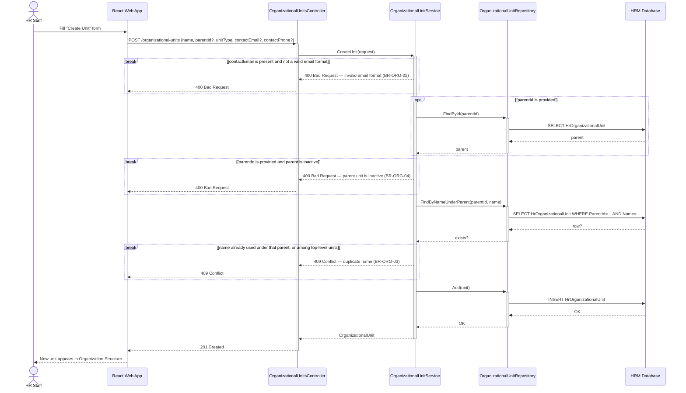

### 2.2 Move Organizational Unit (US-ORG-04)

`POST /organizational-units/{unitId}/move`

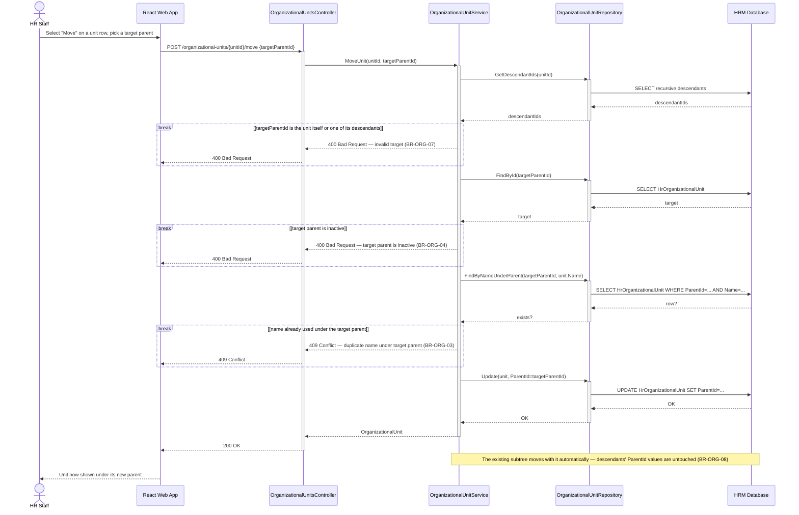

Moving a unit to the top level is rejected as a request-validation error (`targetParentId` is required on this endpoint) — `BR-ORG-09` — not diagrammed as a separate business-rule branch.

### 2.3 Deactivate Organizational Unit (US-ORG-05)

`POST /organizational-units/{unitId}/deactivate`

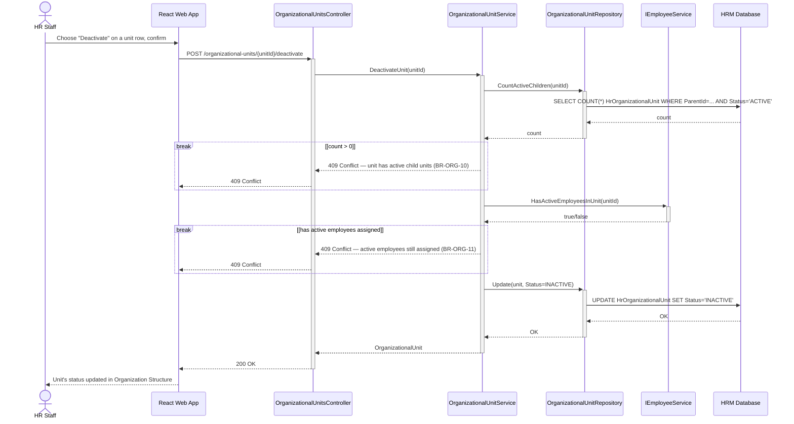

`EMPSVC: IEmployeeService` is the cross-domain dependency named in [ClassDiagram.md §3](ClassDiagram.md#3-organization-management).

### 2.4 Reactivate Organizational Unit (US-ORG-05)

`POST /organizational-units/{unitId}/reactivate`

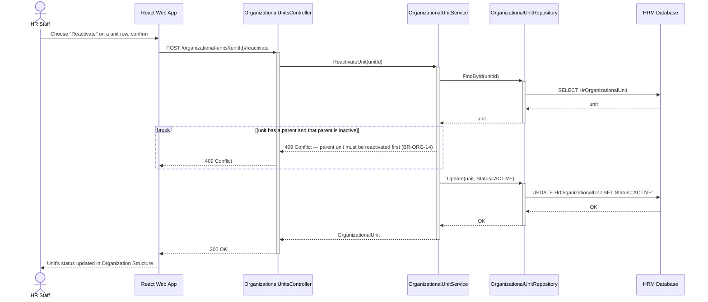

---

## 3. Salary Master Data

### 3.1 Maintain Base Salary Rate (US-SAL-01)

`POST /base-salary-rates`

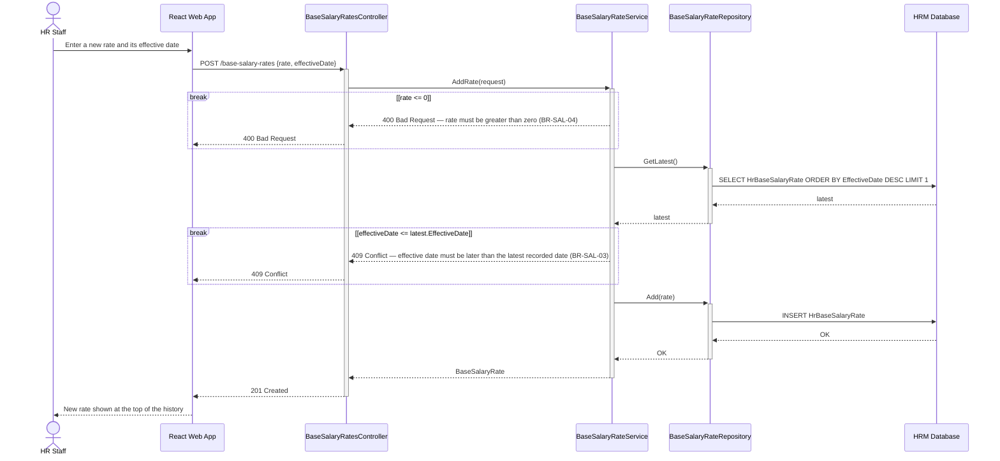

### 3.2 Create Salary Grade (US-SAL-04)

`POST /salary-scales/{scaleId}/grades`

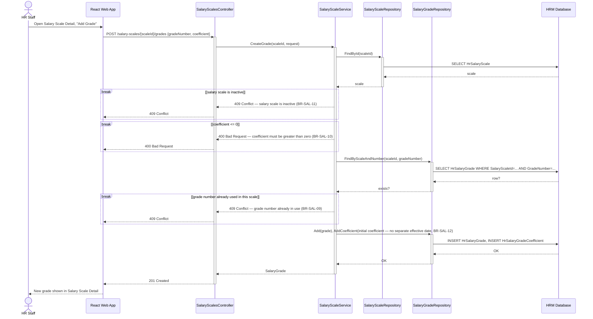

### 3.3 Deactivate Salary Grade (US-SAL-06)

`POST /salary-grades/{gradeId}/deactivate`

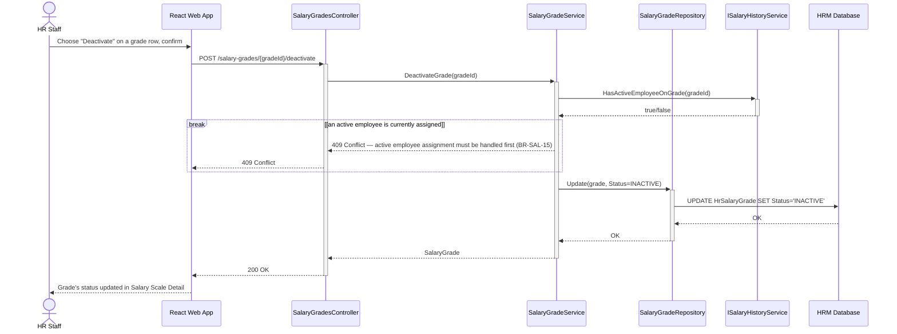

`HISTSVC: ISalaryHistoryService` is the cross-domain dependency (to Salary Grade Promotion) named in [ClassDiagram.md §4](ClassDiagram.md#4-salary-master-data).

### 3.4 Reactivate Salary Grade (US-SAL-06)

`POST /salary-grades/{gradeId}/reactivate`

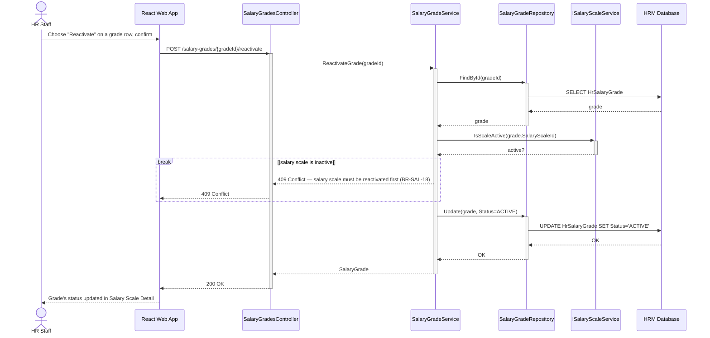

`SCALESVC` is a same-domain call to the sibling `SalaryScaleService`, not a cross-domain dependency.

### 3.5 Deactivate Salary Scale (US-SAL-07)

`POST /salary-scales/{scaleId}/deactivate`

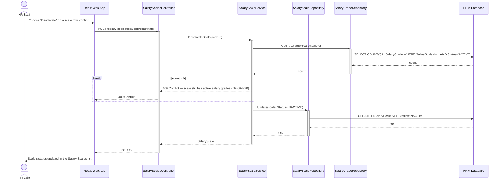

Reactivating a Salary Scale (`POST /salary-scales/{scaleId}/reactivate`) has no guard at all (`BR-SAL-22`) — a plain status flip, not diagrammed.

---

## 4. Salary Grade Promotion

### 4.1 Create a Review Period — eligibility & proposed-grade calculation (US-SGP-01 / US-SGP-03)

`POST /review-periods` — the most business-rule-heavy flow in the system: it drives [Runtime View 6.1](../Arc42/06-runtime-view.md#61-happy-path--process-a-review-period-end-to-end) step 1.

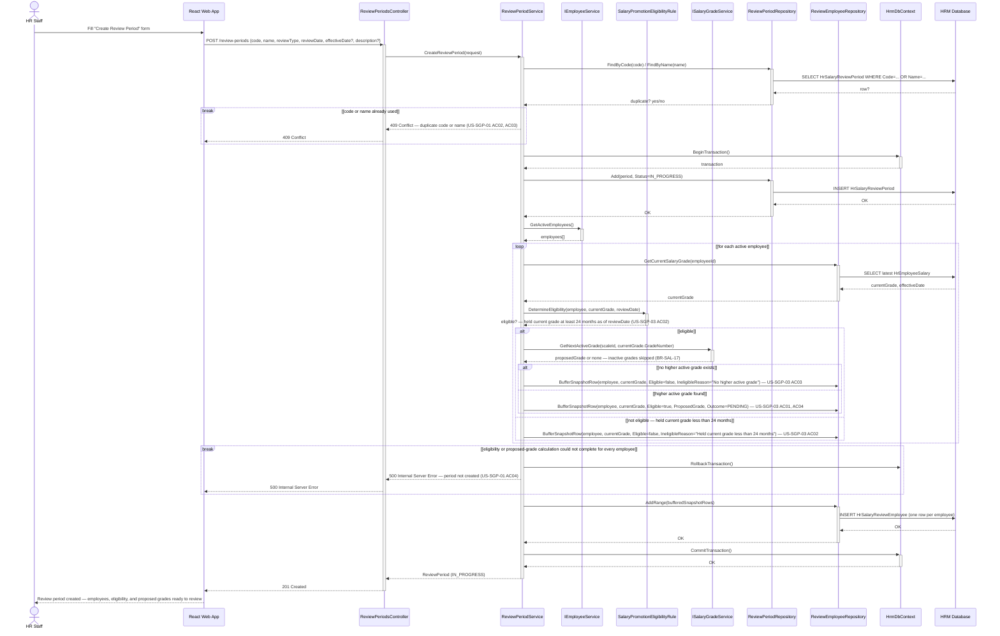

`EMPSVC` (Employee Management) and `GRADESVC` (Salary Master Data) are the 2 cross-domain dependencies already named in the [C4 diagrams' Cross-component Data Dependencies](../c4/README.md#cross-component-data-dependencies) and in [ClassDiagram.md §5](ClassDiagram.md#5-salary-grade-promotion). `UOW: HrmDbContext` owns the transaction because it spans writes through both `PREPO` and `EREPO`.

### 4.2 Approve an employee's proposed grade (US-SGP-04)

`POST /review-periods/{periodId}/employees/{employeeId}/approve`

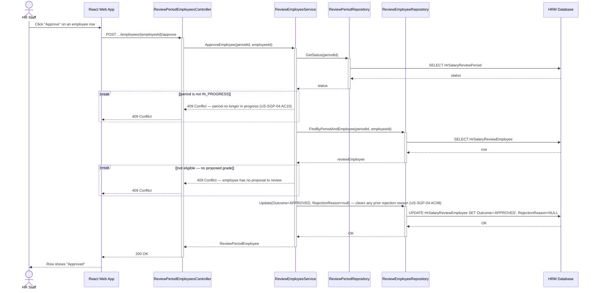

Bulk Approve applies this same guard chain to each selected employee individually, with partial success (`US-SGP-04` AC04, AC05 — see `BulkActionResult` in [ClassDiagram.md](ClassDiagram.md#5-salary-grade-promotion)).

### 4.3 Reject an employee's proposed grade (US-SGP-04)

`POST /review-periods/{periodId}/employees/{employeeId}/reject`

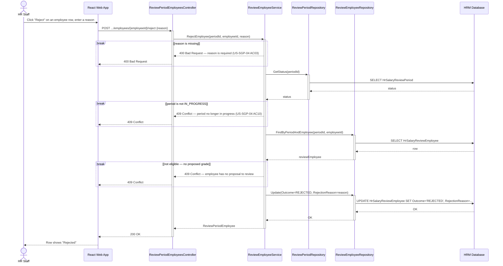

Bulk Reject applies this same guard chain to each selected employee individually, with one shared reason recorded for every employee that succeeds — partial success (`US-SGP-04` AC06, AC07, AC09).

### 4.4 Submit a Review Period (US-SGP-05)

`POST /review-periods/{periodId}/submit`

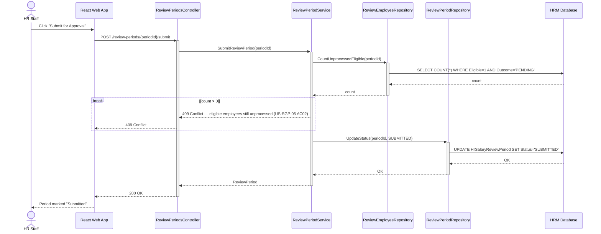

### 4.5 Create a Salary Decision from a Review Period (US-SGP-06 / US-SGP-09)

`GET /salary-decisions/eligible-review-periods`, then `POST /salary-decisions`

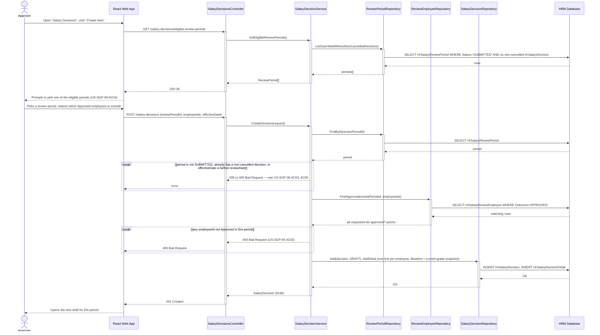

Listing existing decisions (`GET /salary-decisions`) and opening one by id, whether to resume a Draft or view an Applied/Cancelled decision read-only (`GET /salary-decisions/{decisionId}`), is a plain read with no backend branching — `GetDecision` returns the same shape regardless of status, only the frontend's editability differs (`US-SGP-09` AC02, AC03) — so it is not diagrammed separately.

### 4.6 Apply a Salary Decision — all-or-nothing (US-SGP-07)

`POST /salary-decisions/{decisionId}/apply` — the transaction rule from [Runtime View 6.2](../Arc42/06-runtime-view.md#62-errorrecovery--applying-a-decision-fails-partway).

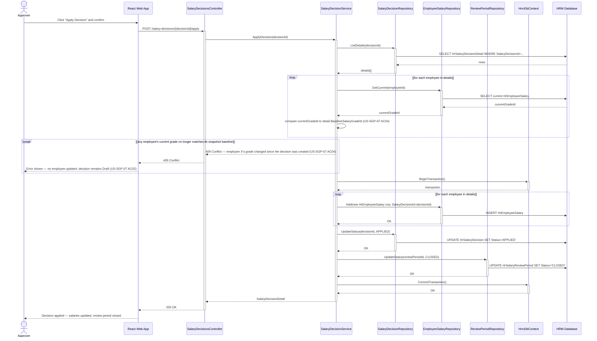

The comparison loop is a read-only validation pass and runs before any transaction starts. `UOW: HrmDbContext` then owns the transaction because the write phase spans `SALREPO`, `DREPO`, and `PREPO` together — no single one of those repositories could safely commit or roll back on behalf of the other two.

### 4.7 Look up an employee's salary history (US-SGP-08)

`GET /employees/{employeeId}/salary-history`

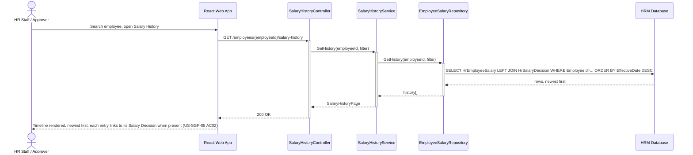

### 4.8 Cancel a Review Period (US-SGP-11)

`POST /review-periods/{periodId}/cancel`

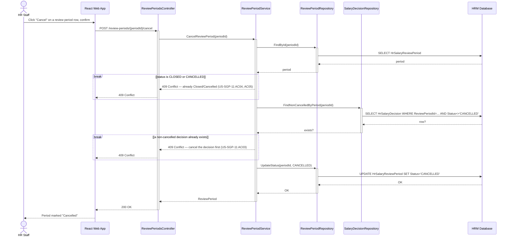

### 4.9 Cancel a Salary Decision (US-SGP-10)

`POST /salary-decisions/{decisionId}/cancel`

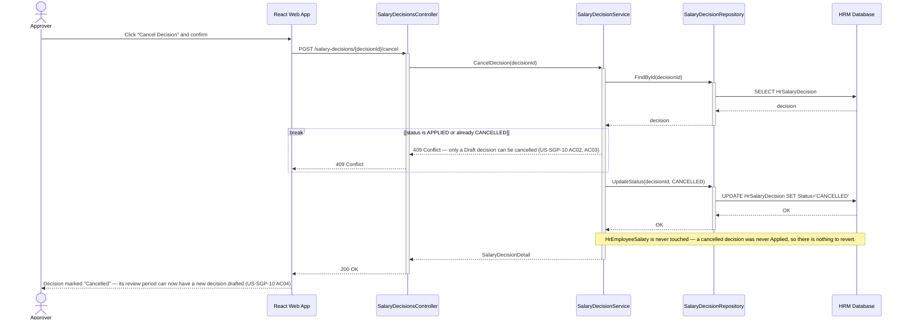
