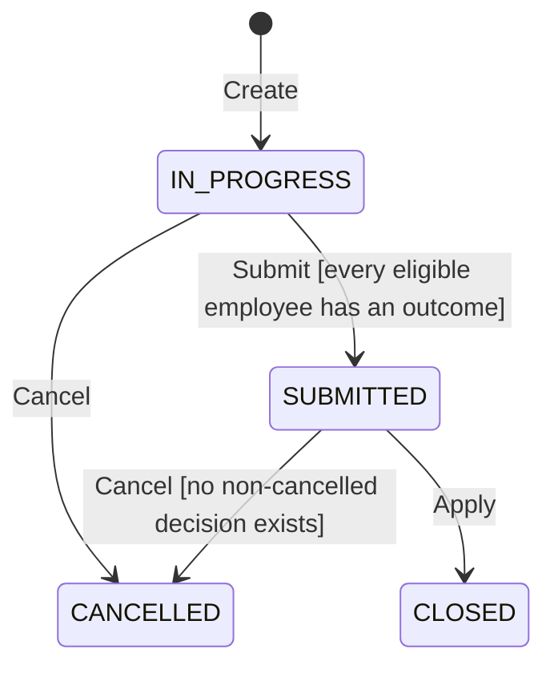
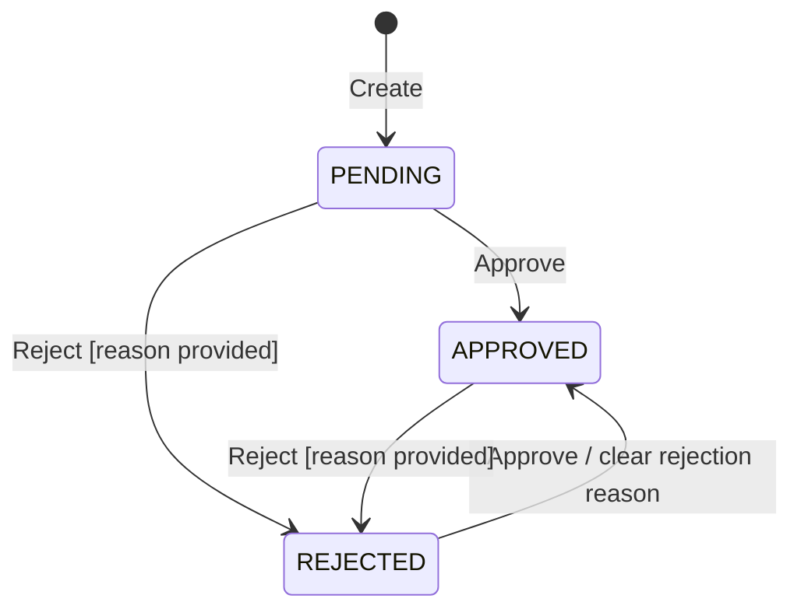
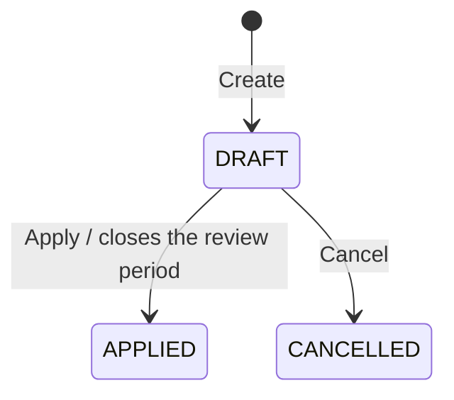
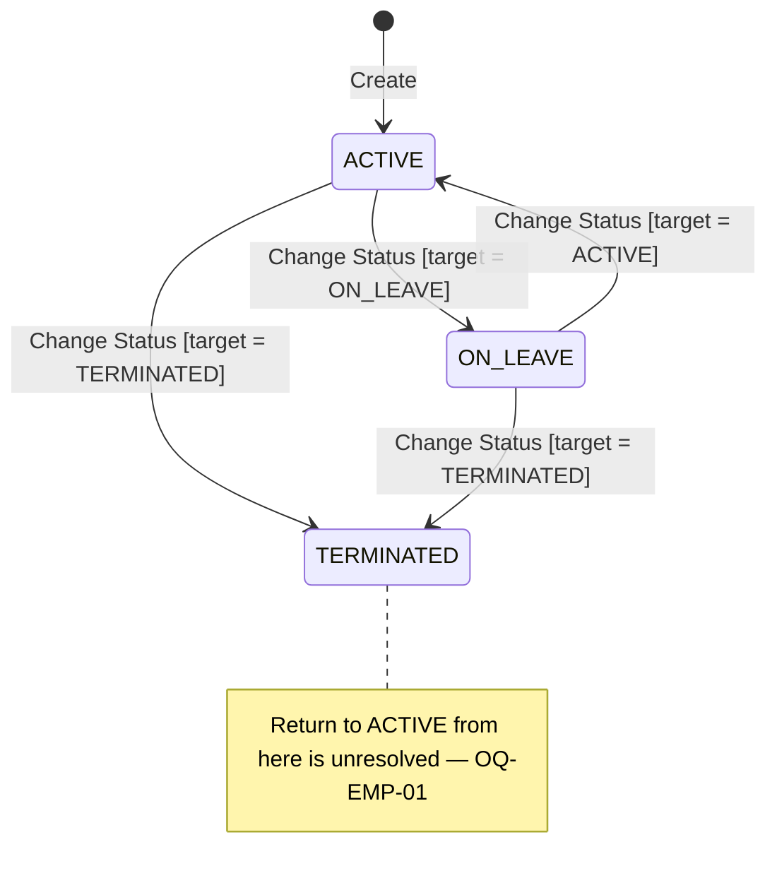
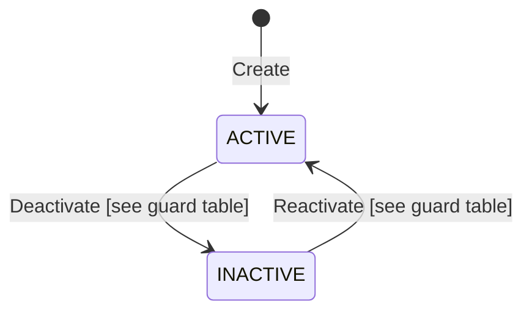
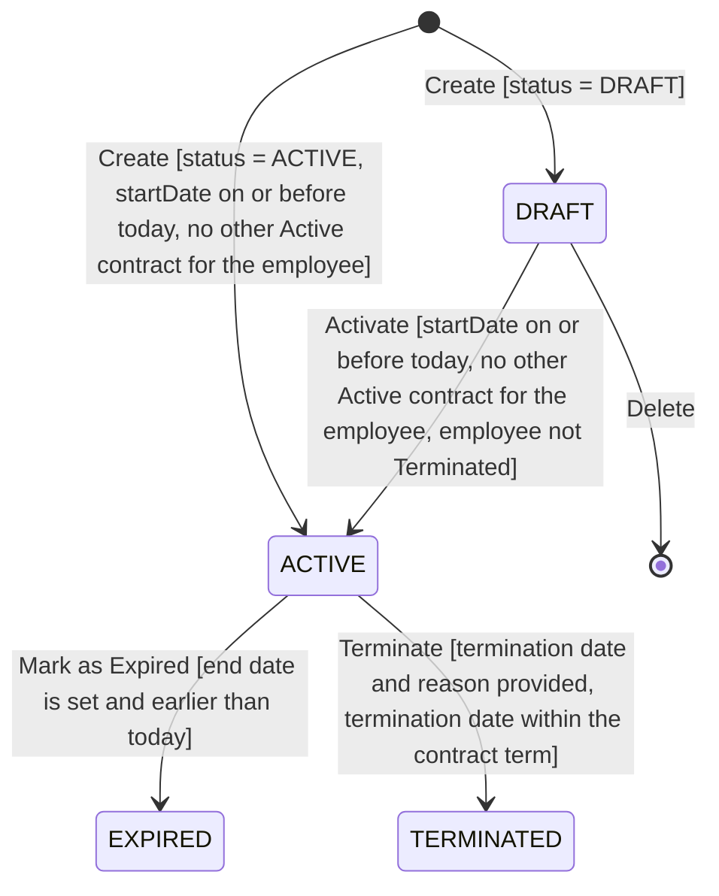

# State Diagrams - HRM System

> **Status:** Current · **Owner:** Sang2197 · **Last Reviewed:** 2026-09-22 · **Implementation Baseline Commit:** `77e5716`

UML state machine diagrams for every status-bearing entity across the full HRM system, derived from the `Status`/enum fields in [Database Design](../Database/README.md) and [`openapi.yaml`](../API/openapi.yaml), and the guard conditions in each module's Use Cases. Sections 1–6 cover all 5 implemented modules, see [ClassDiagram.md §6](ClassDiagram.md#6-contract-management) for Section 6 (Contract Status).

**Notation** — transitions are written in UML's `event [guard] / effect` form: a short event name, an optional `[guard]` stating the condition that must hold for the transition to fire (phrased positively, as what *allows* it, not what blocks it), and an optional `/ effect` for a side effect worth calling out. User Story/Acceptance-Criteria/Business-Rule references and any longer explanation are kept out of the diagram and given as prose underneath instead.

## 1. Review Period Status (`HrSalaryReviewPeriod.Status`)

- **Create** enters `IN_PROGRESS` directly — proposed grades are calculated in the same request, so there is no separate Draft status (`US-SGP-01`).
- **Submit**'s guard is that every eligible employee with a proposed grade already has an Approved/Rejected outcome (`US-SGP-05`).
- **Cancel** from `SUBMITTED` is guarded by the absence of a non-cancelled Salary Decision (`US-SGP-11`); from `IN_PROGRESS` it is unguarded.
- **Apply** is triggered by the associated Salary Decision's own `Apply` transition succeeding (`US-SGP-07`) — see Salary Decision Status below.
- `CLOSED` and `CANCELLED` are terminal — neither transitions anywhere else. In particular `CLOSED` never reverts to `SUBMITTED`, because an `APPLIED` Salary Decision can never be cancelled.

## 2. Review Outcome (`HrSalaryReviewEmployee.Outcome`, per employee within a period)

- **Create** happens as part of the Review Period's own `Create` (Section 1), and only for an employee found eligible — a not-eligible employee has no `Outcome` at all (`ineligibleReason` is populated instead) and never enters this state machine.
- **Approve**/**Reject** both require the containing Review Period to still be `IN_PROGRESS` — not shown as a per-transition guard since it applies uniformly to every transition here (`US-SGP-04` AC10).
- **Reject**'s guard is that a reason was provided (`US-SGP-04` AC02, AC03).
- Changing `REJECTED` back to `APPROVED` clears the previously recorded rejection reason (`US-SGP-04` AC08).

## 3. Salary Decision Status (`HrSalaryDecision.Status`)

- **Create**'s guard is a `SUBMITTED` review period with no existing non-cancelled decision, including only its Approved employees (`US-SGP-06`).
- **Apply** applies every included employee's change together (all-or-nothing) and, as a side effect on the associated Review Period, transitions it to `CLOSED` (`US-SGP-07`).
- **Cancel** is only reachable from `DRAFT` (`US-SGP-10`).
- `APPLIED` and `CANCELLED` are both terminal — an Applied decision can never be cancelled, and there is no un-cancel action. After `CANCELLED`, the review period returns to being eligible for a new decision (`US-SGP-10` AC04) — the decision itself does not reopen.

## 4. Employment Status (`HrEmployee.EmploymentStatus`)

- All 4 transitions are the same event (`POST /employees/{id}/employment-status`, `US-EMP-05`), guarded by which target status was requested.
- `TERMINATED` has no outgoing transition in this diagram, by design rather than omission: whether a Terminated employee can return to `ACTIVE` on the same profile, or must be rehired as a new profile, is open question `OQ-EMP-01` in [`UserStories_EmployeeProfile.md`](../Requirements/UserStories_EmployeeProfile.md) — flagged on the note above rather than drawn as a transition, since it is not yet a defined transition at all.
- Changing status never deletes the employee profile or its history (`BR-EMP-11`), regardless of which state it is in.

## 5. Active/Inactive Toggle (shared pattern — `OrganizationalUnit`, `JobTitle`, `SalaryScale`, `SalaryGrade`)

`HrOrganizationalUnit.Status`, `HrJobTitle.Status`, `HrSalaryScale.Status`, and `HrSalaryGrade.Status` all use the same 2-state shape (`ActiveStatus` enum) and the same `Deactivate`/`Reactivate` events, but each has its own guard. One diagram for the shared shape; the table below is this diagram's guard reference, giving the `[condition]` that belongs in each entity's `Deactivate`/`Reactivate` transition.

| Entity | `Deactivate` guard | `Reactivate` guard |
|---|---|---|
| `OrganizationalUnit` | `[no active child units and no active employees assigned]` (`BR-ORG-10`, `BR-ORG-11` — cross-domain, see [ClassDiagram.md](ClassDiagram.md#3-organization-management)) | `[unit has no parent, or its parent is Active]` (`BR-ORG-14`) |
| `JobTitle` | `[always]` — existing holders are unaffected and keep the title (`BR-ORG-19`) | `[always]` (`BR-ORG-20`) |
| `SalaryScale` | `[scale contains no active Salary Grade]` (`BR-SAL-20`) | `[always]` (`BR-SAL-22`) |
| `SalaryGrade` | `[no active employee currently assigned to it]` (`BR-SAL-15` — cross-domain, see [ClassDiagram.md](ClassDiagram.md#4-salary-master-data)) | `[containing Salary Scale is Active]` (`BR-SAL-18`) |

Neither state is ever terminal for these 4 entities — deactivation is always reversible, unlike the lifecycle-driven statuses in Sections 1–4 above. Deactivating never deletes the row or its historical data (`BR-ORG-12`, `BR-ORG-19`, `BR-SAL-14`, `BR-SAL-19`); it only blocks the row from being selected for new assignments (`BR-ORG-12`, `BR-SAL-16`, `BR-SAL-21`) and, for a Salary Grade, causes it to be skipped when Salary Grade Promotion determines a proposed grade (`BR-SAL-17`).

## 6. Contract Status (`HrLaborContract.Status`)

- **Create** enters `DRAFT` or `ACTIVE` directly depending on the requested initial status (`BR-CON-08`) — there is no separate submission step. Entering `ACTIVE` at creation time requires the same conditions as **Activate** below, so they are checked once at creation instead of being deferred (`BR-CON-09`, `BR-CON-10`).
- **Activate**'s guard: the start date is on or before today, the employee has no other Active contract, and the employee's employment status is not Terminated (`BR-CON-18`).
- **Delete** is the only transition in this diagram — and in the whole system — that leaves the state machine at `[*]` instead of another named state: it is a real row deletion, not a status change, reachable only from `DRAFT`, the one status with no dependent history yet (`BR-CON-28`, `BR-CON-31`). Editing a Draft contract's fields (`BR-CON-30`) is not a state transition and is not shown.
- **Mark as Expired**'s guard: the contract has an end date and it is earlier than today (`BR-CON-19`). This is always an explicit HR Staff action, never date-triggered — the system does not move a contract to `EXPIRED` on its own (`BR-CON-17`).
- **Terminate**'s guard: a termination date and a termination reason are both provided, and the termination date falls within `[startDate, endDate]` (`BR-CON-21`, `BR-CON-22`).
- `EXPIRED` and `TERMINATED` are terminal — neither transitions anywhere else (`BR-CON-16`). Unlike the Active/Inactive toggle in Section 5, this lifecycle has no `Reactivate`-style transition back to `ACTIVE` from either terminal state.
- `Overdue` (`BR-CON-20`) is not a stored status and not a state in this diagram — it is a read-time computed flag (`overdue` in [ClassDiagram.md §6](ClassDiagram.md#6-contract-management-designed-not-yet-implemented)) on an `ACTIVE` contract whose end date has already passed but has not yet been marked `EXPIRED`; it never changes `Status` by itself.
