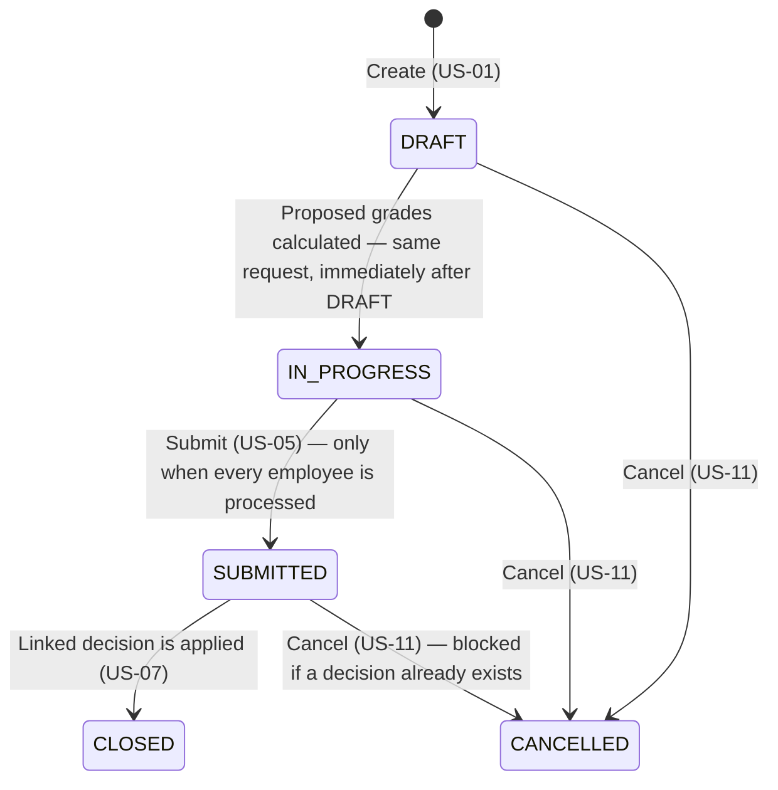
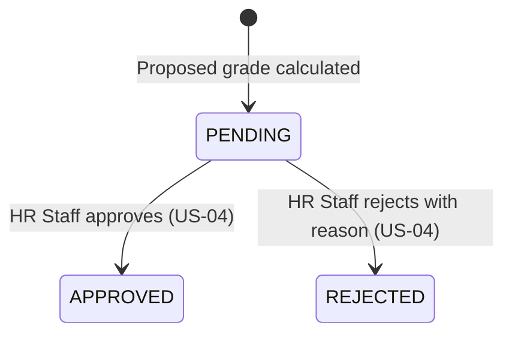
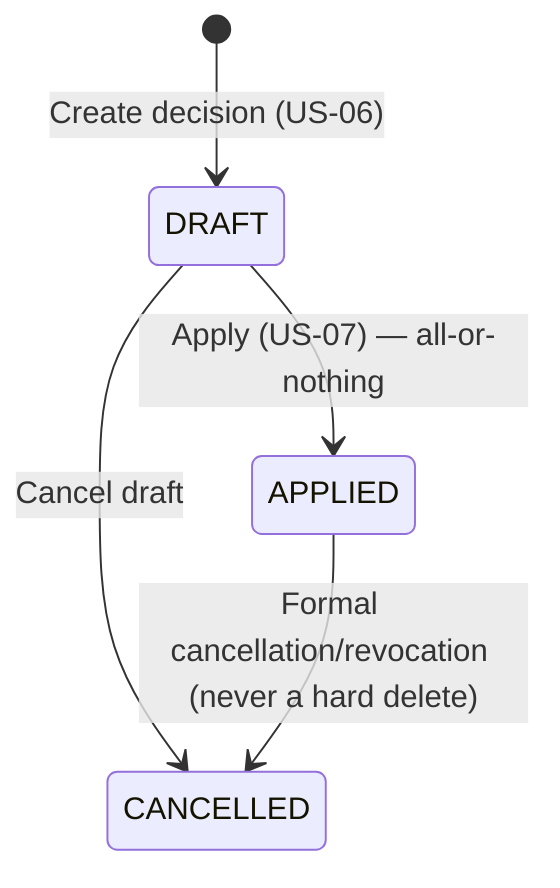

# State Diagrams - Salary Grade Promotion

Status lifecycles already defined as enums in [`openapi.yaml`](../API/openapi.yaml), shown visually.

## Review Period Status

## Review Outcome (per employee within a period)

## Salary Decision Status

