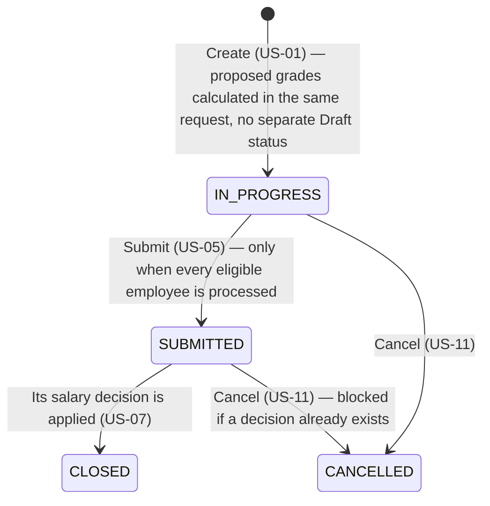
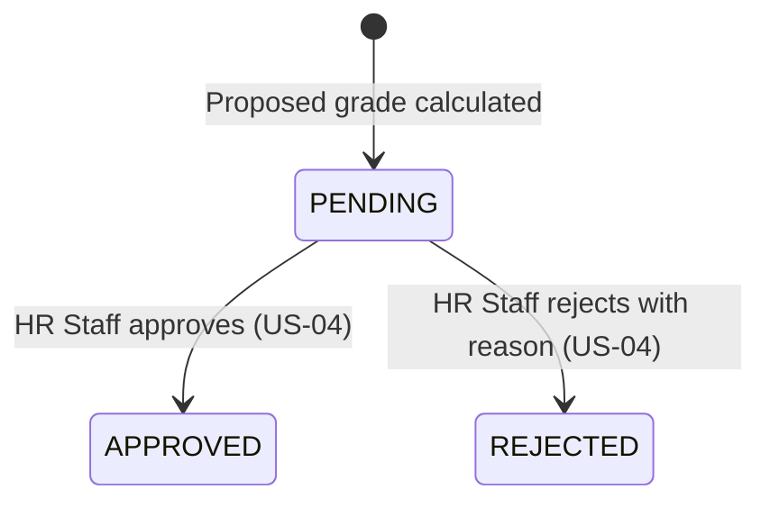
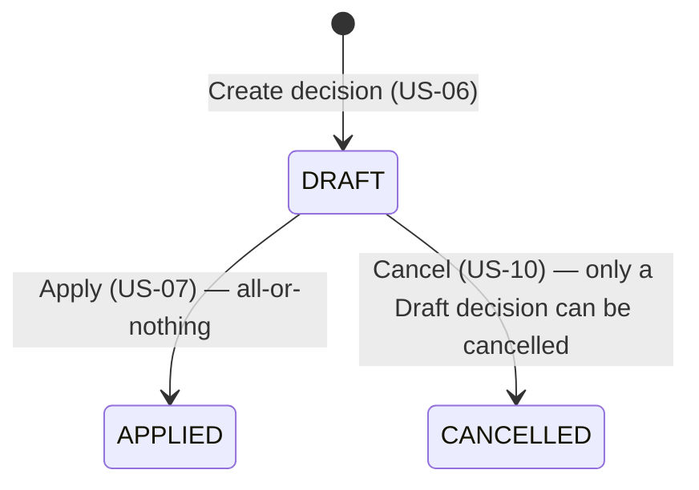

# State Diagrams - Salary Grade Promotion

Status lifecycles already defined as enums in [`openapi.yaml`](../API/openapi.yaml), shown visually.

## Review Period Status

CLOSED and CANCELLED are terminal — neither can transition anywhere else. In
particular CLOSED never reverts to SUBMITTED, because the salary decision
that closed it can never be cancelled once Applied (see the Salary Decision
Status diagram below and US-10).

## Review Outcome (per employee within a period)

## Salary Decision Status

APPLIED and CANCELLED are both terminal — an Applied decision can never be
cancelled (US-10), and there is no un-cancel action.
