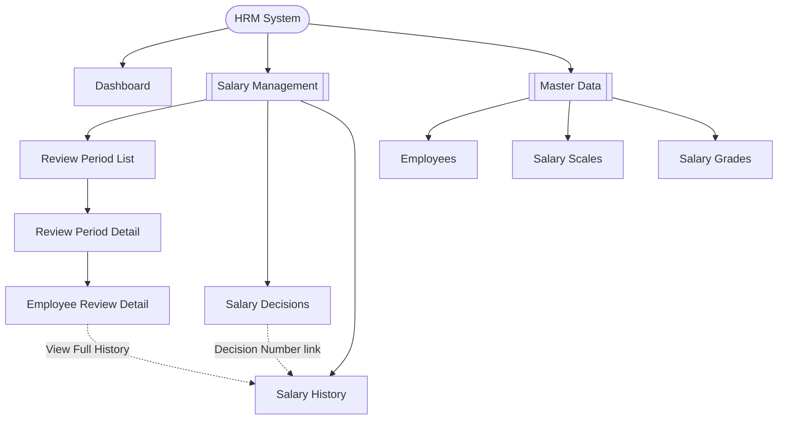

# Information Architecture - Salary Grade Promotion Module

This shows the menu structure (sitemap) of the HRM system, based on the left sidebar visible in the Figma mockups. It is different from the "Recommended Navigation Flow" in the wireframe document — that one shows the step-by-step process for one task; this one shows the full menu/page structure.

## Sitemap

## Page List

| Page | Menu Group | Parent Page | Status |
|---|---|---|---|
| Dashboard | Overview | - | Not designed yet |
| Review Period List | Salary Management | - | Designed (Screen 1) |
| Review Period Detail | Salary Management | Review Period List | Designed (Screen 2) |
| Employee Review Detail | Salary Management | Review Period Detail | Designed (Screen 3) |
| Salary Decisions (Create/Issue) | Salary Management | - | Designed (Screen 4) |
| Salary History | Salary Management | - | Designed (Screen 5) |
| Employees | Master Data | - | Not designed yet |
| Salary Scales | Master Data | - | Not designed yet |
| Salary Grades | Master Data | - | Not designed yet |
