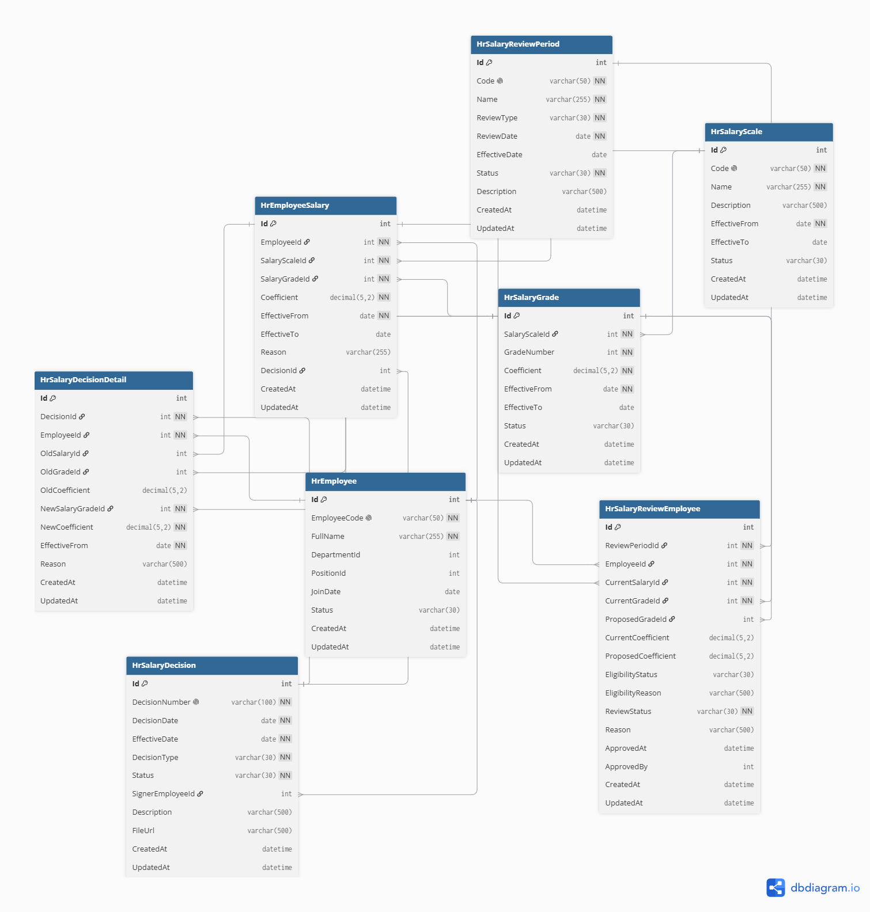

# Docs - Salary Grade Promotion

Design documents for the **Salary Grade Promotion** feature (part of Salary Management).

## Mind Map

- [`Quản lý nhân sự.xmind`](Quản%20lý%20nhân%20sự.xmind) — Top-down mind map breaking down the whole HRM system into its 6 function groups, down to feature-level detail.

## Database Design

- [`DB_Diagram.png`](DB_Diagram.png) — Entity-relationship diagram (from dbdiagram.io) of the 8 database tables and their relationships.
- [`HRM_Salary_Grade_Promotion.dbml`](HRM_Salary_Grade_Promotion.dbml) — DBML source code (from dbdiagram.io) that generates the diagram and SQL below. Edit this file first, then re-export, if the schema changes.
- [`Gen_Table.sql`](Gen_Table.sql) — SQL script (generated from dbdiagram.io) to create the 8 tables, keys, indexes, and foreign keys.
- [`HRM_Salary_Grade_Promotion_Database_Design_EN.docx`](HRM_Salary_Grade_Promotion_Database_Design_EN.docx) — Database design write-up (English).
- [`thiet_ke_CSDL_nang_bac_luong_8_bang.docx`](thiet_ke_CSDL_nang_bac_luong_8_bang.docx) — Same database design write-up (Vietnamese).

## UI/UX Design

- [`HRM_Salary_Grade_Promotion_Wireframe_UIUX_EN.docx`](HRM_Salary_Grade_Promotion_Wireframe_UIUX_EN.docx) — Wireframe & screen behavior write-up (English).
- [`wireframe_uiux_nang_bac_luong.docx`](wireframe_uiux_nang_bac_luong.docx) — Same wireframe write-up (Vietnamese).
- [`Figma_design/`](Figma_design/README.md) — Exported screenshots of the Figma UI/UX design.

## Analysis

- [`UseCase_SalaryGradePromotion.md`](UseCase_SalaryGradePromotion.md) — Use case diagram and description (actors and main actions).
- [`InformationArchitecture_SalaryGradePromotion.md`](InformationArchitecture_SalaryGradePromotion.md) — Sitemap of the module's menu structure (Salary Management, Master Data), separate from the step-by-step navigation flow in the wireframe document.
