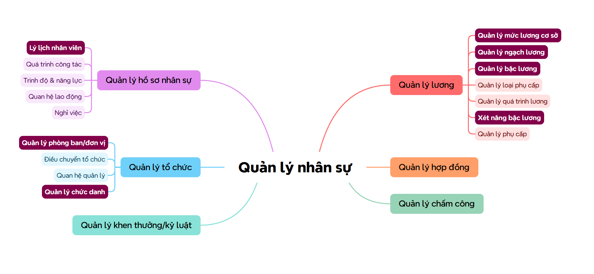

# Requirements Analysis

> **Status:** Current · **Owner:** Sang2197 · **Last Reviewed:** 2026-09-18 · **Implementation Baseline Commit:** `77e5716`

Requirements analysis documents for the HRM system: the overall mind map, user stories and use cases for the four analyzed modules — **Employee Profile**, **Organization Management**, **Salary Master Data**, and **Salary Grade Promotion**.

## Mind Map

Top-down mind map breaking down the whole HRM system into its 6 function groups, down to feature-level detail.

- [`Quản lý nhân sự.xmind`](Quản%20lý%20nhân%20sự.xmind) — editable source file (requires XMind to open).

## User Stories

- [`UserStories_SalaryGradePromotion.md`](UserStories_SalaryGradePromotion.md) — User stories with business rules and acceptance criteria (Given/When/Then) for the review-and-decision workflow. Written first, independent of any screen or database design.
- [`UserStories_OrganizationManagement.md`](UserStories_OrganizationManagement.md) — Organizational units (as a tree, typed as Company/Division/Department/Team) and job titles.
- [`UserStories_EmployeeProfile.md`](UserStories_EmployeeProfile.md) — Employee list/search/detail, employment status. Login account/role is out of scope, deferred to a future Identity & Access Management (IAM) module.
- [`UserStories_SalaryMasterData.md`](UserStories_SalaryMasterData.md) — Base salary rate, salary scales, and salary grades.
- [`UserStories_ContractManagement.md`](UserStories_ContractManagement.md) — Labor contracts: create, search/filter, view, status lifecycle (Draft → Active → Expired / Terminated), correcting or deleting Draft contracts, and contracts expiring soon. *Contract Management has no architecture, database, API, or implementation yet.*

## Use Cases

- [`UseCase_SalaryGradePromotion.md`](UseCase_SalaryGradePromotion.md) — Use case diagram and description (actors and main actions).
- [`UseCase_EmployeeProfile.md`](UseCase_EmployeeProfile.md) — UML 2.5.1 use case diagram, Cockburn-style specifications (adjusted), and full Use Case ↔ User Story ↔ Business Rule traceability.
- [`UseCase_OrganizationManagement.md`](UseCase_OrganizationManagement.md) — UML 2.5.1 use case diagram, Cockburn-style specifications (adjusted), and full Use Case ↔ User Story ↔ Business Rule traceability.
- [`UseCase_SalaryMasterData.md`](UseCase_SalaryMasterData.md) — UML 2.5.1 use case diagram, Cockburn-style specifications (adjusted), and full Use Case ↔ User Story ↔ Business Rule traceability.
- [`UseCase_ContractManagement.md`](UseCase_ContractManagement.md) — UML 2.5.1 use case diagram, contract lifecycle state diagram, Cockburn-style specifications (adjusted), and full Use Case ↔ User Story ↔ Business Rule traceability for Contract Management (6 use cases, 32 business rules).
