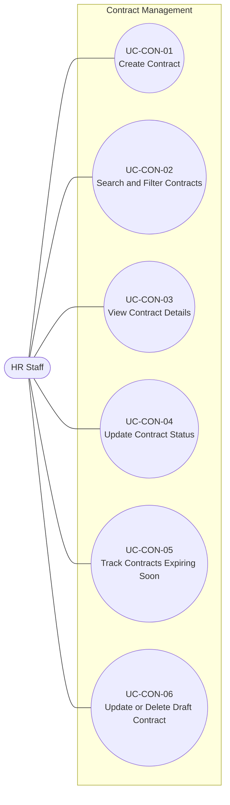
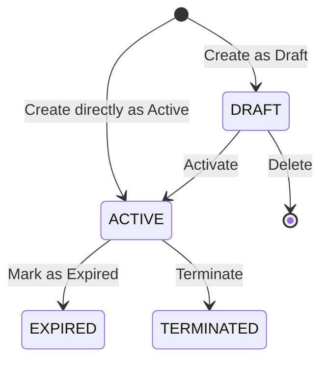

# Use Case Model -- Contract Management

## 1. Overview

This document defines the use case model for the **Contract Management**
module, based on `UserStories_ContractManagement.md` (US-CON-01 through
US-CON-06).

The module covers the following user goals:

-   Create a labor contract for an employee.
-   Search and filter contracts.
-   View contract details.
-   Update a contract's status along its lifecycle.
-   Track contracts that are expiring soon or overdue.
-   Correct or delete a Draft contract.

A labor contract (**Hợp đồng lao động**) is recorded for exactly one
employee. Employees are maintained by the **Employee Profile** module
and are referenced by contracts; the module does not change an
employee's employment status, and an employee's employment status does
not change a contract's status.

The use case diagram follows UML use case modeling conventions and is
rendered using Mermaid flowchart notation. The detailed
specifications use a Cockburn-style structure adapted to the size of
this module. The specifications describe business interactions and
expected outcomes without prescribing screen, API, database, or other
implementation design.

------------------------------------------------------------------------

## 2. Actors

### HR Staff

HR Staff is the only actor for this module. HR Staff records contracts,
finds and reviews them, updates their status, corrects or deletes Draft
contracts, and monitors contracts that are about to expire.

Employee Profile is a source of reference data (the employee a contract
belongs to). It is not an actor of this module.

User accounts, authentication, roles, and permissions are outside the
Contract Management module and belong to **Identity & Access
Management**.

------------------------------------------------------------------------

## 3. Business Rules

| ID | Business Rule | Source |
|---|---|---|
| BR-CON-01 | Each contract must have a unique contract number. | US-CON-01, US-CON-06 |
| BR-CON-02 | Creating a contract requires the employee, contract type, contract number, start date, and contract salary amount. The end date and salary note are optional, subject to BR-CON-04. | US-CON-01 |
| BR-CON-03 | The contract type is one of Probation, Fixed-Term, or Indefinite-Term. | US-CON-01 |
| BR-CON-04 | Probation and Fixed-Term contracts require an end date. Indefinite-Term contracts must not have an end date. | US-CON-01, US-CON-06 |
| BR-CON-05 | The end date must be later than the start date. | US-CON-01, US-CON-06 |
| BR-CON-06 | The contract salary amount must be greater than zero. | US-CON-01, US-CON-06 |
| BR-CON-07 | A contract can only be created for an existing employee whose employment status is not Terminated. | US-CON-01 |
| BR-CON-08 | A contract is created as Draft or Active. | US-CON-01 |
| BR-CON-09 | A contract can be created directly as Active only when its start date is today or earlier and the employee has no other Active contract. | US-CON-01 |
| BR-CON-10 | An employee can have at most one Active contract at a time, and any number of contracts in other statuses. | US-CON-01, US-CON-04 |
| BR-CON-11 | Contracts can be searched by employee (employee code or full name) and by contract number. | US-CON-02 |
| BR-CON-12 | Contracts can be filtered by contract type, contract status, and time period. | US-CON-02 |
| BR-CON-13 | A time period filter matches contracts whose term overlaps the selected period. A contract without an end date is treated as running from its start date without limit. | US-CON-02 |
| BR-CON-14 | Search and filter criteria may be combined. Contracts of every status are included unless a status filter is applied. | US-CON-02 |
| BR-CON-15 | Employee information shown with a contract is the employee's currently recorded information, not a copy taken when the contract was created. | US-CON-03 |
| BR-CON-16 | A contract status is one of Draft, Active, Expired, or Terminated. The allowed status changes are Draft → Active, Active → Expired, and Active → Terminated; no other change is allowed. Expired and Terminated are final. | US-CON-04 |
| BR-CON-17 | Contract status is updated explicitly by HR Staff. Status is not changed automatically based on dates. | US-CON-04 |
| BR-CON-18 | A Draft contract can be activated only when its start date is today or earlier, the employee has no other Active contract, and the employee's employment status is not Terminated. | US-CON-04 |
| BR-CON-19 | The end date is the last day of a contract's term; it has passed when it is earlier than today. An Active contract can be marked as Expired only when it has an end date that has passed. | US-CON-04 |
| BR-CON-20 | An Active contract whose end date has passed and that has not been marked as Expired is overdue. | US-CON-05 |
| BR-CON-21 | Terminating an Active contract requires a termination date and a termination reason. | US-CON-04 |
| BR-CON-22 | The termination date must not be earlier than the contract's start date and, if the contract has an end date, must not be later than it. | US-CON-04 |
| BR-CON-23 | Changing a contract's status does not delete the contract or its existing information. | US-CON-04 |
| BR-CON-24 | Changing a contract's status does not change the employee's employment status, and changing the employee's employment status does not change an existing contract's status. | US-CON-04 |
| BR-CON-25 | The expiring-soon view lists Active contracts whose end date falls from today up to and including the last day of the selected window. The window is 30 or 60 days from today; the default is 30 days. | US-CON-05 |
| BR-CON-26 | Indefinite-Term contracts and contracts that are not Active are not listed as expiring soon. Overdue contracts are included and identified as overdue. | US-CON-05 |
| BR-CON-27 | Expiring-soon contracts are ordered by end date, earliest first. | US-CON-05 |
| BR-CON-28 | Only a Draft contract can be updated or deleted. Active, Expired, and Terminated contracts cannot. | US-CON-06 |
| BR-CON-29 | The employee of a Draft contract cannot be changed. | US-CON-06 |
| BR-CON-30 | Updating a Draft contract does not create a new contract and does not change its status. The validation rules of US-CON-01 apply to the updated information, except the rules about the employee. Keeping the contract's own number is allowed. | US-CON-06 |
| BR-CON-31 | Deleting a Draft contract removes it from the contract list and search results, and its contract number can be used again. | US-CON-06 |

### Deferred Business Questions

Three business questions are deferred to a future release and do not
block the current scope; they are listed in section 8 as `DQ-CON-01` to
`DQ-CON-03`.

------------------------------------------------------------------------

## 4. UML Use Case Diagram

### Relationships

No `<<include>>`, `<<extend>>`, or generalization relationships are
required by the current business requirements.

The use cases depend on the state of a contract, not on each other's
behavior:

-   UC-CON-04 and UC-CON-06 operate on contracts recorded by UC-CON-01.
    UC-CON-06 applies only to Draft contracts; UC-CON-04 changes Draft
    and Active contracts.
-   UC-CON-05 shows overdue contracts that HR Staff then complete
    through UC-CON-04.

These are **business-state dependencies**, not mandatory behavioral
inclusion or extension. An implementation may let HR Staff find a
contract with UC-CON-02 or UC-CON-05 before viewing or updating it, but
that navigation is not a mandatory business relationship between the use
cases. Therefore it is not modeled as `<<include>>` or `<<extend>>`.

The three status changes of UC-CON-04 (activate, mark as Expired,
terminate) are variants of one user goal -- keeping the contract status
accurate -- and are specified within one use case, as in the source user
story.

------------------------------------------------------------------------

## 5. Contract Lifecycle

Expired and Terminated are final statuses: they have no outgoing
transitions (BR-CON-16). The conditions for each transition are defined
by BR-CON-09, BR-CON-18, BR-CON-19, and BR-CON-21 to BR-CON-22. Only
Draft contracts can be updated or deleted (BR-CON-28); updating does not
change the status.

------------------------------------------------------------------------

## 6. Traceability Matrix

| Use Case | User Story | Acceptance Criteria | Business Rules |
|---|---|---|---|
| UC-CON-01 Create Contract | US-CON-01 | AC01–AC10 | BR-CON-01–BR-CON-10 |
| UC-CON-02 Search and Filter Contracts | US-CON-02 | AC01–AC06 | BR-CON-11–BR-CON-14 |
| UC-CON-03 View Contract Details | US-CON-03 | AC01–AC02 | BR-CON-15 |
| UC-CON-04 Update Contract Status | US-CON-04 | AC01–AC10 | BR-CON-10, BR-CON-16–BR-CON-19, BR-CON-21–BR-CON-24 |
| UC-CON-05 Track Contracts Expiring Soon | US-CON-05 | AC01–AC06 | BR-CON-19, BR-CON-20, BR-CON-25–BR-CON-27 |
| UC-CON-06 Update or Delete Draft Contract | US-CON-06 | AC01–AC06 | BR-CON-01–BR-CON-06, BR-CON-28–BR-CON-31 |

------------------------------------------------------------------------

## 7. Use Case Specifications

## UC-CON-01 -- Create Contract

**Primary Actor:** HR Staff

**Goal:** Record a labor contract for an employee in the HRM system.

**Preconditions:** None beyond the actor being permitted to perform this
business function.

**Trigger:** A labor contract has been agreed with an employee and needs
to be recorded.

### Main Success Scenario

1.  HR Staff initiates creation of a contract.
2.  HR Staff selects the employee and provides the contract information:
    contract type, contract number, start date, end date (when
    applicable), contract salary amount, optionally a salary note, and
    the initial status (Draft or Active).
3.  System validates the provided information.
4.  System verifies that the employee's employment status is not
    Terminated.
5.  System verifies that the contract number is unique.
6.  If the initial status is Active, System verifies that the start date
    is today or earlier and that the employee has no other Active
    contract.
7.  System creates the contract with the requested status.
8.  System confirms successful creation.

### Extensions

**3a. Required information is missing**
1. System identifies the missing required information.
2. No contract is created.
3. HR Staff may correct the information and resubmit.

**3b. End date does not match the contract type**
1. The contract type is Probation or Fixed-Term and no end date was
   provided, or the contract type is Indefinite-Term and an end date was
   provided.
2. System rejects the request and identifies that the end date does not
   match the contract type.
3. No contract is created.

**3c. End date is not later than the start date**
1. System rejects the request.
2. No contract is created.

**3d. Contract salary amount is zero or negative**
1. System rejects the request.
2. No contract is created.

**4a. Employee is Terminated**
1. System rejects the request.
2. No contract is created.

**5a. Contract number already exists**
1. System rejects the request and identifies that the contract number is
   already in use.
2. No contract is created.

**6a. Start date is later than today**
1. System rejects the request.
2. No contract is created. HR Staff may save the contract as Draft
   instead.

**6b. Employee already has another Active contract**
1. System rejects the request.
2. No contract is created.

### Postconditions -- Success

-   One new contract exists with the submitted valid information and the
    requested status (Draft or Active).
-   The employee has at most one Active contract.
-   No other contract uses the same contract number.
-   The employee's employment status is unchanged.

**Business Rules:** BR-CON-01--BR-CON-10

**Related User Story:** US-CON-01

------------------------------------------------------------------------

## UC-CON-02 -- Search and Filter Contracts

**Primary Actor:** HR Staff

**Goal:** Find a specific contract or a group of contracts matching
selected criteria.

**Preconditions:** None beyond the actor being permitted to perform this
business function.

**Trigger:** HR Staff needs to find a contract or a group of contracts.

### Main Success Scenario

1.  HR Staff specifies a search term, one or more filters, or both.
2.  Search may use employee code, employee full name, or contract
    number.
3.  Filters may use contract type, contract status, or time period.
4.  System applies all provided search and filter criteria together. A
    time period matches contracts whose term overlaps the selected
    period; a contract without an end date is treated as running from
    its start date without limit.
5.  System returns the contracts matching the criteria, of every status
    unless a status filter was applied.
6.  HR Staff reviews the results.

### Extensions

**5a. No contract matches the criteria**
1. System indicates that no matching contracts were found.
2. No data is changed.

### Postconditions

-   HR Staff receives the set of contracts matching the specified
    criteria, which may be empty.
-   When searching by employee, every contract of the matching employees
    is included regardless of status.
-   No contract data is changed.

**Business Rules:** BR-CON-11--BR-CON-14

**Related User Story:** US-CON-02

------------------------------------------------------------------------

## UC-CON-03 -- View Contract Details

**Primary Actor:** HR Staff

**Goal:** Review the recorded information of a specific contract and the
employee it belongs to.

**Preconditions:** The contract exists.

**Trigger:** HR Staff needs to review a specific contract.

### Main Success Scenario

1.  HR Staff identifies the contract to view.
2.  System retrieves the contract's recorded information.
3.  System provides the contract number, contract type, status, start
    date, end date (if any), contract salary amount, and salary note (if
    any), together with the employee's currently recorded code, full
    name, Organizational Unit, job title, and employment status.
4.  HR Staff reviews the information.

### Extensions

**3a. The contract is Terminated**
1. System also provides the termination date and the termination
   reason.
2. Continue at step 4.

### Postconditions

-   HR Staff can view the contract's recorded information together with
    the employee's current information.
-   No contract or employee data is changed.

**Business Rules:** BR-CON-15

**Related User Story:** US-CON-03

------------------------------------------------------------------------

## UC-CON-04 -- Update Contract Status

**Primary Actor:** HR Staff

**Goal:** Move a contract to its next lifecycle status so that the
record reflects the contract's actual state.

**Preconditions:** The contract exists.

**Trigger:** The state of a contract has changed: it has started, its
term has ended, or it is ended before its normal expiry.

### Main Success Scenario

1.  HR Staff identifies the contract whose status needs to change.
2.  HR Staff specifies the requested change: activate, mark as Expired,
    or terminate. To terminate, HR Staff also provides the termination
    date and termination reason.
3.  System verifies that the requested change is allowed for the
    contract's current status.
4.  System verifies the conditions of the requested change:
    -   **Activate (Draft → Active):** the start date is today or
        earlier, the employee has no other Active contract, and the
        employee's employment status is not Terminated.
    -   **Mark as Expired (Active → Expired):** the contract has an end
        date and the end date is earlier than today.
    -   **Terminate (Active → Terminated):** the termination date and
        reason are provided, and the termination date is not earlier
        than the start date and, if the contract has an end date, not
        later than it.
5.  System updates the contract's status; for a termination, System also
    records the termination date and reason.
6.  System retains the contract and all its existing information.
7.  System confirms the status change.

### Extensions

**3a. The requested change is not allowed for the current status**
1. The contract is Draft and Expired or Terminated is requested, or the
   contract is already Expired or Terminated.
2. System rejects the request.
3. The contract status is unchanged.

**4a. Activation: the start date is later than today**
1. System rejects the request.
2. The contract remains Draft.

**4b. Activation: the employee already has another Active contract**
1. System rejects the request.
2. The contract remains Draft.

**4c. Activation: the employee is Terminated**
1. System rejects the request.
2. The contract remains Draft.

**4d. Expiry: the end date is today or later, or there is no end date**
1. System rejects the request.
2. The contract remains Active.

**4e. Termination: the termination date or reason is missing**
1. System rejects the request.
2. The contract remains Active.

**4f. Termination: the termination date is outside the contract term**
1. The termination date is earlier than the start date, or later than
   the end date when an end date exists.
2. System rejects the request.
3. The contract remains Active.

### Postconditions -- Success

-   The contract's status reflects the requested valid change.
-   For a terminated contract, the termination date and reason are
    recorded.
-   The contract and its existing information remain available.
-   The employee has at most one Active contract.
-   The employee's employment status is unchanged.

**Business Rules:** BR-CON-10, BR-CON-16--BR-CON-19,
BR-CON-21--BR-CON-24

**Related User Story:** US-CON-04

------------------------------------------------------------------------

## UC-CON-05 -- Track Contracts Expiring Soon

**Primary Actor:** HR Staff

**Goal:** See the Active contracts that are approaching or have passed
their end date, so that the appropriate lifecycle action can be taken in
time.

**Preconditions:** None beyond the actor being permitted to perform this
business function.

**Trigger:** HR Staff needs to know which contracts are ending soon or
are overdue.

### Main Success Scenario

1.  HR Staff opens the expiring-soon view.
2.  HR Staff selects a window of 30 or 60 days from today; the default
    is 30 days.
3.  System identifies the Active contracts whose end date falls from
    today up to and including the last day of the window.
4.  System identifies the overdue contracts: Active contracts whose end
    date is earlier than today.
5.  System returns these contracts ordered by end date, earliest first,
    identifying overdue contracts as overdue.
6.  HR Staff reviews the results.

### Extensions

**3a. No contract is expiring within the window and none is overdue**
1. System indicates that no contracts are expiring soon.
2. No data is changed.

### Postconditions

-   HR Staff receives the expiring and overdue Active contracts, which
    may be none.
-   Indefinite-Term contracts and contracts that are not Active are not
    included.
-   A contract that HR Staff marks as Expired through UC-CON-04 no
    longer appears.
-   No contract data is changed.

**Business Rules:** BR-CON-19, BR-CON-20, BR-CON-25--BR-CON-27

**Related User Story:** US-CON-05

------------------------------------------------------------------------

## UC-CON-06 -- Update or Delete Draft Contract

**Primary Actor:** HR Staff

**Goal:** Correct or remove a Draft contract that was recorded by
mistake, before it takes effect.

**Preconditions:** The contract exists.

**Trigger:** HR Staff needs to correct or remove a contract that is
still in Draft status.

### Main Success Scenario

1.  HR Staff identifies the contract to correct.
2.  HR Staff provides one or more changes to the contract type,
    contract number, start date, end date, contract salary amount, or
    salary note.
3.  System verifies that the contract is Draft.
4.  System validates the submitted changes against the validation rules
    of UC-CON-01, except the rules about the employee. If the contract
    number is changed, System verifies that it is unique.
5.  System updates the existing contract; its status remains Draft.
6.  System confirms the update.

### Extensions

**2a. HR Staff deletes the contract instead of updating it**
1. HR Staff requests deletion of the contract.
2. Continue at step 3.
3. At step 5, System removes the contract and releases its contract
   number.
4. System confirms the deletion. Continue at the end of the use case.

**2b. HR Staff attempts to change the employee**
1. System rejects the update.
2. The contract remains assigned to its original employee. If the wrong
   employee was selected, HR Staff deletes the Draft contract (2a) and
   creates a new one with UC-CON-01.

**3a. The contract is not Draft**
1. The contract is Active, Expired, or Terminated.
2. System rejects the update or deletion.
3. The contract remains unchanged.

**4a. The changed contract number already exists**
1. System rejects the update and identifies that the contract number is
   already in use by another contract.
2. The contract retains its existing information.

**4b. A submitted change violates a validation rule of UC-CON-01**
1. System rejects the update.
2. The contract retains its existing information.

### Postconditions -- Success

-   After an update, the existing contract reflects the valid submitted
    changes, remains Draft, and no new contract is created.
-   After a deletion, the contract no longer exists, no longer appears in
    the contract list or search results, and its contract number can be
    used again.

**Business Rules:** BR-CON-01--BR-CON-06, BR-CON-28--BR-CON-31

**Related User Story:** US-CON-06

------------------------------------------------------------------------

## 8. Deferred Business Questions

| ID | Question | Current-Scope Decision | Affected Use Case |
|---|---|---|---|
| DQ-CON-01 | Are additional contract types such as seasonal, project-based, or service contracts required? | Only Probation, Fixed-Term, and Indefinite-Term are supported. | UC-CON-01, UC-CON-02, UC-CON-06 |
| DQ-CON-02 | How should contract salary integrate with Salary Master Data and Salary Grade Promotion? | Contract salary is independent information recorded from the labor contract. No automatic synchronization is performed. | UC-CON-01, UC-CON-03, UC-CON-06 |
| DQ-CON-03 | Should renewal or replacement contracts reference the previous contract? | A renewal or replacement is stored as a new contract without an explicit predecessor relationship. | UC-CON-01 |

------------------------------------------------------------------------

## 9. References

-   `UserStories_ContractManagement.md` -- source user stories, business
    rules, acceptance criteria, and deferred business questions.
-   `UserStories_EmployeeProfile.md` -- source of employees and their
    employment status.
-   `UseCase_EmployeeProfile.md` -- use case model of the module that
    maintains employees and their employment status.
