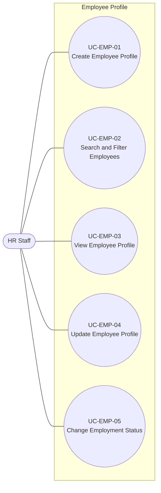

# Use Case Model -- Employee Profile

## 1. Overview

This document defines the use case model for the **Employee Profile**
module, based on `UserStories_EmployeeProfile.md` (US-EMP-01 through
US-EMP-05).

The module covers the following user goals:

-   Create an employee profile.
-   Search and filter employees.
-   View an employee profile.
-   Update an employee profile.
-   Change an employee's employment status.

Each employee is assigned to exactly one current **Organizational Unit**
at a time. The Organizational Unit may be of any supported unit type,
but it must be active when assigned.

The use case diagram follows UML use case notation. The detailed
specifications use a Cockburn-style structure adapted to the size of
this module. The specifications describe business interactions and
expected outcomes without prescribing screen, API, database, or other
implementation design.

------------------------------------------------------------------------

## 2. Actors

### HR Staff

HR Staff is the primary actor for this module and can create, find,
view, update employee profiles, and record employment status changes.

User accounts, authentication, roles, and permissions are outside the
Employee Profile module and belong to **Identity & Access Management**.

------------------------------------------------------------------------

## 3. Business Rules

| ID | Business Rule | Source |
|---|---|---|
| BR-EMP-01 | Each employee must have a unique employee code. | US-EMP-01 |
| BR-EMP-02 | Creating an employee profile requires employee code, full name, Organizational Unit, job title, join date, and employment status. | US-EMP-01 |
| BR-EMP-03 | An employee is assigned to exactly one current Organizational Unit at a time. | US-EMP-01, US-EMP-04 |
| BR-EMP-04 | The Organizational Unit assigned to an employee must be active. | US-EMP-01, US-EMP-04 |
| BR-EMP-05 | The job title assigned to an employee must be active. | US-EMP-01, US-EMP-04 |
| BR-EMP-06 | Employees can be filtered by Organizational Unit, job title, and employment status. | US-EMP-02 |
| BR-EMP-07 | Search and filter criteria may be combined. | US-EMP-02 |
| BR-EMP-08 | The employee code must remain unique across employee profiles after an update. | US-EMP-04 |
| BR-EMP-09 | Updating an employee profile modifies the existing profile and does not create a new employee profile. | US-EMP-04 |
| BR-EMP-10 | Employment status is one of Active, On Leave, or Terminated. | US-EMP-05 |
| BR-EMP-11 | Changing employment status does not delete the employee profile or its existing information. | US-EMP-05 |

### Open Business Rule

Whether a **Terminated** employee can return to **Active** using the
same employee profile remains unresolved and is tracked as `OQ-EMP-01`.

------------------------------------------------------------------------

## 4. UML Use Case Diagram

### Relationships

No `<<include>>` or `<<extend>>` relationships are required by the
current business requirements.

For example, an implementation may allow HR Staff to search for an
employee before viewing or updating the profile, but that navigation
sequence is not a mandatory business relationship between the use cases.
Therefore it is not modeled as `<<include>>` or `<<extend>>`.

------------------------------------------------------------------------

## 5. Traceability Matrix

| Use Case | User Story | Acceptance Criteria | Business Rules |
|---|---|---|---|
| UC-EMP-01 Create Employee Profile | US-EMP-01 | AC01–AC04 | BR-EMP-01–BR-EMP-05 |
| UC-EMP-02 Search and Filter Employees | US-EMP-02 | AC01–AC05 | BR-EMP-06, BR-EMP-07 |
| UC-EMP-03 View Employee Profile | US-EMP-03 | AC01 | — |
| UC-EMP-04 Update Employee Profile | US-EMP-04 | AC01–AC03 | BR-EMP-03–BR-EMP-05, BR-EMP-08, BR-EMP-09 |
| UC-EMP-05 Change Employment Status | US-EMP-05 | AC01–AC03 | BR-EMP-10, BR-EMP-11 |

------------------------------------------------------------------------

## 6. Use Case Specifications

## UC-EMP-01 -- Create Employee Profile

**Primary Actor:** HR Staff

**Goal:** Record a new employee as an employee profile in the HRM
system.

**Preconditions:** None beyond the actor being permitted to perform this
business function.

**Trigger:** A new employee needs to be recorded.

### Main Success Scenario

1.  HR Staff initiates creation of an employee profile.
2.  HR Staff provides the required employee information: employee code,
    full name, Organizational Unit, job title, join date, and employment
    status.
3.  System validates the provided information.
4.  System verifies that the employee code is unique.
5.  System verifies that the selected Organizational Unit and job title
    are active.
6.  System creates the employee profile.
7.  System confirms successful creation.

### Extensions

**3a. Required information is missing**
1. System identifies the missing required information.
2. The profile is not created.
3. HR Staff may correct the information and resubmit.

**4a. Employee code already exists**
1. System rejects the request and identifies that the employee code is already in use.
2. No employee profile is created.

**5a. Selected Organizational Unit is inactive**
1. System rejects the request.
2. No employee profile is created.

**5b. Selected job title is inactive**
1. System rejects the request.
2. No employee profile is created.

### Postconditions -- Success

-   One new employee profile exists with the submitted valid
    information.
-   The employee is assigned to exactly one current active
    Organizational Unit.
-   No other employee profile uses the same employee code.

**Business Rules:** BR-EMP-01--BR-EMP-05

**Related User Story:** US-EMP-01

------------------------------------------------------------------------

## UC-EMP-02 -- Search and Filter Employees

**Primary Actor:** HR Staff

**Goal:** Find a specific employee or a group of employees matching
selected criteria.

**Preconditions:** None beyond the actor being permitted to perform this
business function.

**Trigger:** HR Staff needs to find an employee or a group of employees.

### Main Success Scenario

1.  HR Staff specifies a search term, one or more filters, or both.
2.  Search may use employee code or employee name.
3.  Filters may use Organizational Unit, job title, or employment
    status.
4.  System applies all provided search and filter criteria together.
5.  System returns the employees matching the criteria.
6.  HR Staff reviews the results.

### Extensions

**5a. No employee matches the criteria**
1. System returns an empty result.
2. No data is changed.

### Postconditions

-   HR Staff receives the set of employees matching the specified
    criteria, which may be empty.
-   No employee data is changed.

**Business Rules:** BR-EMP-06, BR-EMP-07

**Related User Story:** US-EMP-02

------------------------------------------------------------------------

## UC-EMP-03 -- View Employee Profile

**Primary Actor:** HR Staff

**Goal:** Review the current recorded information for a specific
employee.

**Preconditions:** The employee profile exists.

**Trigger:** HR Staff needs to review a specific employee's profile.

### Main Success Scenario

1.  HR Staff identifies the employee profile to view.
2.  System retrieves the employee's recorded profile information.
3.  System provides the employee's current Organizational Unit, current
    job title, and current employment status together with the other
    recorded profile information.
4.  HR Staff reviews the information.

### Extensions

None identified from the current business requirements.

### Postconditions

-   HR Staff can view the employee's current recorded profile
    information.
-   No employee data is changed.

**Business Rules:** None specific to this read-only use case.

**Related User Story:** US-EMP-03

------------------------------------------------------------------------

## UC-EMP-04 -- Update Employee Profile

**Primary Actor:** HR Staff

**Goal:** Update the existing employee profile when recorded employee
information changes or needs correction.

**Preconditions:** The employee profile exists.

**Trigger:** Employee information has changed or needs correction.

### Main Success Scenario

1.  HR Staff identifies the employee profile to update.
2.  HR Staff provides one or more changes to the employee's profile
    information.
3.  System validates the submitted changes.
4.  If the employee code is changed, System verifies that the new code
    remains unique.
5.  If the Organizational Unit is changed, System verifies that the new
    Organizational Unit is active.
6.  If the job title is changed, System verifies that the new job title
    is active.
7.  System updates the existing employee profile.
8.  System confirms successful update.

### Extensions

**4a. Changed employee code already exists**
1. System rejects the update.
2. The employee profile retains its existing information.

**5a. Newly selected Organizational Unit is inactive**
1. System rejects the update.
2. The employee profile retains its existing Organizational Unit.

**6a. Newly selected job title is inactive**
1. System rejects the update.
2. The employee profile retains its existing job title.

### Postconditions -- Success

-   The existing employee profile reflects the valid submitted changes.
-   The update does not create a new employee profile.
-   The employee remains assigned to exactly one current Organizational
    Unit.

**Business Rules:** BR-EMP-03--BR-EMP-05, BR-EMP-08, BR-EMP-09

**Related User Story:** US-EMP-04

------------------------------------------------------------------------

## UC-EMP-05 -- Change Employment Status

**Primary Actor:** HR Staff

**Goal:** Record a valid change to an employee's current employment
status without deleting the employee profile.

**Preconditions:** The employee profile exists.

**Trigger:** An employment event requires the employee's current
employment status to change.

### Main Success Scenario

1.  HR Staff identifies the employee whose employment status needs to
    change.
2.  HR Staff specifies the new employment status.
3.  System validates the requested status change against the currently
    defined business rules.
4.  System updates the employee's employment status.
5.  System retains the employee profile and its existing information.
6.  System confirms the status change.

### Extensions

**3a. Active → On Leave**
1. System accepts the transition.
2. Continue at step 4.

**3b. On Leave → Active**
1. System accepts the transition.
2. Continue at step 4.

**3c. Active or On Leave → Terminated**
1. System accepts the transition.
2. Continue at step 4.

**3d. Terminated → another status**
1. This transition is not yet defined.
2. The behavior remains unresolved until `OQ-EMP-01` is decided.

### Postconditions -- Success

-   The employee's employment status reflects the valid requested
    change.
-   The employee profile and its existing information remain available.

**Business Rules:** BR-EMP-10, BR-EMP-11

**Related User Story:** US-EMP-05

**Open Issue:** `OQ-EMP-01` -- Determine whether a Terminated employee
can return to Active using the same employee profile.

------------------------------------------------------------------------

## 7. Open Issues

| ID | Question | Affected Use Case |
|---|---|---|
| OQ-EMP-01 | Can a Terminated employee return to Active using the same employee profile, or must rehiring follow a separate process? | UC-EMP-05 |

------------------------------------------------------------------------

## 8. References

-   `UserStories_EmployeeProfile.md` -- source user stories, business
    rules, acceptance criteria, and open question.
-   `UserStories_OrganizationManagement.md` -- source of Organizational
    Unit and job title reference data.
