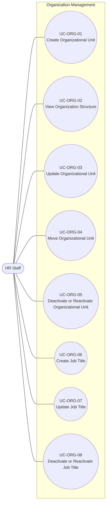

# Use Case Model -- Organization Management

## 1. Overview

This document defines the use case model for the **Organization
Management** module, based on `UserStories_OrganizationManagement.md`
(US-ORG-01 through US-ORG-08).

The module covers the following user goals:

-   Create, view, update, move, deactivate, and reactivate
    organizational units.
-   Create, update, deactivate, and reactivate job titles.

An **Organizational Unit** represents an element in the organization
structure, such as a company, division, department, or team, and may
have a parent unit. A **Job Title** is maintained as an
organization-wide catalog, independent of any single organizational
unit. Job title names are unique across the organization-wide catalog.

The use case diagram follows UML use case notation. The detailed
specifications use a Cockburn-style structure adapted to the size of
this module. The specifications describe business interactions and
expected outcomes without prescribing screen, API, database, or other
implementation design.

------------------------------------------------------------------------

## 2. Actors

### HR Staff

HR Staff is the primary actor for this module and can create, view,
update, move, deactivate, and reactivate organizational units, and can
create, update, deactivate, and reactivate job titles.

User accounts, authentication, roles, and permissions are outside the
Organization Management module and belong to **Identity & Access
Management**.

------------------------------------------------------------------------

## 3. Business Rules

| ID | Business Rule | Source |
|---|---|---|
| BR-ORG-01 | Each organizational unit has a unit type, such as Company, Division, Department, or Team. | US-ORG-01 |
| BR-ORG-02 | An organizational unit may have a parent unit; a unit without a parent is a top-level unit. | US-ORG-01 |
| BR-ORG-03 | An organizational unit name must be unique among units that share the same parent. | US-ORG-01, US-ORG-03, US-ORG-04 |
| BR-ORG-04 | Only an active organizational unit can be selected as the parent of a new or moved unit. | US-ORG-01, US-ORG-04 |
| BR-ORG-05 | Updating an organizational unit modifies the existing unit and does not create a new one. | US-ORG-03 |
| BR-ORG-06 | The name and unit type of an existing organizational unit may be updated. | US-ORG-03 |
| BR-ORG-07 | An organizational unit cannot be moved under itself or under one of its own descendants. | US-ORG-04 |
| BR-ORG-08 | Moving an organizational unit moves its existing subtree with it; descendants are not automatically detached or relocated. | US-ORG-04 |
| BR-ORG-09 | A non-top-level organizational unit can only be moved to another active parent; moving it to the top level is not allowed. | US-ORG-04 |
| BR-ORG-10 | An organizational unit cannot be deactivated while it has active child units. | US-ORG-05 |
| BR-ORG-11 | An organizational unit cannot be deactivated while active employees remain assigned to it. | US-ORG-05 |
| BR-ORG-12 | Deactivating an organizational unit does not delete it; the unit remains visible in the hierarchy but is unavailable for new employee assignments or as a parent unit. | US-ORG-05 |
| BR-ORG-13 | A deactivated organizational unit can be reactivated. | US-ORG-05 |
| BR-ORG-14 | When reactivating an organizational unit that has a parent, its parent must be active. | US-ORG-05 |
| BR-ORG-15 | The organization hierarchy shows all organizational units, active or inactive and with or without assigned employees, arranged by parent-child relationship. | US-ORG-02 |
| BR-ORG-16 | Job titles are maintained as an organization-wide catalog and are not owned by a single organizational unit. | US-ORG-06; confirmed business decision |
| BR-ORG-17 | A job title name must be unique across the organization-wide job title catalog. | US-ORG-06, US-ORG-07; confirmed business decision |
| BR-ORG-18 | Updating a job title modifies the existing job title and does not create a new one. | US-ORG-07 |
| BR-ORG-19 | Deactivating a job title does not delete it and does not change employees who already hold it; a deactivated job title is unavailable for new employee assignments. | US-ORG-08 |
| BR-ORG-20 | A deactivated job title can be reactivated. | US-ORG-08 |
| BR-ORG-21 | An organizational unit may optionally have a Contact Email and a Contact Phone. Both apply to the organizational unit itself regardless of unit type, and neither is required. | US-ORG-01, US-ORG-03 |
| BR-ORG-22 | A Contact Email, when provided, must be a valid email format. | US-ORG-01, US-ORG-03 |
| BR-ORG-23 | An organizational unit's recorded Contact Email and Contact Phone, when present, are shown as part of the organization structure view. | US-ORG-02 |

------------------------------------------------------------------------

## 4. UML Use Case Diagram

### Relationships

No `<<include>>` or `<<extend>>` relationships are required by the
current business requirements.

For example, an implementation may allow HR Staff to view the
organization structure before updating, moving, or deactivating a unit,
but that navigation sequence is not a mandatory business relationship
between the use cases. Therefore it is not modeled as `<<include>>` or
`<<extend>>`.

------------------------------------------------------------------------

## 5. Traceability Matrix

| Use Case | User Story | Acceptance Criteria | Business Rules |
|---|---|---|---|
| UC-ORG-01 Create Organizational Unit | US-ORG-01 | AC01–AC08 | BR-ORG-01–BR-ORG-04, BR-ORG-21, BR-ORG-22 |
| UC-ORG-02 View Organization Structure | US-ORG-02 | AC01–AC05 | BR-ORG-15, BR-ORG-23 |
| UC-ORG-03 Update Organizational Unit | US-ORG-03 | AC01–AC05 | BR-ORG-03, BR-ORG-05, BR-ORG-06, BR-ORG-21, BR-ORG-22 |
| UC-ORG-04 Move Organizational Unit | US-ORG-04 | AC01–AC06 | BR-ORG-03, BR-ORG-04, BR-ORG-07–BR-ORG-09 |
| UC-ORG-05 Deactivate or Reactivate Organizational Unit | US-ORG-05 | AC01–AC05 | BR-ORG-10–BR-ORG-14 |
| UC-ORG-06 Create Job Title | US-ORG-06 | AC01–AC02 | BR-ORG-16, BR-ORG-17 |
| UC-ORG-07 Update Job Title | US-ORG-07 | AC01–AC02 | BR-ORG-17, BR-ORG-18 |
| UC-ORG-08 Deactivate or Reactivate Job Title | US-ORG-08 | AC01–AC02 | BR-ORG-19, BR-ORG-20 |

------------------------------------------------------------------------

## 6. Use Case Specifications

## UC-ORG-01 -- Create Organizational Unit

**Primary Actor:** HR Staff

**Goal:** Add a new organizational unit to the organization structure.

**Preconditions:** None beyond the actor being permitted to perform this
business function.

**Trigger:** A new organizational unit needs to be represented in the
structure.

### Main Success Scenario

1.  HR Staff initiates creation of an organizational unit.
2.  HR Staff provides the unit's name, unit type, optionally a parent
    unit, and optionally a Contact Email and/or a Contact Phone.
3.  System validates the provided information.
4.  If a parent unit is specified, System verifies that the parent unit
    is active.
5.  System verifies that the unit name is unique among units under the
    same parent, or among top-level units if no parent is specified.
6.  System creates the organizational unit.
7.  System confirms successful creation.

### Extensions

**3a. Required information is missing**

1.  System identifies the missing required information.
2.  The unit is not created.
3.  HR Staff may correct the information and resubmit.

**3b. Provided Contact Email is not a valid email format**

1.  System rejects the request and identifies that the Contact Email
    format is invalid.
2.  No organizational unit is created.
3.  HR Staff may correct the Contact Email and resubmit.

**4a. Specified parent unit is inactive**

1.  System rejects the request.
2.  No organizational unit is created.
3.  HR Staff may specify an active parent unit or create the unit
    without a parent.

**5a. Duplicate name under the same parent**

1.  System rejects the request and identifies that the name is already
    in use under that parent.
2.  No organizational unit is created.

### Postconditions -- Success

-   One new organizational unit exists with the submitted valid
    information.
-   The unit is placed under its specified parent, or at the top level
    if no parent was specified.
-   No other unit under the same parent uses the same name.
-   Any submitted Contact Email or Contact Phone is stored with the
    unit; if neither was submitted, the unit has no contact information.

**Business Rules:** BR-ORG-01--BR-ORG-04, BR-ORG-21, BR-ORG-22

**Related User Story:** US-ORG-01

**Open Issues:** `OQ-ORG-01`, `OQ-ORG-03`

------------------------------------------------------------------------

## UC-ORG-02 -- View Organization Structure

**Primary Actor:** HR Staff

**Goal:** Understand the organization's current structure.

**Preconditions:** None beyond the actor being permitted to perform this
business function.

**Trigger:** HR Staff needs to review the organization structure.

### Main Success Scenario

1.  HR Staff requests to view the organization structure.
2.  System retrieves all organizational units, active and inactive.
3.  System presents the units arranged by parent-child relationship,
    with top-level units at the root.
4.  System includes each unit's recorded Contact Email and Contact
    Phone, when present.
5.  HR Staff reviews the hierarchy.

### Extensions

None identified from the current business requirements.

### Postconditions

-   HR Staff can view the complete organization hierarchy, including
    inactive units and units with no employees assigned.
-   Contact information recorded for a unit, when present, is visible
    as part of that view.
-   No data is changed.

**Business Rules:** BR-ORG-15, BR-ORG-23

**Related User Story:** US-ORG-02

------------------------------------------------------------------------

## UC-ORG-03 -- Update Organizational Unit

**Primary Actor:** HR Staff

**Goal:** Correct or update an organizational unit's name, unit type, or
contact information.

**Preconditions:** The organizational unit exists.

**Trigger:** The unit's recorded name, unit type, or contact information
has changed or needs correction.

### Main Success Scenario

1.  HR Staff identifies the organizational unit to update.
2.  HR Staff changes the unit's name, unit type, Contact Email, Contact
    Phone, or any combination of these.
3.  System validates the submitted changes.
4.  If the name is changed, System verifies that the new name remains
    unique among units under the same parent.
5.  System updates the existing organizational unit.
6.  System confirms successful update.

### Extensions

**3a. Changed Contact Email is not a valid email format**

1.  System rejects the update.
2.  The organizational unit retains its existing information.

**4a. Changed name duplicates an existing sibling name**

1.  System rejects the update.
2.  The organizational unit retains its existing information.

Parent Unit is not editable through this use case. Moving a unit to a
different parent is handled separately by UC-ORG-04.

### Postconditions -- Success

-   The existing organizational unit reflects the valid submitted name,
    unit type, and/or contact information changes.
-   The update does not create a new organizational unit.
-   The unit's parent-child relationship is unchanged.

**Business Rules:** BR-ORG-03, BR-ORG-05, BR-ORG-06, BR-ORG-21, BR-ORG-22

**Related User Story:** US-ORG-03

**Open Issues:** `OQ-ORG-01`, `OQ-ORG-03`

------------------------------------------------------------------------

## UC-ORG-04 -- Move Organizational Unit

**Primary Actor:** HR Staff

**Goal:** Relocate a non-top-level organizational unit under a different
parent to reflect organizational restructuring.

**Preconditions:** The organizational unit exists and currently has a
parent. The target parent unit exists.

**Trigger:** An organizational restructuring requires the unit to have a
different parent.

### Main Success Scenario

1.  HR Staff identifies the organizational unit to move.
2.  HR Staff specifies a different target parent unit.
3.  System verifies that the target parent is not the unit itself and is
    not one of the unit's descendants.
4.  System verifies that the target parent unit is active.
5.  System verifies that the unit's name remains unique among units
    under the target parent.
6.  System moves the unit, together with its existing subtree, under the
    target parent.
7.  System confirms the successful move.

### Extensions

**2a. HR Staff attempts to move the unit to the top level**

1.  System rejects the move.
2.  The existing hierarchy remains unchanged.

**3a. Target parent is the unit itself or one of its descendants**

1.  System rejects the move.
2.  The existing hierarchy remains unchanged.

**4a. Target parent unit is inactive**

1.  System rejects the move.
2.  The existing hierarchy remains unchanged.

**5a. Target parent already has a unit with the same name**

1.  System rejects the move.
2.  The existing hierarchy remains unchanged.

### Postconditions -- Success

-   The organizational unit is a child of the specified target parent.
-   The unit's existing descendants remain under it, unchanged.
-   The moved unit remains non-top-level.

**Business Rules:** BR-ORG-03, BR-ORG-04, BR-ORG-07--BR-ORG-09

**Related User Story:** US-ORG-04

------------------------------------------------------------------------

## UC-ORG-05 -- Deactivate or Reactivate Organizational Unit

**Primary Actor:** HR Staff

**Goal:** Mark an organizational unit as no longer in current use, or
restore a previously deactivated unit, without deleting organizational
records.

**Preconditions:** The organizational unit exists.

**Trigger:** An organizational unit is no longer in current use, or a
previously deactivated unit needs to be brought back into use.

### Main Success Scenario

1.  HR Staff identifies the organizational unit and specifies whether to
    deactivate or reactivate it.
2.  System validates the requested status change against the applicable
    business rules.
3.  System updates the unit's status.
4.  System confirms the status change.

### Extensions

**2a. Deactivation requested and the unit has active child units**

1.  System rejects the request and identifies that active child units
    must be handled first.
2.  The organizational unit remains active.

**2b. Deactivation requested and the unit has active employees
assigned**

1.  System rejects the request and identifies that active employees must
    be reassigned or otherwise handled first.
2.  The organizational unit remains active.

**2c. Reactivation requested and the unit has an inactive parent**

1.  System rejects the request.
2.  The organizational unit remains inactive.
3.  The parent unit must be reactivated before this unit can be
    reactivated.

**2d. Valid deactivation requested**

1.  Continue at step 3.

**2e. Valid reactivation requested**

1.  Continue at step 3.

### Postconditions -- Success

-   The unit's status reflects the valid requested change.
-   A deactivated unit remains visible in the organization hierarchy but
    is unavailable for new employee assignments or as a parent for new
    or moved units.
-   A reactivated non-top-level unit has an active parent and becomes
    available for use again, subject to the applicable business rules.

**Business Rules:** BR-ORG-10--BR-ORG-14

**Related User Story:** US-ORG-05

------------------------------------------------------------------------

## UC-ORG-06 -- Create Job Title

**Primary Actor:** HR Staff

**Goal:** Add a new job title to the organization-wide job title
catalog.

**Preconditions:** None beyond the actor being permitted to perform this
business function.

**Trigger:** A new job title needs to be available for employee
assignment.

### Main Success Scenario

1.  HR Staff initiates creation of a job title.
2.  HR Staff provides the job title name.
3.  System validates the provided information.
4.  System verifies that the job title name is unique across the
    organization-wide catalog.
5.  System creates the job title.
6.  System confirms successful creation.

### Extensions

**3a. Required information is missing**

1.  System identifies the missing required information.
2.  The job title is not created.

**4a. Duplicate job title name**

1.  System rejects the request and identifies that the name is already
    in use.
2.  No job title is created.

### Postconditions -- Success

-   One new job title exists in the organization-wide catalog and is
    available for employee assignment.
-   No other job title in the catalog uses the same name.

**Business Rules:** BR-ORG-16, BR-ORG-17

**Related User Story:** US-ORG-06

**Open Issues:** `OQ-ORG-02`

------------------------------------------------------------------------

## UC-ORG-07 -- Update Job Title

**Primary Actor:** HR Staff

**Goal:** Update an existing job title's name.

**Preconditions:** The job title exists.

**Trigger:** The job title's name needs to be corrected or updated.

### Main Success Scenario

1.  HR Staff identifies the job title to update.
2.  HR Staff provides the updated name.
3.  System validates the submitted change.
4.  System verifies that the new name remains unique across the
    organization-wide catalog.
5.  System updates the existing job title.
6.  System confirms successful update.

### Extensions

**4a. Changed name duplicates an existing job title**

1.  System rejects the update.
2.  The job title retains its existing information.

### Postconditions -- Success

-   The existing job title reflects the valid submitted change.
-   The update does not create a new job title.

**Business Rules:** BR-ORG-17, BR-ORG-18

**Related User Story:** US-ORG-07

**Open Issues:** `OQ-ORG-02`

------------------------------------------------------------------------

## UC-ORG-08 -- Deactivate or Reactivate Job Title

**Primary Actor:** HR Staff

**Goal:** Mark a job title as no longer in current use, or restore a
previously deactivated job title, without affecting employees who
already hold it.

**Preconditions:** The job title exists.

**Trigger:** A job title is no longer in current use, or a previously
deactivated job title needs to be brought back into use.

### Main Success Scenario

1.  HR Staff identifies the job title whose status needs to change.
2.  HR Staff specifies whether to deactivate or reactivate the job
    title.
3.  System validates the requested change against the applicable
    business rules.
4.  System updates the job title's status.
5.  System retains employees who already hold the job title, unchanged.
6.  System confirms the status change.

### Extensions

**3a. Valid deactivation requested**

1.  Continue at step 4.

**3b. Valid reactivation requested**

1.  Continue at step 4.

### Postconditions -- Success

-   The job title's status reflects the valid requested change.
-   Employees who already hold the job title retain it, unaffected by
    the status change.
-   A deactivated job title is unavailable for new employee assignments;
    a reactivated job title becomes available again.

**Business Rules:** BR-ORG-19, BR-ORG-20

**Related User Story:** US-ORG-08

------------------------------------------------------------------------

## 7. Open Issues

| ID | Question | Affected Use Case |
|---|---|---|
| OQ-ORG-01 | Do organizational units require a stable unique business code in addition to their name? | UC-ORG-01, UC-ORG-03 |
| OQ-ORG-02 | Do job titles require a stable unique business code in addition to their name? | UC-ORG-06, UC-ORG-07 |
| OQ-ORG-03 | Are the proposed organizational unit types (Company, Division, Department, Team) sufficient, or must the organization support a configurable set of unit types? | UC-ORG-01, UC-ORG-03 |

------------------------------------------------------------------------

## 8. References

-   `UserStories_OrganizationManagement.md` -- source user stories,
    business rules, acceptance criteria, and open questions.
-   `UserStories_EmployeeProfile.md` -- consumer of active
    organizational units and job titles as reference data.
