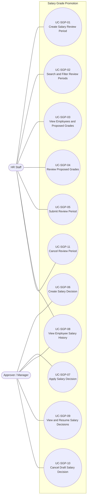
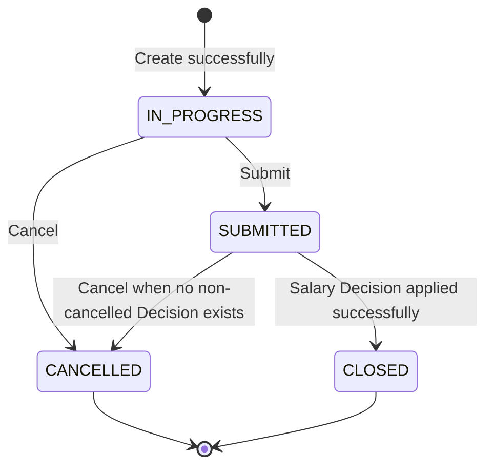
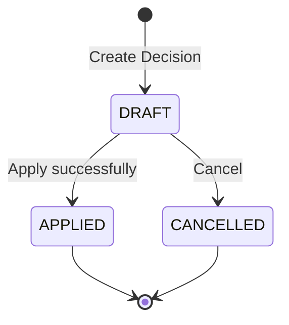

# Use Case Diagram - Salary Grade Promotion

This document provides a high-level view of the actors and their interactions with the **Salary Grade Promotion** module. The use cases are aligned with the requirements defined in `UserStories_SalaryGradePromotion.md`.

The module supports the salary grade promotion process from creating a review period and evaluating proposed grades through creating and applying the final salary decision.

---

## 1. Actors

### HR Staff

HR Staff manages the salary review process before formal approval. The actor can:

* Create salary review periods.
* Search and view existing review periods.
* Review eligible employees and their proposed salary grades.
* Approve or reject proposed grades.
* Submit completed review periods for approval.
* Cancel review periods when permitted.
* View employee salary history.

### Approver / Manager

Approver / Manager handles the formal salary decision after HR Staff submits a review period. The actor can:

* Create a salary decision from a submitted review period.
* View and resume draft salary decisions.
* Apply a salary decision.
* Cancel a draft salary decision.
* View employee salary history.

User accounts, authentication, roles, and permissions are outside the Salary Grade Promotion module and belong to **Identity & Access Management**.

---

## 2. UML Use Case Diagram

---

## 3. Use Case Relationships

No `<<include>>` or `<<extend>>` relationships are required by the current business requirements.

Some use cases depend on the business state produced by earlier use cases. For example:

* A review period must be `SUBMITTED` before a Salary Decision can be created.
* A Salary Decision must be `DRAFT` before it can be applied or cancelled.
* A Review Period becomes `CLOSED` after its Salary Decision is successfully applied.

These are **business-state dependencies**, not mandatory behavioral inclusion or extension relationships. Therefore, they are not modeled using `<<include>>` or `<<extend>>`.

---

## 4. Use Case Descriptions

### UC-SGP-01 — Create Salary Review Period

HR Staff creates a new salary review period by providing the required review information, including its name, type, and review date.

When the period is successfully created, the system determines eligible employees and calculates their proposed salary grades.

An employee is eligible when:

* The employee has been at the current Salary Grade for at least **24 months as of the Review Date**.
* A higher active Salary Grade exists within the employee's current Salary Scale.

The proposed grade is the **first active Salary Grade above the employee's current grade in ascending grade order**. Inactive grades are skipped. If no higher active grade exists, the employee is not eligible.

The resulting employee list, Current Grades, eligibility results, and Proposed Grades are stored as a **snapshot** for the Review Period and are not automatically recalculated when underlying employee or salary master data changes later.

Multiple Review Periods may overlap or have the same Review Date and Type.

A successfully created Review Period enters the `IN_PROGRESS` status.

---

### UC-SGP-02 — Search and Filter Review Periods

HR Staff searches for and filters existing Salary Review Periods using available criteria such as date range, review type, and status.

The system returns Review Periods matching the specified criteria, including periods in `IN_PROGRESS`, `SUBMITTED`, `CANCELLED`, and `CLOSED` status.

This use case does not change Review Period data.

---

### UC-SGP-03 — View Employees and Proposed Grades

HR Staff views the employees captured in a Salary Review Period together with their eligibility results, Current Grades, and Proposed Grades.

The information is based on the snapshot created with the Review Period.

The system does not automatically recalculate a Proposed Grade because an employee's current data or Salary Master Data changes after the Review Period was created.

Employees for whom no higher active Salary Grade exists are not eligible for promotion.

---

### UC-SGP-04 — Review Proposed Grades

While a Review Period is `IN_PROGRESS`, HR Staff reviews each eligible employee's Proposed Grade and records an outcome of:

* `Approved`, or
* `Rejected`.

HR Staff may process employees individually or in bulk.

The Proposed Grade is system-generated and **cannot be manually changed by HR Staff**.

While the Review Period remains `IN_PROGRESS`, HR Staff may change a previously recorded outcome between `Approved` and `Rejected`.

Once the Review Period is `SUBMITTED`, the review outcomes can no longer be changed.

---

### UC-SGP-05 — Submit Review Period

HR Staff submits an `IN_PROGRESS` Salary Review Period after reviewing the eligible employees.

Before submission, every eligible employee who has a Proposed Grade must have an `Approved` or `Rejected` outcome.

Employees who are not eligible do not require a review outcome.

When submission succeeds:

* The Review Period changes from `IN_PROGRESS` to `SUBMITTED`.
* The review outcomes become locked.
* The submitted period becomes available to the Approver / Manager for creation of a Salary Decision.

---

### UC-SGP-06 — Create Salary Decision

Approver / Manager creates a draft Salary Decision from a `SUBMITTED` Review Period.

Only employees whose Proposed Grades were `Approved` by HR Staff can be included in the Salary Decision.

The Approver specifies the Decision Effective Date, which must be **on or after the Review Date**.

Creating the Salary Decision does not immediately change any employee's actual Salary Grade.

At most one **non-cancelled Salary Decision** may exist for a Review Period at a time.

The employee set is selected when the draft Decision is created. Employees may be removed while the Decision remains `DRAFT`, but additional employees cannot be added to the existing draft. If the employee set needs to be expanded, the draft Decision must be cancelled and a new Decision created from the Review Period.

A successfully created Salary Decision enters the `DRAFT` status.

---

### UC-SGP-07 — Apply Salary Decision

Approver / Manager applies a Salary Decision that is currently in `DRAFT` status.

Before applying the Decision, the system validates that each included employee's current Salary Grade still matches the Current Grade captured in the Review Period snapshot and used by the Decision.

If any employee's Current Grade has changed or any included employee cannot be validly updated, the entire operation fails and **no employee Salary Grade is changed**.

The Salary Decision is applied using an **all-or-nothing** rule.

When the operation succeeds:

* Every included employee is updated to the approved Salary Grade.
* The previous Salary Grade information is preserved as salary history.
* The new Salary Grade becomes effective according to the Decision Effective Date.
* The Salary Decision changes from `DRAFT` to `APPLIED`.
* The associated Review Period changes from `SUBMITTED` to `CLOSED`.

An `APPLIED` Salary Decision is terminal and cannot be applied again or cancelled.

---

### UC-SGP-08 — View Employee Salary History

HR Staff or Approver / Manager views an employee's Salary Grade history over time.

The history allows the actor to identify previous and current Salary Grades and the Salary Decision responsible for an applied promotion where applicable.

This use case is read-only and does not change employee salary information.

---

### UC-SGP-09 — View and Resume Salary Decisions

Approver / Manager searches for or views existing Salary Decisions and their current statuses.

A Salary Decision in `DRAFT` status can be reopened so that the Approver can continue working with it before applying or cancelling it.

`APPLIED` and `CANCELLED` decisions remain available for reference but cannot return to `DRAFT`.

---

### UC-SGP-10 — Cancel Draft Salary Decision

Approver / Manager cancels a Salary Decision that is currently in `DRAFT` status.

A successfully cancelled Decision changes from `DRAFT` to `CANCELLED`.

Cancelling the Decision:

* Does not change employee Salary Grades.
* Does not cancel the associated Review Period.
* Leaves the associated Review Period in `SUBMITTED` status.
* Allows another Salary Decision to be created from that Review Period.

Only a `DRAFT` Salary Decision can be cancelled.

`APPLIED` and already `CANCELLED` Salary Decisions cannot be cancelled.

`CANCELLED` is a terminal Salary Decision status.

---

### UC-SGP-11 — Cancel Review Period

HR Staff cancels a Salary Review Period that should no longer continue through the promotion process.

An `IN_PROGRESS` Review Period can be cancelled.

A `SUBMITTED` Review Period can be cancelled only when it has **no non-cancelled Salary Decision** associated with it.

Therefore, if a Draft Salary Decision exists, the Decision must first be cancelled before the submitted Review Period can be cancelled.

When cancellation succeeds:

* The Review Period changes to `CANCELLED`.
* No employee Salary Grade is changed.
* The Review Period remains available as historical information.

`CANCELLED` and `CLOSED` Review Periods are terminal and cannot be cancelled again or returned to an earlier status.

---

## 5. Review Period Lifecycle

A partially created Review Period is not exposed as a separate user-visible `DRAFT` state. Creation and proposal calculation are treated as one complete business operation.

---

## 6. Salary Decision Lifecycle

`APPLIED` and `CANCELLED` are terminal states.

Cancelling a Draft Salary Decision does not change the associated Review Period from `SUBMITTED`. The Review Period may then be used to create another Salary Decision.

---

## 7. Traceability

| Use Case                                     | Related User Story |
| -------------------------------------------- | ------------------ |
| UC-SGP-01 Create Salary Review Period        | US-SGP-01          |
| UC-SGP-02 Search and Filter Review Periods   | US-SGP-02          |
| UC-SGP-03 View Employees and Proposed Grades | US-SGP-03          |
| UC-SGP-04 Review Proposed Grades             | US-SGP-04          |
| UC-SGP-05 Submit Review Period               | US-SGP-05          |
| UC-SGP-06 Create Salary Decision             | US-SGP-06          |
| UC-SGP-07 Apply Salary Decision              | US-SGP-07          |
| UC-SGP-08 View Employee Salary History       | US-SGP-08          |
| UC-SGP-09 View and Resume Salary Decisions   | US-SGP-09          |
| UC-SGP-10 Cancel Draft Salary Decision       | US-SGP-10          |
| UC-SGP-11 Cancel Review Period               | US-SGP-11          |

---

## 8. References

* `UserStories_SalaryGradePromotion.md` — source user stories, acceptance criteria, business rules, and workflow requirements.
* `UserStories_SalaryMasterData.md` — source of Salary Scale, ordered Salary Grades, active/inactive Grade status, and applicable salary coefficients.
* `UserStories_EmployeeProfile.md` — source of employee information required by the salary review process.
