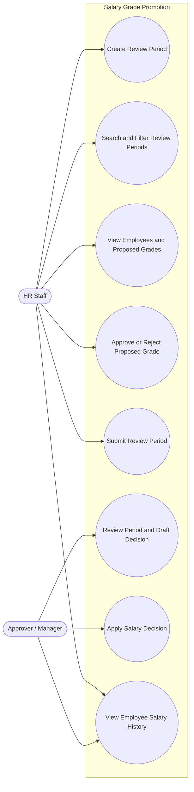

# Use Case Diagram - Salary Grade Promotion

This diagram provides a high-level view of the actors and their interactions with the Salary Grade Promotion feature. The use cases are aligned with the user stories defined in [`UserStories_SalaryGradePromotion.md`](UserStories_SalaryGradePromotion.md).

## Actors

- **HR Staff** – Creates review periods, screens the system's proposed grades for each employee (approves or rejects them), and submits a processed period to the Approver.
- **Approver / Manager** – Reviews a submitted period, drafts a salary decision from the approved employees, and applies the decision to make it official.

## Diagram

## Use Case Descriptions

1. **Create Review Period** – HR Staff creates a new salary review period (name, type, review date).
2. **Search and Filter Review Periods** – HR Staff finds a specific review period by date range, type, or status.
3. **View Employees and Proposed Grades** – HR Staff sees the employees in a review period along with the new grade the system proposed for each of them.
4. **Approve or Reject Proposed Grade** – HR Staff marks each employee's proposed grade as approved or not approved, one at a time or in bulk.
5. **Submit Review Period** – Once every employee in the period has been marked, HR Staff submits the period to the Approver.
6. **Review Period and Draft Decision** – The Approver reviews a submitted period and drafts a salary decision containing the approved employees.
7. **Apply Salary Decision** – The Approver applies a drafted decision, making the new grades official.
8. **View Employee Salary History** – Either actor looks up an employee's salary history over time, including which decision caused each change.
