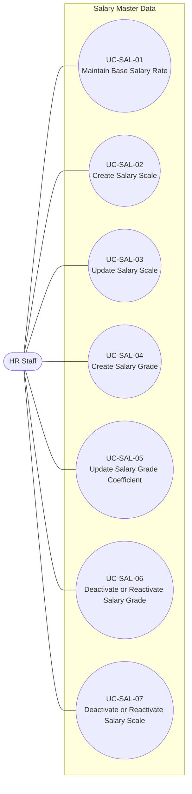

# Use Case Model -- Salary Master Data

## 1. Overview

This document defines the use case model for the **Salary Master Data**
module, based on `UserStories_SalaryMasterData.md` (US-SAL-01 through
US-SAL-07).

The module covers the following user goals:

-   Maintain the organization-wide base salary rate over time.
-   Create and update salary scales (**Ngạch lương**).
-   Create salary grades (**Bậc lương**) within a salary scale and
    maintain their coefficients over time.
-   Deactivate and reactivate salary scales and salary grades.

A **Salary Scale** contains multiple ordered **Salary Grades**. Each
salary grade has a grade number defining its order within the scale and
an effective-dated coefficient used together with the applicable base
salary rate.

The use case diagram follows UML use case notation. The detailed
specifications use a Cockburn-style structure adapted to the size of
this module. The specifications describe business interactions and
expected outcomes without prescribing screen, API, database, or other
implementation design.

------------------------------------------------------------------------

## 2. Actors

### HR Staff

HR Staff is the primary actor for this module and can maintain the base
salary rate, create and update salary scales, create salary grades and
their coefficients, and deactivate or reactivate salary scales and
salary grades.

User accounts, authentication, roles, and permissions are outside the
Salary Master Data module and belong to **Identity & Access
Management**.

------------------------------------------------------------------------

## 3. Business Rules

| ID | Business Rule | Source |
|---|---|---|
| BR-SAL-01 | Only one base salary rate applies across the organization at any given date. | US-SAL-01 |
| BR-SAL-02 | Each base salary rate has an effective date; historical base salary rates are preserved and never overwritten. | US-SAL-01 |
| BR-SAL-03 | A new base salary rate must have an effective date later than the latest recorded effective date; it cannot be inserted between previously recorded effective dates. | US-SAL-01 |
| BR-SAL-04 | The base salary rate must be greater than zero. | US-SAL-01 |
| BR-SAL-05 | Each salary scale has a unique, stable code that cannot be reused by another salary scale. | US-SAL-02 |
| BR-SAL-05A | A newly created salary scale is Active by default. | US-SAL-02 |
| BR-SAL-06 | A salary scale name must be unique. | US-SAL-02, US-SAL-03 |
| BR-SAL-07 | A salary scale code is a stable business identifier and cannot be changed after the scale is created. | US-SAL-03 |
| BR-SAL-08 | Updating a salary scale modifies the existing scale and does not create a new one. | US-SAL-03 |
| BR-SAL-09 | A salary grade belongs to exactly one salary scale and has a grade number, unique within that scale, that defines its ascending order (Grade 1 → Grade 2 → Grade 3 → ...). | US-SAL-04 |
| BR-SAL-09A | A newly created salary grade is Active by default. | US-SAL-04 |
| BR-SAL-10 | A salary grade coefficient must be greater than zero. | US-SAL-04, US-SAL-05 |
| BR-SAL-11 | A new salary grade can only be created under an active salary scale. | US-SAL-04 |
| BR-SAL-12 | The initial coefficient recorded when a salary grade is created is its current coefficient and does not require a separate effective date. Subsequent coefficient changes are effective-dated, and prior coefficient values are preserved as history. | US-SAL-04, US-SAL-05 |
| BR-SAL-13 | For subsequent coefficient changes, each new coefficient requires an effective date later than the latest recorded coefficient-change effective date; it cannot be inserted between previously recorded coefficient-change effective dates. | US-SAL-05 |
| BR-SAL-13A | A new coefficient cannot be recorded while the salary grade is Inactive. | US-SAL-05 |
| BR-SAL-14 | Deactivating a salary grade does not delete it or its historical data. | US-SAL-06 |
| BR-SAL-15 | A salary grade cannot be deactivated while an active employee is currently assigned to it. | US-SAL-06 |
| BR-SAL-16 | A deactivated salary grade cannot be selected for new employee salary assignments. | US-SAL-06 |
| BR-SAL-17 | A deactivated salary grade is skipped when determining the next grade for a salary promotion proposal; the next active grade in ascending grade order is used. | US-SAL-06 |
| BR-SAL-18 | A deactivated salary grade can be reactivated only when its salary scale is Active. | US-SAL-06 |
| BR-SAL-19 | Deactivating a salary scale does not delete the scale, its salary grades, or historical data. | US-SAL-07 |
| BR-SAL-20 | A salary scale cannot be deactivated while it contains any active salary grade. | US-SAL-07 |
| BR-SAL-21 | A deactivated salary scale cannot be used for new salary assignments. | US-SAL-07 |
| BR-SAL-22 | A deactivated salary scale can be reactivated. | US-SAL-07 |

------------------------------------------------------------------------

## 4. UML Use Case Diagram

### Relationships

No `<<include>>` or `<<extend>>` relationships are required by the
current business requirements.

Creating a salary grade depends on its salary scale already existing
and being active (BR-SAL-11), and deactivating a salary scale depends on
its salary grades' status (BR-SAL-20). These are data and business-rule
dependencies between use cases, not a mandatory behavioral inclusion or
extension of one use case by another. Therefore they are not modeled as
`<<include>>` or `<<extend>>`.

------------------------------------------------------------------------

## 5. Traceability Matrix

| Use Case | User Story | Acceptance Criteria | Business Rules |
|---|---|---|---|
| UC-SAL-01 Maintain Base Salary Rate | US-SAL-01 | AC01–AC05 | BR-SAL-01–BR-SAL-04 |
| UC-SAL-02 Create Salary Scale | US-SAL-02 | AC01–AC04 | BR-SAL-05, BR-SAL-05A, BR-SAL-06 |
| UC-SAL-03 Update Salary Scale | US-SAL-03 | AC01–AC03 | BR-SAL-06–BR-SAL-08 |
| UC-SAL-04 Create Salary Grade | US-SAL-04 | AC01–AC06 | BR-SAL-09, BR-SAL-09A, BR-SAL-10, BR-SAL-11, BR-SAL-12 |
| UC-SAL-05 Update Salary Grade Coefficient | US-SAL-05 | AC01–AC06 | BR-SAL-10, BR-SAL-12, BR-SAL-13, BR-SAL-13A |
| UC-SAL-06 Deactivate or Reactivate Salary Grade | US-SAL-06 | AC01–AC06 | BR-SAL-14–BR-SAL-18 |
| UC-SAL-07 Deactivate or Reactivate Salary Scale | US-SAL-07 | AC01–AC03 | BR-SAL-19–BR-SAL-22 |

------------------------------------------------------------------------

## 6. Use Case Specifications

## UC-SAL-01 -- Maintain Base Salary Rate

**Primary Actor:** HR Staff

**Goal:** Record a new organization-wide base salary rate effective from
a specified date, while preserving historical rates.

**Preconditions:** None beyond the actor being permitted to perform this
business function.

**Trigger:** The organization's base salary rate needs to change,
immediately or from a future date.

### Main Success Scenario

1.  HR Staff initiates recording a new base salary rate.
2.  HR Staff provides the new rate and its effective date.
3.  System validates that the rate is greater than zero.
4.  System validates that the effective date is later than the latest
    recorded effective date.
5.  System records the new base salary rate.
6.  System confirms successful recording.

### Extensions

**3a. Rate is zero or negative**
1. System rejects the request.
2. No new rate is recorded.

**4a. Effective date is earlier than or equal to the latest recorded effective date**
1. System rejects the request.
2. The existing base salary rate history remains unchanged.

### Postconditions -- Success

-   A new base salary rate is recorded with the submitted valid rate and
    effective date.
-   The rate applies from its effective date onward.
-   All previously recorded rates remain available as historical data,
    retrievable by the date they were in effect.

**Business Rules:** BR-SAL-01--BR-SAL-04

**Related User Story:** US-SAL-01

------------------------------------------------------------------------

## UC-SAL-02 -- Create Salary Scale

**Primary Actor:** HR Staff

**Goal:** Define a new salary scale to contain an ordered set of salary
grades.

**Preconditions:** None beyond the actor being permitted to perform this
business function.

**Trigger:** A new salary progression structure needs to be defined.

### Main Success Scenario

1.  HR Staff initiates creation of a salary scale.
2.  HR Staff provides the salary scale code and name.
3.  System validates the provided information.
4.  System verifies that the code is unique.
5.  System verifies that the name is unique.
6.  System creates the salary scale.
7.  System confirms successful creation.

### Extensions

**3a. Required information is missing**
1. System identifies the missing required information.
2. The salary scale is not created.

**4a. Duplicate salary scale code**
1. System rejects the request and identifies that the code is already in use.
2. No salary scale is created.

**5a. Duplicate salary scale name**
1. System rejects the request and identifies that the name is already in use.
2. No salary scale is created.

### Postconditions -- Success

-   One new salary scale exists with the submitted valid code and name.
-   No other salary scale uses the same code or the same name.
-   The new salary scale's status is Active.
-   The salary scale is available for salary grade definition while
    active.

**Business Rules:** BR-SAL-05, BR-SAL-05A, BR-SAL-06

**Related User Story:** US-SAL-02

------------------------------------------------------------------------

## UC-SAL-03 -- Update Salary Scale

**Primary Actor:** HR Staff

**Goal:** Update a salary scale's name when it needs correction.

**Preconditions:** The salary scale exists.

**Trigger:** The salary scale's name needs to be corrected or updated.

### Main Success Scenario

1.  HR Staff identifies the salary scale to update.
2.  HR Staff provides the updated name.
3.  System validates the submitted change.
4.  System verifies that the new name remains unique.
5.  System updates the existing salary scale.
6.  System confirms successful update.

### Extensions

**4a. Changed name duplicates an existing salary scale**
1. System rejects the update.
2. The salary scale retains its existing information.

The salary scale code is fixed at creation and is not among the fields
this use case can change (see BR-SAL-07).

### Postconditions -- Success

-   The existing salary scale reflects the valid submitted name change.
-   The salary scale code remains unchanged.
-   The update does not create a new salary scale.

**Business Rules:** BR-SAL-06--BR-SAL-08

**Related User Story:** US-SAL-03

------------------------------------------------------------------------

## UC-SAL-04 -- Create Salary Grade

**Primary Actor:** HR Staff

**Goal:** Add a new ordered salary grade within a salary scale.

**Preconditions:** The salary scale exists.

**Trigger:** A new salary grade needs to be defined within a salary
scale.

### Main Success Scenario

1.  HR Staff identifies the salary scale to add a grade to.
2.  HR Staff provides the grade number and its initial coefficient.
3.  System validates the provided information.
4.  System verifies that the salary scale is active.
5.  System verifies that the grade number is not already used within
    that salary scale.
6.  System verifies that the coefficient is greater than zero.
7.  System creates the salary grade within the salary scale, positioned
    by its grade number.
8.  System confirms successful creation.

### Extensions

**3a. Required information is missing**
1. System identifies the missing required information.
2. The salary grade is not created.

**4a. Salary scale is inactive**
1. System rejects the request.
2. No salary grade is created.

**5a. Duplicate grade number within the same scale**
1. System rejects the request and identifies that the grade number is already in use within that scale.
2. No salary grade is created.

**6a. Coefficient is zero or negative**
1. System rejects the request.
2. No salary grade is created.

### Postconditions -- Success

-   One new salary grade exists within the specified salary scale,
    positioned by its grade number.
-   No other grade within the same scale uses the same grade number.
-   The new salary grade's status is Active.
-   The grade's initial coefficient is greater than zero and recorded as
    its currently effective coefficient, without a separate effective
    date.

**Business Rules:** BR-SAL-09, BR-SAL-09A, BR-SAL-10, BR-SAL-11, BR-SAL-12

**Related User Story:** US-SAL-04

------------------------------------------------------------------------

## UC-SAL-05 -- Update Salary Grade Coefficient

**Primary Actor:** HR Staff

**Goal:** Record a new coefficient for a salary grade effective from a
specified date, while preserving historical coefficient values.

**Preconditions:** The salary grade exists.

**Trigger:** The salary grade's coefficient policy needs to change,
immediately or from a future date.

### Main Success Scenario

1.  HR Staff identifies the salary grade to update.
2.  HR Staff provides the new coefficient and its effective date.
3.  System verifies that the salary grade is active.
4.  System validates that the coefficient is greater than zero.
5.  System validates that the effective date is later than the latest
    recorded effective date for that grade.
6.  System records the new coefficient.
7.  System confirms successful recording.

### Extensions

**3a. Salary grade is inactive**
1. System rejects the request.
2. No new coefficient is recorded.

**4a. Coefficient is zero or negative**
1. System rejects the request.
2. No new coefficient is recorded.

**5a. Effective date is earlier than or equal to the latest recorded effective date**
1. System rejects the request.
2. The existing coefficient history for that grade remains unchanged.

### Postconditions -- Success

-   A new coefficient is recorded for the salary grade with the
    submitted valid value and effective date.
-   The coefficient applies from its effective date onward.
-   All previously recorded coefficients for that grade remain available
    as historical data, retrievable by the date they were in effect.

**Business Rules:** BR-SAL-10, BR-SAL-12, BR-SAL-13, BR-SAL-13A

**Related User Story:** US-SAL-05

------------------------------------------------------------------------

## UC-SAL-06 -- Deactivate or Reactivate Salary Grade

**Primary Actor:** HR Staff

**Goal:** Mark a salary grade as no longer in current use, or restore a
previously deactivated grade, without losing historical data.

**Preconditions:** The salary grade exists.

**Trigger:** A salary grade is no longer in current use, or a previously
deactivated grade needs to be brought back into use.

### Main Success Scenario

1.  HR Staff identifies the salary grade and specifies whether to
    deactivate or reactivate it.
2.  System validates the requested status change against the applicable
    business rules.
3.  System updates the grade's status.
4.  System confirms the status change.

### Extensions

**2a. Deactivation requested and an active employee is currently assigned to the grade**
1. System rejects the request and identifies that the active employee assignment must be handled first.
2. The salary grade remains active.

**2b. Reactivation requested and the grade's salary scale is inactive**
1. System rejects the request and identifies that the salary scale must be reactivated first.
2. The salary grade remains inactive.

**2c. Valid deactivation requested**
1. Continue at step 3.

**2d. Valid reactivation requested**
1. Continue at step 3.

### Postconditions -- Success

-   The grade's status reflects the valid requested change.
-   A deactivated grade is unavailable for new employee salary
    assignments and is skipped, in ascending grade order, when
    determining the next grade for a salary promotion proposal.
-   A reactivated grade has an active salary scale and becomes available
    for use again, subject to the applicable business rules.

**Business Rules:** BR-SAL-14--BR-SAL-18

**Related User Story:** US-SAL-06

------------------------------------------------------------------------

## UC-SAL-07 -- Deactivate or Reactivate Salary Scale

**Primary Actor:** HR Staff

**Goal:** Mark a salary scale as no longer in current use, or restore a
previously deactivated scale, without losing its structure or
historical data.

**Preconditions:** The salary scale exists.

**Trigger:** A salary scale is no longer in current use, or a previously
deactivated scale needs to be brought back into use.

### Main Success Scenario

1.  HR Staff identifies the salary scale and specifies whether to
    deactivate or reactivate it.
2.  System validates the requested status change against the applicable
    business rules.
3.  System updates the scale's status.
4.  System confirms the status change.

### Extensions

**2a. Deactivation requested and the scale contains one or more active salary grades**
1. System rejects the request and identifies that active salary grades must be handled first.
2. The salary scale remains active.

**2b. Valid deactivation requested**
1. Continue at step 3.

**2c. Valid reactivation requested**
1. Continue at step 3.

### Postconditions -- Success

-   The scale's status reflects the valid requested change.
-   A deactivated scale, its grades, and its historical data remain
    intact but are unavailable for new salary assignments.
-   A reactivated scale becomes available for use again, subject to the
    applicable business rules.

**Business Rules:** BR-SAL-19--BR-SAL-22

**Related User Story:** US-SAL-07

------------------------------------------------------------------------

## 7. Open Issues

No open issues have been identified for this module at this stage.

------------------------------------------------------------------------

## 8. References

-   `UserStories_SalaryMasterData.md` -- source user stories, business
    rules, and acceptance criteria.
-   `UserStories_SalaryGradePromotion.md` -- consumer of salary scale,
    ordered salary grades, active/inactive status, and applicable
    coefficients when determining and recording salary promotion
    outcomes.
-   `UserStories_EmployeeProfile.md` -- consumer of the applicable
    salary scale and salary grade as part of an employee's current
    salary information where required by the agreed scope.
