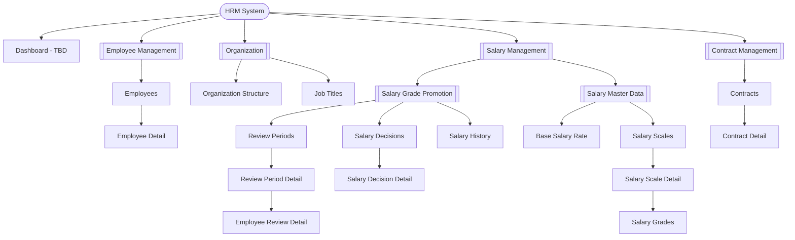

# Information Architecture - HRM System

> **Status:** Current · **Owner:** Sang2197 · **Last Reviewed:** 2026-09-18 · **Implementation Baseline Commit:** `77e5716`

This document defines the page-level information architecture and sitemap of the HRM system based on the modules currently specified in `Docs/Requirements/`.

The current scope covers:

* **Employee Management**
* **Organization Management**
* **Salary Management**

  * Salary Grade Promotion
  * Salary Master Data

* **Contract Management**

**Identity & Access Management (IAM)** is recognized as a separate HRM module but is not included in the current sitemap because its user stories, use cases, and UI requirements have not yet been specified.

This document focuses on **page-level information organization and hierarchy**. It does not define detailed screen behavior, dialogs, confirmation flows, UI states, or task navigation. Those concerns are handled separately in each module's Screens Hierarchy and subsequent UI/UX specifications.

---

## 1. Information Architecture Principles

The information architecture is organized using the following principles:

* **Organization** — pages are grouped according to their business domain and information relationships.
* **Hierarchy** — parent-child relationships reflect how users understand and access related business information.
* **Labeling** — page and navigation labels use consistent business terminology from the requirements.
* **Navigation** — major business objects have clear and predictable locations within the system.
* **Findability** — frequently accessed business objects are represented by appropriate landing pages.
* **Task Alignment** — the architecture provides locations for the information required to support the defined use cases without mapping every use case to a separate page.
* **Consistency** — the same business concept is represented consistently across modules.
* **Scalability** — the structure allows future HRM capabilities to be added without reorganizing unrelated modules.

---

## 2. Sitemap



---

## 3. Page Hierarchy

### HRM System

#### Dashboard

The Dashboard is retained as a **TBD placeholder** for future global HRM navigation.

No Dashboard-specific user stories or use cases have been defined in the current requirements, so its content and functionality are outside the current specified scope.

---

### Employee Management

#### Employees

Landing page for employee profiles.

Supports access to the employee collection, including searching and filtering employees. Employee creation may be initiated from this location, but whether creation uses a modal, dialog, drawer, or separate screen is defined later in the Employee Management Screens Hierarchy.

##### Employee Detail

Displays an individual employee profile and provides access to operations applicable to that employee.

Update and employment-status actions belong to the employee context but do not require separate IA nodes unless later screen design determines that they need independent page locations.

---

### Organization

#### Organization Structure

Represents the hierarchical structure of Organizational Units.

Organizational Units are managed within this organizational structure rather than through a separate top-level page for each unit.

Create, update, move, deactivate, and reactivate operations are screen-level interactions and therefore are not represented as separate IA nodes.

#### Job Titles

Represents the organization-wide Job Title catalog.

Job Titles are independent of individual Organizational Units in the current domain model.

Create, update, deactivate, and reactivate operations are handled within the Job Titles screen structure rather than represented as separate IA nodes.

---

### Salary Management

Salary Management contains the two currently specified salary-related capabilities:

* **Salary Grade Promotion**
* **Salary Master Data**

Keeping both under Salary Management preserves the domain boundary defined by the requirements while separating transactional promotion workflows from salary reference data.

#### Salary Grade Promotion

##### Review Periods

Landing page for Salary Review Periods.

Provides access to existing Review Periods and the entry point for creating a new Review Period.

###### Review Period Detail

Represents a specific Salary Review Period and its review workflow.

It provides the context for reviewing eligible employees, recording review outcomes, submitting the period, and performing other actions allowed by the Review Period's current state.

###### Employee Review Detail

Provides detailed review information for an employee within a specific Review Period.

It is represented as a dedicated page-level information location because reviewing an employee requires a distinct context for examining the employee's current Salary Grade, Proposed Grade, eligibility information, review outcome, and related salary information within the selected Review Period.

##### Salary Decisions

Landing page for Salary Decisions.

Provides access to existing Salary Decisions and allows the Approver / Manager to locate and resume Draft Decisions.

###### Salary Decision Detail

Represents a specific Salary Decision regardless of its lifecycle state.

The same information location may support different behavior depending on status:

* `DRAFT` — editable and may be applied or cancelled.
* `APPLIED` — read-only terminal state.
* `CANCELLED` — read-only terminal state.

Creation, editing, application, and cancellation are actions or states of a Salary Decision rather than separate IA pages.

##### Salary History

Provides access to employee Salary Grade history.

Detailed navigation from employee reviews, Salary Decisions, or other related screens is defined in Screens Hierarchy or Navigation Flow documentation rather than in this sitemap.

---

#### Salary Master Data

##### Base Salary Rate

Provides access to the company's Base Salary Rate records and their effective-dated history.

Adding a new Base Salary Rate is an operation within this information area and does not require a separate IA page.

##### Salary Scales

Landing page for Salary Scales.

Provides access to the collection of Salary Scales and the entry point for creating a new Salary Scale.

###### Salary Scale Detail

Represents a specific Salary Scale and provides the context for maintaining the scale and its Salary Grades.

###### Salary Grades

Salary Grades belong to a specific Salary Scale and are therefore organized within Salary Scale Detail rather than exposed as an independent top-level catalog.

Creating, updating, deactivating, and reactivating Salary Grades are interactions within this context and do not require separate IA pages.

---

### Contract Management

#### Contracts

Landing page for labor contracts.

Supports access to the contract collection, including searching and filtering contracts across all statuses. It is the primary starting point for HR Staff's contract work. Contract creation may be initiated from this location, but whether creation uses a modal, dialog, drawer, or separate screen is defined later in the Contract Management Screens Hierarchy.

The list of contracts expiring soon (US-CON-05) is an information view over the same contract collection, so it does not require a separate IA node. Whether it is presented as a quick filter on this page or as a dashboard view is defined later; the Dashboard itself remains a TBD placeholder.

##### Contract Detail

Displays an individual contract together with the currently recorded information of its employee, and provides access to operations applicable to that contract.

Contextual navigation from Contract Detail to the related Employee Detail is not drawn in the sitemap; it is defined in [`ScreensHierarchy_ContractManagement.md`](ScreensHierarchy_ContractManagement.md).

The applicable operations depend on the contract's status:

* `DRAFT` — may be corrected, deleted, or activated.
* `ACTIVE` — read-only; may be marked as Expired or terminated.
* `EXPIRED` — read-only terminal state.
* `TERMINATED` — read-only terminal state, including its termination date and reason.

Creating, updating, deleting, and changing the status of a contract are actions or states of a contract rather than separate IA pages.

---

## 4. Page List

| Page / Information Location | Type           | Domain                  | Parent                 | Current Design Status         |
| ---------------------------- | -------------- | ----------------------- | ---------------------- | ------------------------------ |
| Dashboard                   | Page           | HRM                     | HRM System             | TBD — no current requirements |
| Employees                   | Page           | Employee Management     | Employee Management    | Designed (image)              |
| Employee Detail             | Page           | Employee Management     | Employees              | Wireframe specified             |
| Organization Structure      | Page           | Organization Management | Organization           | Designed (image)              |
| Job Titles                  | Page           | Organization Management | Organization           | Wireframe specified             |
| Review Periods              | Page           | Salary Grade Promotion  | Salary Grade Promotion | Designed (image)              |
| Review Period Detail        | Page           | Salary Grade Promotion  | Review Periods         | Designed (image)              |
| Employee Review Detail      | Page           | Salary Grade Promotion  | Review Period Detail   | Designed (image)              |
| Salary Decisions            | Page           | Salary Grade Promotion  | Salary Grade Promotion | Designed (image)              |
| Salary Decision Detail      | Page           | Salary Grade Promotion  | Salary Decisions       | Designed (image)              |
| Salary History              | Page           | Salary Grade Promotion  | Salary Grade Promotion | Designed (image)              |
| Base Salary Rate            | Page           | Salary Master Data      | Salary Master Data     | Wireframe specified             |
| Salary Scales               | Page           | Salary Master Data      | Salary Master Data     | Wireframe specified             |
| Salary Scale Detail         | Page           | Salary Master Data      | Salary Scales          | Wireframe specified             |
| Salary Grades               | Nested Section | Salary Master Data      | Salary Scale Detail    | Wireframe specified             |
| Contracts                   | Page           | Contract Management     | Contract Management    | Designed (image)              |
| Contract Detail             | Page           | Contract Management     | Contracts              | Designed (image)              |

---

## 5. Navigation and Page-Level Actions

This sitemap represents **information locations and their hierarchy**, not every possible navigation path or user action.

Actions such as:

* Create Employee
* Update Employee
* Change Employment Status
* Create or Move Organizational Unit
* Create or Update Job Title
* Create Review Period
* Review Proposed Grade
* Submit or Cancel Review Period
* Create Salary Decision
* Apply or Cancel Salary Decision
* Add Base Salary Rate
* Create or Update Salary Scale
* Create or Update Salary Grade
* Create Contract
* Update or Delete Draft Contract
* Update Contract Status (activate, mark as Expired, terminate)

do not automatically require separate IA nodes.

Whether an action is implemented using a modal, dialog, drawer, dedicated screen, or interaction within an existing page is determined during **Screens Hierarchy and detailed UI/UX design**.

Similarly, task-oriented navigation such as:

```text
Review Period Detail
    → Create Salary Decision
    → Salary Decision Detail
```

or:

```text
Employee Review Detail
    → View Salary History
    → Salary History
```

belongs to Screens Hierarchy / Navigation Flow documentation rather than the core sitemap.

---

## 6. Cross-Module References

The HRM modules reference data owned by other modules.

Examples include:

* Employee Profile references an Organizational Unit and Job Title.
* Salary Grade Promotion references employee information.
* Salary Grade Promotion references Salary Scales and Salary Grades.
* Salary History is associated with individual employees.
* Contract Management references an employee: a contract belongs to one employee, and Contract Detail shows that employee's currently recorded information. Employee data remains owned by Employee Management and is not modified by Contract Management. Contextual navigation from Contract Detail to the related Employee Detail is not drawn in the sitemap, because a data reference alone does not create a page-to-page relationship; it is defined in [`ScreensHierarchy_ContractManagement.md`](ScreensHierarchy_ContractManagement.md).

These data relationships do not automatically imply navigation relationships.

Cross-module navigation should be introduced only when it supports a confirmed user task or navigation need. A data reference alone is not sufficient reason to create a page-to-page navigation relationship in the IA.

---

## 7. Scope Notes

* **Employee Management** owns Employee Profile information and employee-related profile operations.
* **Organization Management** owns Organizational Units and the organization-wide Job Title catalog.
* **Salary Management** contains both Salary Grade Promotion and Salary Master Data.
* **Salary Master Data** owns Base Salary Rate, Salary Scales, and Salary Grades.
* **Salary Grade Promotion** owns Review Periods, review outcomes, Salary Decisions, and promotion workflow information.
* **Contract Management** owns labor contracts and their lifecycle (Draft, Active, Expired, Terminated). It reads employee information from Employee Management but does not change it.
* **IAM** remains a separate HRM module but is outside the current IA scope until its requirements are specified.
* Authentication, authorization, roles, and permissions should not be modeled as Employee Management functionality.

---

## 8. References

### Employee Management

* `Docs/Requirements/UserStories_EmployeeProfile.md`
* `Docs/Requirements/UseCase_EmployeeProfile.md`

### Organization Management

* `Docs/Requirements/UserStories_OrganizationManagement.md`
* `Docs/Requirements/UseCase_OrganizationManagement.md`

### Salary Management — Salary Grade Promotion

* `Docs/Requirements/UserStories_SalaryGradePromotion.md`
* `Docs/Requirements/UseCase_SalaryGradePromotion.md`

### Salary Management — Salary Master Data

* `Docs/Requirements/UserStories_SalaryMasterData.md`
* `Docs/Requirements/UseCase_SalaryMasterData.md`

### Contract Management

* `Docs/Requirements/UserStories_ContractManagement.md`
* `Docs/Requirements/UseCase_ContractManagement.md`
