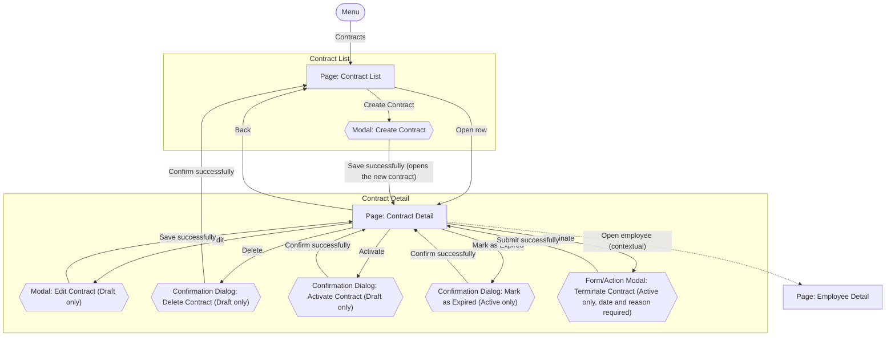

# Screens Hierarchy - Contract Management

This document expands the Contract Management portion of the [Information Architecture](InformationArchitecture_HRM.md) sitemap into every individual screen state a user will actually encounter — including modals and confirmation dialogs that a page-level sitemap does not show. Each transition is labeled with the user action that triggers it, so this becomes the direct blueprint for the wireframe and visual design that follow. It is derived from `UseCase_ContractManagement.md` (UC-CON-01 through UC-CON-06).

Four kinds of nodes:
- **Page** — a full navigable screen with its own URL/location.
- **Modal** — a transient overlay on top of a page that hosts the full contract form (Create Contract, Edit Contract); closing it returns to that same page.
- **Form/Action Modal** — a transient overlay on top of a page that collects the input for a single status action (Terminate Contract); closing it returns to that same page.
- **Confirmation Dialog** — a transient overlay on top of a page that only asks the user to confirm an action, with no input; closing it returns to that same page.

## Hierarchy Diagram

`Employee Detail` belongs to the Employee Profile module and is defined in [`ScreensHierarchy_EmployeeProfile.md`](ScreensHierarchy_EmployeeProfile.md); it is shown here only as the target of a contextual link.

## Screen Inventory

| Screen | Type | Parent | Reached by |
|---|---|---|---|
| Contract List | Page | Menu | Menu: "Contracts" |
| Create Contract | Modal | Contract List | "Create Contract" |
| Contract Detail | Page | Contract List | "Open row"; also after "Create Contract" succeeds |
| Edit Contract | Modal | Contract Detail | "Edit" (Draft only) |
| Delete Contract | Confirmation Dialog | Contract Detail | "Delete" (Draft only) |
| Activate Contract | Confirmation Dialog | Contract Detail | "Activate" (Draft only) |
| Mark as Expired | Confirmation Dialog | Contract Detail | "Mark as Expired" (Active only) |
| Terminate Contract | Form/Action Modal | Contract Detail | "Terminate" (Active only) |
| Employee Detail | Page *(Employee Profile)* | Contract Detail *(contextual link)* | "Open employee" |

## Notes

- After a successful action, a Modal, Form/Action Modal, or Confirmation Dialog returns to the page it was opened from, with two exceptions: after **Create Contract** succeeds, the user goes to the Contract Detail of the newly created contract (UC-CON-01); after **Delete Contract** succeeds, the contract no longer exists, so the user returns to Contract List (UC-CON-06).
- Validation or business-rule failures keep the user in the current Modal, Form/Action Modal, or Confirmation Dialog and display the applicable feedback. They do not create separate screen nodes in this hierarchy.
- **Action availability and validation.** The business conditions of an action (for example BR-CON-09 for creating a contract as Active, BR-CON-18 for activation, BR-CON-19 for expiry, and BR-CON-28 for editing or deleting) may be used by the UI to disable or hide the action, or to guide the user before submission. They are never the only check: the backend always revalidates every condition when the request is submitted, and a rejected request is shown as feedback in the modal or dialog. The wireframe of each screen is in [`Wireframe_ContractManagement.md`](Wireframe_ContractManagement.md).
- **Confirming the target.** Every Confirmation Dialog and Form/Action Modal that acts on an existing contract (Delete, Activate, Mark as Expired, Terminate) displays the Contract Number so HR Staff can confirm the correct contract before proceeding, and may also display the employee (Employee Code and Full Name).
- **Contract Detail available actions depend on the contract status**, not on the navigation path:
  - `DRAFT` — Edit, Delete, Activate.
  - `ACTIVE` — Mark as Expired, Terminate.
  - `EXPIRED` and `TERMINATED` — read-only; no actions. A terminated contract also shows its termination date and reason (UC-CON-03).
- All status changes are performed from Contract Detail. Contract List has no row actions in this hierarchy.
- **Contract List is HR Staff's main working screen.** Search (by employee or contract number) and filters (contract type, status, time period) happen directly on it; there is no separate search-results page (UC-CON-02).
- **Expiring soon (UC-CON-05) is a quick filter on Contract List**, not a separate page. It offers a 30-day or 60-day window (default 30 days), can be combined with the search and the other filters (all criteria are applied together, US-CON-05), and also shows overdue contracts, identified as overdue. Contract Detail identifies an overdue contract the same way, so HR Staff can open it and mark it as Expired.
- **Create Contract** lets HR Staff select the employee and choose the initial status (Draft or Active); the employee must not be Terminated (BR-CON-07). Choosing Active is rejected in the modal on submission when the start date is later than today or the employee already has another Active contract (BR-CON-09).
- **Edit Contract** shows the employee as read-only: the employee of a Draft contract cannot be changed (BR-CON-29). If the wrong employee was selected, the user deletes the Draft contract and creates a new one.
- **Activate Contract** and **Mark as Expired** (like **Delete Contract**) are Confirmation Dialogs: they collect no input. Their conditions (BR-CON-18, BR-CON-19) are revalidated by the backend when the user confirms, and a failure is shown in the dialog. **Terminate Contract** is a Form/Action Modal because it collects the required termination date and termination reason (BR-CON-21, BR-CON-22), which the backend validates on submission.
- **Contextual navigation to Employee Detail.** Contract Detail offers an "Open employee" link to the related employee's Employee Detail, so HR Staff can review the full employee profile while looking at a contract. This is navigation only: employee data remains owned by Employee Management, and the link does not change either record. The behavior of Employee Detail is unchanged from `ScreensHierarchy_EmployeeProfile.md`; how the user returns to Contract Detail is a UI/UX detail. No navigation from Employee Detail to contracts is defined, because no requirement confirms it.
- Use case coverage: UC-CON-01 → Create Contract; UC-CON-02 and UC-CON-05 → Contract List; UC-CON-03 → Contract Detail; UC-CON-04 → Activate Contract, Mark as Expired, Terminate Contract; UC-CON-06 → Edit Contract, Delete Contract.
