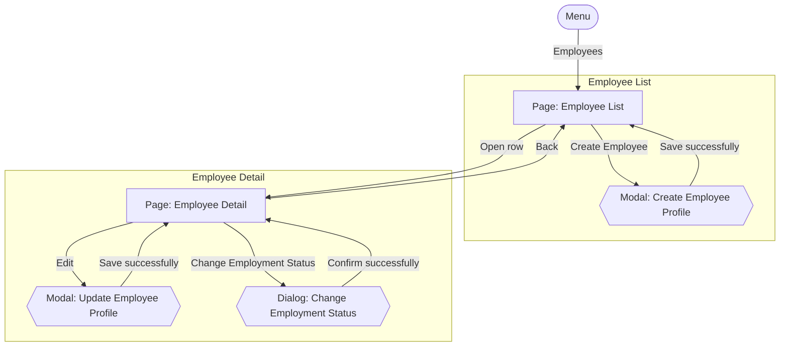

# Screens Hierarchy - Employee Profile

This document expands the Employee Management portion of the [Information Architecture](InformationArchitecture_HRM.md) sitemap into every individual screen state a user will actually encounter — including modals and confirmation dialogs that a page-level sitemap does not show. Each transition is labeled with the user action that triggers it, so this becomes the direct blueprint for the visual design that follows. It is derived from `UseCase_EmployeeProfile.md` (UC-EMP-01 through UC-EMP-05).

Two kinds of nodes:
- **Page** — a full navigable screen with its own URL/location.
- **Modal / Dialog** — a transient overlay on top of a page; closing it returns to that same page.

## Hierarchy Diagram

## Screen Inventory

| Screen | Type | Parent | Reached by |
|---|---|---|---|
| Employee List | Page | Menu | Menu: "Employees" |
| Create Employee Profile | Modal | Employee List | "Create Employee" |
| Employee Detail | Page | Employee List | "Open row" |
| Update Employee Profile | Modal | Employee Detail | "Edit" |
| Change Employment Status | Dialog | Employee Detail | "Change Employment Status" |

## Notes

- Every dialog/modal returns the user to the exact page it was opened from — none of them navigate elsewhere.
- "Create Employee Profile" and "Update Employee Profile" both operate on an employee profile, per UC-EMP-01 and UC-EMP-04 respectively; in both, the selected Organizational Unit and job title must be Active (BR-EMP-04, BR-EMP-05).
- "Change Employment Status" offers the three confirmed employment statuses — Active, On Leave, and Terminated (BR-EMP-10). Whether Terminated → Active is a valid transition remains open (`OQ-EMP-01` in `UserStories_EmployeeProfile.md`) and is not assumed here.
- When a modal or dialog's submission fails validation or a business rule, it stays open and shows the error — no separate screen is created for a failure state.
- Search and filter (UC-EMP-02) happen directly on Employee List; there is no separate search-results page.
