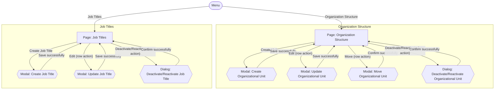

# Screens Hierarchy - Organization Management

This document expands the Organization portion of the [Information Architecture](InformationArchitecture_HRM.md) into the pages, modals, dialogs, and key transitions required by the module. It is derived from `UseCase_OrganizationManagement.md` (UC-ORG-01 through UC-ORG-08).

Two kinds of nodes:
- **Page** — a full navigable screen with its own URL/location.
- **Modal / Dialog** — a transient overlay on top of a page.

## Hierarchy Diagram

## Screen Inventory

| Screen | Type | Parent | Reached by |
|---|---|---|---|
| Organization Structure | Page | Menu | Menu: "Organization Structure" |
| Create Organizational Unit | Modal | Organization Structure | "Create Unit" |
| Update Organizational Unit | Modal | Organization Structure | "Edit" (row action) |
| Move Organizational Unit | Modal | Organization Structure | "Move" (row action) |
| Deactivate/Reactivate Organizational Unit | Dialog | Organization Structure | "Deactivate/Reactivate" (row action) |
| Job Titles | Page | Menu | Menu: "Job Titles" |
| Create Job Title | Modal | Job Titles | "Create Job Title" |
| Update Job Title | Modal | Job Titles | "Edit" (row action) |
| Deactivate/Reactivate Job Title | Dialog | Job Titles | "Deactivate/Reactivate" (row action) |

## Notes

- After a successful action, the user returns to the page from which the modal or dialog was opened.
- Validation or business-rule failures keep the user in the current modal or dialog and display the applicable feedback. They do not create separate screen nodes in this hierarchy.
- Organizational Units are managed directly within the Organization Structure page. No separate Organizational Unit Detail page is defined in the current hierarchy.
- "Move Organizational Unit" only offers active units as a target parent, never the unit's own subtree, and never the top level for a unit that currently has a parent (BR-ORG-04, BR-ORG-07, BR-ORG-09).
- "Deactivate/Reactivate Organizational Unit" blocks deactivation while the unit has active children or active employees (BR-ORG-10, BR-ORG-11), and blocks reactivation while the unit's parent is inactive (BR-ORG-14).

## Scope Decision — Job Titles Search/Filter

`UserStories_OrganizationManagement.md` and `UseCase_OrganizationManagement.md` do not define a separate view/search Job Titles use case. US-ORG-06/07/08 cover create, update, and deactivate/reactivate operations.

Job Titles is kept as a **catalog-access page** supporting these maintenance operations. Search and filtering are not included because they are not currently defined by the requirements.

If search or filtering is required later, it should first be introduced at the requirements level rather than added directly during UI design.
