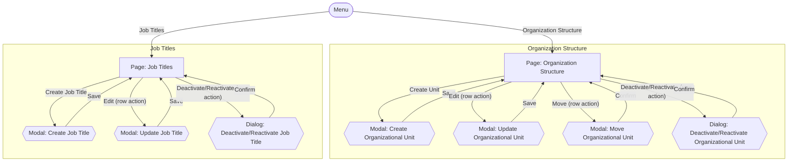

# Screens Hierarchy - Organization Management

This document expands the Organization portion of the [Information Architecture](InformationArchitecture_HRM.md) sitemap into every individual screen state a user will actually encounter — including modals and confirmation dialogs that a page-level sitemap does not show. Each transition is labeled with the user action that triggers it, so this becomes the direct blueprint for the visual design that follows. It is derived from `UseCase_OrganizationManagement.md` (UC-ORG-01 through UC-ORG-08).

Two kinds of nodes:
- **Page** — a full navigable screen with its own URL/location.
- **Modal / Dialog** — a transient overlay on top of a page; closing it returns to that same page.

## Hierarchy Diagram

## Screen Inventory

| Screen | Type | Parent | Reached by |
|---|---|---|---|
| Organization Structure | Page | Menu | Menu: "Organization Structure" |
| Create Organizational Unit | Modal | Organization Structure | "Create Unit" |
| Update Organizational Unit | Modal | Organization Structure | "Edit" (row action) |
| Move Organizational Unit | Modal | Organization Structure | "Move" (row action) |
| Deactivate/Reactivate Organizational Unit | Dialog | Organization Structure | "Deactivate/Reactivate" (row action) |
| Job Titles | Page | Menu | Menu: "Job Titles" |
| Create Job Title | Modal | Job Titles | "Create Job Title" |
| Update Job Title | Modal | Job Titles | "Edit" (row action) |
| Deactivate/Reactivate Job Title | Dialog | Job Titles | "Deactivate/Reactivate" (row action) |

## Notes

- Every dialog/modal returns the user to the exact page it was opened from — none of them navigate elsewhere.
- Unlike Salary Grade Promotion's Review Periods, no organizational unit has a dedicated Detail page: the tree on Organization Structure, together with row actions and their modals/dialogs, is the entire interaction surface (consistent with the Information Architecture, which explicitly does not give individual units their own page).
- "Move Organizational Unit" only offers active units as a target parent, never the unit's own subtree, and never the top level for a unit that currently has a parent (BR-ORG-04, BR-ORG-07, BR-ORG-09).
- "Deactivate/Reactivate Organizational Unit" blocks deactivation while the unit has active children or active employees (BR-ORG-10, BR-ORG-11), and blocks reactivation while the unit's parent is inactive (BR-ORG-14).

## Scope Decision — Job Titles Search/Filter

`UserStories_OrganizationManagement.md` / `UseCase_OrganizationManagement.md` do not define a "view/search Job Titles" use case — US-ORG-06/07/08 only cover create, update, and deactivate/reactivate. Job Titles is kept in the IA and this hierarchy as a **catalog-access page** serving those maintenance use cases: an always-visible list, with no search or filter, since none is a confirmed requirement.

This is a deliberate scope decision, not a gap: if the job title catalog later grows large enough that search/filter becomes necessary, that should be introduced as a new requirement (a new user story/AC) first, rather than added directly at the UI layer.
