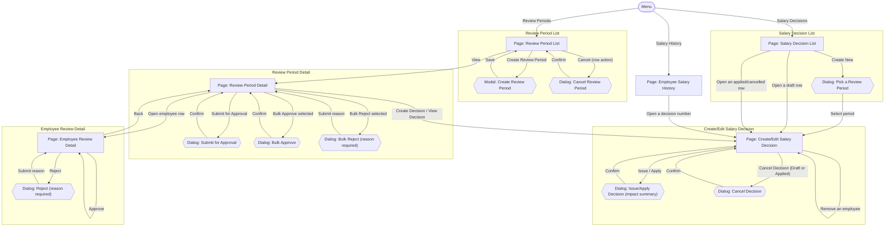

# Screens Hierarchy - Salary Grade Promotion

This document expands the [Information Architecture](InformationArchitecture_SalaryGradePromotion.md) sitemap into every individual screen state a user will actually encounter — including modals, confirmation dialogs, and read-only variants that a page-level sitemap does not show. Each transition is labeled with the user action that triggers it, so this becomes the direct blueprint for the visual design that follows.

Two kinds of nodes:
- **Page** — a full navigable screen with its own URL/location.
- **Modal / Dialog** — a transient overlay on top of a page; closing it returns to that same page.

## Hierarchy Diagram

## Screen Inventory

| Screen | Type | Parent | Reached by |
|---|---|---|---|
| Review Period List | Page | Menu | Menu: "Review Periods" |
| Create Review Period | Modal | Review Period List | "Create Review Period" |
| Cancel Review Period | Dialog | Review Period List | Row action "Cancel" |
| Review Period Detail | Page | Review Period List | "View" |
| Submit for Approval | Dialog | Review Period Detail | "Submit for Approval" |
| Bulk Approve | Dialog | Review Period Detail | "Bulk Approve selected" |
| Bulk Reject | Dialog | Review Period Detail | "Bulk Reject selected" |
| Employee Review Detail | Page | Review Period Detail | "Open employee row" |
| Reject (employee) | Dialog | Employee Review Detail | "Reject" |
| Salary Decision List | Page | Menu | Menu: "Salary Decisions" |
| Pick a Review Period | Dialog | Salary Decision List | "Create New" |
| Create/Edit Salary Decision | Page | Salary Decision List *(also reachable from Review Period Detail and Employee Salary History)* | "Create New" (after picking a period), "Open a draft/applied/cancelled row", "Create/View Decision", "Open a decision number" |
| Issue/Apply Decision | Dialog | Create/Edit Salary Decision | "Issue / Apply" |
| Cancel Decision | Dialog | Create/Edit Salary Decision | "Cancel Decision" (available while Draft or Applied) |
| Employee Salary History | Page | Menu | Menu: "Salary History" |

## Notes

- Every dialog returns the user to the exact page it was opened from — none of them navigate elsewhere.
- "Create/Edit Salary Decision" is the only page reachable from more than one parent; it behaves differently depending on how it was reached (a fresh draft, a resumed draft, or a read-only view of something already decided), but it is still one screen, not three.
- "Employee Review Detail" and "Review Period Detail" link back and forth to each other rather than only going one direction.
