# Screens Hierarchy - Salary Grade Promotion

This document expands the Salary Grade Promotion portion of the [Information Architecture](InformationArchitecture_HRM.md) into the pages, modals, dialogs, and key transitions required by the module. Each transition is labeled with the user action that triggers it.

Two kinds of nodes:
- **Page** — a full navigable screen with its own URL/location.
- **Modal / Dialog** — a transient overlay associated with a page.

## Hierarchy Diagram

```mermaid
flowchart TD
    Menu([Menu])

    Menu -- "Review Periods" --> RPL[Page: Review Period List]
    Menu -- "Salary Decisions" --> SDL[Page: Salary Decision List]
    Menu -- "Salary History" --> ESH[Page: Employee Salary History]

    subgraph G1["Review Period List"]
        RPL
        M_CreatePeriod{{"Modal: Create Review Period"}}
        M_CancelPeriod{{"Dialog: Cancel Review Period"}}
    end
    RPL -- "Create Review Period" --> M_CreatePeriod
    M_CreatePeriod -- "Save successfully" --> RPL
    RPL -- "Cancel (row action)" --> M_CancelPeriod
    M_CancelPeriod -- "Confirm successfully" --> RPL
    RPL -- "View" --> RPD[Page: Review Period Detail]

    subgraph G2["Review Period Detail"]
        RPD
        M_Submit{{"Dialog: Submit Review Period"}}
        M_BulkApprove{{"Dialog: Bulk Approve"}}
        M_BulkReject{{"Dialog: Bulk Reject (reason required)"}}
    end
    RPD -- "Open employee row" --> ERD[Page: Employee Review Detail]
    RPD -- "Submit Review Period" --> M_Submit
    M_Submit -- "Confirm successfully" --> RPD
    RPD -- "Bulk Approve selected" --> M_BulkApprove
    M_BulkApprove -- "Confirm successfully" --> RPD
    RPD -- "Bulk Reject selected" --> M_BulkReject
    M_BulkReject -- "Submit reason successfully" --> RPD
    RPD -- "Create Decision / View Decision" --> CED[Page: Salary Decision Detail]

    subgraph G3["Employee Review Detail"]
        ERD
        M_Reject{{"Dialog: Reject (reason required)"}}
    end
    ERD -- "Approve successfully" --> ERD
    ERD -- "Reject" --> M_Reject
    M_Reject -- "Submit reason successfully" --> ERD
    ERD -- "Back" --> RPD

    subgraph G4["Salary Decision List"]
        SDL
        M_PickPeriod{{"Dialog: Pick a Review Period"}}
    end
    SDL -- "Create New" --> M_PickPeriod
    M_PickPeriod -- "Select period" --> CED
    SDL -- "Open a draft row" --> CED
    SDL -- "Open an applied/cancelled row" --> CED

    subgraph G5["Salary Decision Detail"]
        CED
        M_Apply{{"Dialog: Issue/Apply Decision (impact summary)"}}
        M_CancelDecision{{"Dialog: Cancel Decision"}}
    end
    CED -- "Save Draft" --> CED
    CED -- "Remove an employee" --> CED
    CED -- "Issue / Apply" --> M_Apply
    M_Apply -- "Confirm successfully" --> CED
    CED -- "Cancel Decision (Draft only)" --> M_CancelDecision
    M_CancelDecision -- "Confirm successfully" --> CED

    ESH -- "Open a decision number" --> CED
```

## Screen Inventory

| Screen | Type | Parent | Reached by |
|---|---|---|---|
| Review Period List | Page | Menu | Menu: "Review Periods" |
| Create Review Period | Modal | Review Period List | "Create Review Period" |
| Cancel Review Period | Dialog | Review Period List | Row action "Cancel" |
| Review Period Detail | Page | Review Period List | "View" |
| Submit Review Period | Dialog | Review Period Detail | "Submit Review Period" |
| Bulk Approve | Dialog | Review Period Detail | "Bulk Approve selected" |
| Bulk Reject | Dialog | Review Period Detail | "Bulk Reject selected" |
| Employee Review Detail | Page | Review Period Detail | "Open employee row" |
| Reject (employee) | Dialog | Employee Review Detail | "Reject" |
| Salary Decision List | Page | Menu | Menu: "Salary Decisions" |
| Pick a Review Period | Dialog | Salary Decision List | "Create New" |
| Salary Decision Detail | Page | Salary Decision List *(also reachable from Review Period Detail and Employee Salary History)* | "Create New" (after picking a period), "Open a draft/applied/cancelled row", "Create/View Decision", "Open a decision number" |
| Issue/Apply Decision | Dialog | Salary Decision Detail | "Issue / Apply" |
| Cancel Decision | Dialog | Salary Decision Detail | "Cancel Decision" (Draft only) |
| Employee Salary History | Page | Menu | Menu: "Salary History" |

## Notes

- After a successful action, a modal or dialog normally returns to its originating page unless the hierarchy explicitly defines navigation to another page, such as selecting a Review Period when creating a Salary Decision.
- Validation or business-rule failures keep the user in the current modal or dialog and display the applicable feedback. They do not create separate screen nodes in this hierarchy.
- Salary Decision Detail is reachable from multiple locations, but its available actions and editability are determined by the Salary Decision state rather than by the navigation path. A `DRAFT` decision is editable, while `APPLIED` and `CANCELLED` decisions are read-only.
- Employee Review Detail is reached from Review Period Detail and returns to that Review Period Detail when the user navigates back.
- Rejecting an individual employee from Employee Review Detail requires a reason specific to that employee. Bulk Reject on Review Period Detail requires one reason that is recorded for every selected employee in that action (US-SGP-04).
- Approving an employee whose outcome was previously `Rejected` clears the rejection reason associated with that employee's current review outcome (US-SGP-04).
