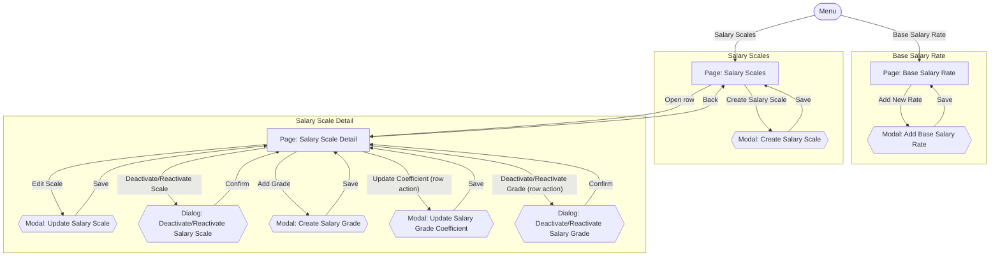

# Screens Hierarchy - Salary Master Data

This document expands the Salary Management (Master Data) portion of the [Information Architecture](InformationArchitecture_HRM.md) sitemap into every individual screen state a user will actually encounter — including modals and confirmation dialogs that a page-level sitemap does not show. Each transition is labeled with the user action that triggers it, so this becomes the direct blueprint for the visual design that follows. It is derived from `UseCase_SalaryMasterData.md` (UC-SAL-01 through UC-SAL-07).

Two kinds of nodes:
- **Page** — a full navigable screen with its own URL/location.
- **Modal / Dialog** — a transient overlay on top of a page; closing it returns to that same page.

## Hierarchy Diagram

## Screen Inventory

| Screen | Type | Parent | Reached by |
|---|---|---|---|
| Base Salary Rate | Page | Menu | Menu: "Base Salary Rate" |
| Add Base Salary Rate | Modal | Base Salary Rate | "Add New Rate" |
| Salary Scales | Page | Menu | Menu: "Salary Scales" |
| Create Salary Scale | Modal | Salary Scales | "Create Salary Scale" |
| Salary Scale Detail | Page | Salary Scales | "Open row" |
| Update Salary Scale | Modal | Salary Scale Detail | "Edit Scale" |
| Deactivate/Reactivate Salary Scale | Dialog | Salary Scale Detail | "Deactivate/Reactivate Scale" |
| Create Salary Grade | Modal | Salary Scale Detail | "Add Grade" |
| Update Salary Grade Coefficient | Modal | Salary Scale Detail | "Update Coefficient" (row action) |
| Deactivate/Reactivate Salary Grade | Dialog | Salary Scale Detail | "Deactivate/Reactivate Grade" (row action) |

## Notes

- Every dialog/modal returns the user to the exact page it was opened from — none of them navigate elsewhere.
- Salary Grades have no page or menu item of their own — per the Information Architecture, a grade always belongs to exactly one salary scale (BR-SAL-09), so the grade list is a nested section within Salary Scale Detail, not a separate navigable location.
- "Add Base Salary Rate" and "Update Salary Grade Coefficient" only ever add a new effective-dated record; neither one edits or removes a past value (BR-SAL-02/BR-SAL-03 for the base rate, BR-SAL-12/BR-SAL-13 for grade coefficients).
- "Create Salary Grade" is only available while the scale shown in Salary Scale Detail is active (BR-SAL-11); "Update Salary Grade Coefficient" and "Deactivate/Reactivate Salary Grade" are per-grade row actions, and reactivating a grade additionally requires its scale to already be active (BR-SAL-18).
- "Update Salary Scale" never exposes the scale's code as an editable field — the code is fixed at creation (BR-SAL-07).

## Scope Decision — Salary Scales Search/Filter

`UserStories_SalaryMasterData.md` / `UseCase_SalaryMasterData.md` do not define a "view/search Salary Scales" (or grades-within-a-scale) use case — US-SAL-02 through US-SAL-07 only cover create, update, and deactivate/reactivate. Salary Scales and Salary Scale Detail are kept in the IA and this hierarchy as **catalog-access pages** serving those maintenance use cases: always-visible lists, with no search or filter, since none is a confirmed requirement.

This is a deliberate scope decision, not a gap: if this reference data later grows large enough that search/filter becomes necessary, that should be introduced as a new requirement (a new user story/AC) first, rather than added directly at the UI layer.
