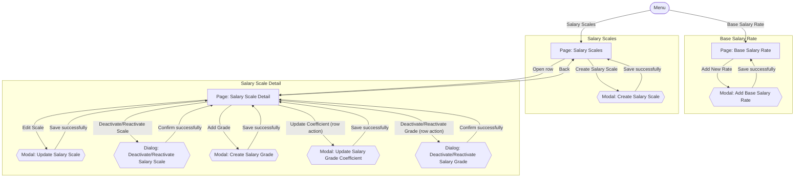

# Screens Hierarchy - Salary Master Data

This document expands the Salary Management (Master Data) portion of the [Information Architecture](InformationArchitecture_HRM.md) into the pages, modals, dialogs, and key transitions required by the module. It is derived from `UseCase_SalaryMasterData.md` (UC-SAL-01 through UC-SAL-07).

Two kinds of nodes:
- **Page** — a full navigable screen with its own URL/location.
- **Modal / Dialog** — a transient overlay on top of a page.

## Hierarchy Diagram

## Screen Inventory

| Screen | Type | Parent | Reached by |
|---|---|---|---|
| Base Salary Rate | Page | Menu | Menu: "Base Salary Rate" |
| Add Base Salary Rate | Modal | Base Salary Rate | "Add New Rate" |
| Salary Scales | Page | Menu | Menu: "Salary Scales" |
| Create Salary Scale | Modal | Salary Scales | "Create Salary Scale" |
| Salary Scale Detail | Page | Salary Scales | "Open row" |
| Update Salary Scale | Modal | Salary Scale Detail | "Edit Scale" |
| Deactivate/Reactivate Salary Scale | Dialog | Salary Scale Detail | "Deactivate/Reactivate Scale" |
| Create Salary Grade | Modal | Salary Scale Detail | "Add Grade" |
| Update Salary Grade Coefficient | Modal | Salary Scale Detail | "Update Coefficient" (row action) |
| Deactivate/Reactivate Salary Grade | Dialog | Salary Scale Detail | "Deactivate/Reactivate Grade" (row action) |

## Notes

- Every dialog/modal returns the user to the exact page it was opened from — none of them navigate elsewhere.
- Validation or business-rule failures keep the user in the current modal or dialog and display the applicable feedback. They do not create separate screen nodes in this hierarchy.
- Salary Grades are managed as a nested section within Salary Scale Detail. The current Information Architecture does not define Salary Grade as a separate page-level information location. Each Salary Grade belongs to one Salary Scale as defined by BR-SAL-09.
- "Add Base Salary Rate" and "Update Salary Grade Coefficient" add new effective-dated records rather than editing or removing past values (BR-SAL-02/BR-SAL-03 for the base salary rate and BR-SAL-12/BR-SAL-13 for grade coefficients).
- Creating a Salary Grade requires the containing Salary Scale to be active (BR-SAL-11). Updating a Salary Grade coefficient is unavailable while the grade is Inactive (BR-SAL-13A), and reactivating a Salary Grade requires its containing Salary Scale to be active (BR-SAL-18). The detailed UI treatment of unavailable or invalid actions is defined during detailed screen design.
- "Update Salary Scale" does not expose the Salary Scale code as an editable field because the code is fixed at creation (BR-SAL-07).

## Scope Decision — Salary Scales Search/Filter

`UserStories_SalaryMasterData.md` and `UseCase_SalaryMasterData.md` do not define a separate view/search use case for Salary Scales or Salary Grades. US-SAL-02 through US-SAL-07 cover their create, update, and deactivate/reactivate operations.

Salary Scales and Salary Scale Detail are kept as **catalog-access locations** supporting these maintenance operations. Search and filtering are not included because they are not currently defined by the requirements.

If search or filtering is required later, it should first be introduced at the requirements level rather than added directly during UI design.
