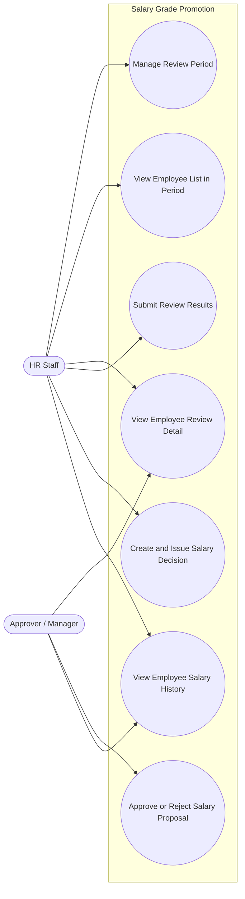

# Use Case Diagram - Salary Grade Promotion

This diagram shows who uses the Salary Grade Promotion feature and what they can do.

## Actors

- **HR Staff** – The person who prepares and manages the salary review process (creates review periods, checks employee lists, prepares salary decisions).
- **Approver / Manager** – The person who reviews and approves or rejects the salary grade proposals.

## Diagram

## Use Case Descriptions

1. **Manage Review Period** – Create, search, and filter salary review periods (e.g. period name, type, date, status).
2. **View Employee List in Period** – See the list of employees in a review period, with their current grade and proposed grade. Can filter by department or status.
3. **View Employee Review Detail** – Open one employee's detail to see current salary, proposed grade, and the reason if the employee is not eligible.
4. **Approve or Reject Salary Proposal** – The Approver decides to approve or reject the proposed grade for an employee. A reason is required if rejected.
5. **Submit Review Results** – After employees are processed, HR Staff submits the results so the Approver can review them.
6. **Create and Issue Salary Decision** – Create a salary decision containing only approved employees, then issue it. Once issued, the employee's salary history is updated.
7. **View Employee Salary History** – Look up an employee's salary history over time, including which decision caused each change.

## Notes

- This diagram only shows the main actions of each actor, kept simple for easy understanding.
- "Approve or Reject Salary Proposal" happens before "Create and Issue Salary Decision" — only approved employees can be included in a decision.
- The system checks eligibility automatically, so it is not listed as a separate action for any actor.
