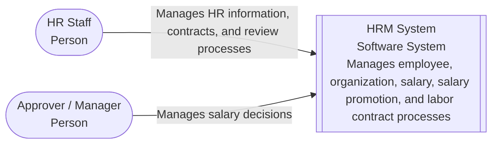
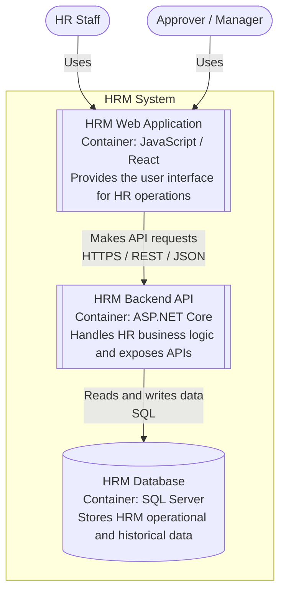
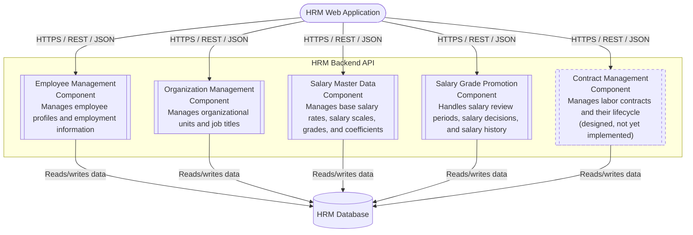

# C4 Model Diagrams

> **Status:** Current · **Owner:** Sang2197 · **Last Reviewed:** 2026-09-18 · **Implementation Baseline Commit:** `77e5716`

Architecture diagrams for the HRM System following the C4 Model.

The diagrams are written in Mermaid and can be rendered directly by GitHub.

This document uses the first three levels of the C4 Model:

1. **System Context** — shows the HRM System and the people who interact with it.
2. **Container** — shows the major applications and data stores that make up the HRM System.
3. **Component** — shows the major functional components inside the Backend API.

The Code level (level 4) is intentionally not included in this document — the C4 diagrams stop at the Component level.

Detailed application structure and runtime interactions are designed separately in [Detailed Design](../DetailedDesign/README.md) using:

- **Class Diagrams** — classes, interfaces, responsibilities, and structural relationships.
- **Sequence Diagrams** — runtime interactions for important use cases.
- **State Diagrams** — status lifecycles.

## Design Basis

These architecture diagrams are derived from the current HRM design artifacts, including:

- User Stories and Business Rules
- Use Cases
- Information Architecture and UI/UX design
- Database Design

The diagrams represent the architecture of the HRM System for the analyzed scope. They were derived from the requirements and design artifacts above, not from code; the backend in `backend/` was then implemented against them, and four of the five components are built (see [`backend/README.md`](../../backend/README.md)). **Contract Management** is designed (requirements, use cases, and UI/UX) but has no database design, API, or implementation yet. The React Web Application container is design-only — it has not been implemented yet.

---

## 1. System Context Diagram



The System Context diagram shows the HRM System as a single software system and the people who directly interact with it.

### People

- **HR Staff** — manages HR information and labor contracts, and performs HR operational and Salary Review processes.
- **Approver / Manager** — manages Salary Decisions created from submitted Salary Review Periods.

At this level, internal implementation details such as the Web Application, Backend API, and Database are intentionally hidden.

---

## 2. Container Diagram



The Container diagram shows the three major containers inside the HRM System.

### HRM Web Application

**Technology:** JavaScript / React

Provides the user interface used by HR Staff and Approver / Manager.

The Web Application communicates with the Backend API over HTTPS using REST APIs and JSON.

### HRM Backend API

**Technology:** ASP.NET Core

Provides application APIs and contains the HRM business logic.

It receives requests from the Web Application, performs business operations, and reads or writes HRM data.

### HRM Database

**Technology:** SQL Server

Stores operational, master, snapshot, and historical data used by the HRM System.

The Backend API accesses the database through its data-access layer.

Adding Contract Management does not change the containers: it is a new component inside the existing HRM Backend API, reached through the same Web Application and stored in the same HRM Database (its tables are not designed yet).

---

## 3. Component Diagram



The Component diagram zooms into the **HRM Backend API** and shows the five major functional components derived from the currently analyzed HRM modules. A dashed border marks a component that is designed but not yet implemented.

| Component | Status |
|---|---|
| Employee Management | Implemented |
| Organization Management | Implemented |
| Salary Master Data | Implemented |
| Salary Grade Promotion | Implemented |
| Contract Management | Designed only — requirements, use cases, and UI/UX; no database design, API, or implementation yet |

### Employee Management

Responsible for Employee Profile and employment information, including:

- Employee profiles
- Organizational Unit assignments
- Job Title assignments
- Employment Status

### Organization Management

Responsible for organization-related master data, including:

- Organizational Unit hierarchy
- Organizational Unit lifecycle
- Job Title catalog

### Salary Master Data

Responsible for salary-related master data, including:

- Base Salary Rate
- Salary Scale
- Salary Grade
- Effective-dated Salary Grade coefficients

### Salary Grade Promotion

Responsible for Salary Grade Promotion processes and Employee Salary History, including:

- Salary Review Periods
- Employee review snapshots
- Proposed Salary Grades
- Review outcomes
- Salary Decisions
- Applying Salary Decisions
- Employee Salary History

### Contract Management

Responsible for labor contracts and their lifecycle, including:

- Labor contracts of employees (Probation, Fixed-Term, Indefinite-Term)
- Contract term and the salary recorded on the contract
- Contract lifecycle (Draft, Active, Expired, Terminated)
- Tracking contracts that are expiring soon or overdue

---

## Cross-component Data Dependencies

Some business processes require information belonging to other functional areas.

For example:

- Employee Management uses Organizational Unit and Job Title data.
- Salary Grade Promotion uses Employee information.
- Salary Grade Promotion uses Organizational Unit information for review context and filtering.
- Salary Grade Promotion uses Salary Grade and coefficient information when determining promotion proposals.
- Contract Management uses Employee information: a contract belongs to an employee, the employee must exist and not be Terminated, and the employee's current information is shown with the contract.

These relationships represent **business/data dependencies** between functional areas.

They are intentionally not shown as direct component-to-component calls in the Component Diagram, which is kept at the level of business responsibilities. The detailed interaction model is defined in the [Class Diagram](../DetailedDesign/ClassDiagram.md) and implemented as in-process calls to the other component's **Service interface** (never its repository — see [ADR-03](../Arc42/09-architecture-decisions.md#adr-03-split-the-backend-by-business-domain)):

- Employee Management → Organization Management (unit and job title must be active)
- Organization Management → Employee Management (a unit with active employees cannot be deactivated)
- Salary Master Data → Salary Grade Promotion (a grade with an assigned active employee cannot be deactivated)
- Salary Grade Promotion → Employee Management and Salary Master Data (active employees, next active grade, current coefficient)
- Contract Management → Employee Management (planned, not yet implemented: employee existence and employment status, employee information shown with a contract)

The Component Diagram therefore does not draw relationships such as:

```text
Salary Grade Promotion
        ↓
Employee Management Service
```

or:

```text
Employee Management
        ↓
Organization Management Service
```

These dependencies are documented at the class level rather than as component-level call arrows.

---

## Relationship Between the C4 Levels

The diagrams progressively zoom into the HRM System:

```text
C1 — System Context

HR Staff
Approver / Manager
        ↓
   HRM System

        ↓ zoom in

C2 — Container

HRM Web Application
HRM Backend API
HRM Database

        ↓ zoom into Backend API

C3 — Component

Employee Management
Organization Management
Salary Master Data
Salary Grade Promotion
Contract Management
```

The C4 diagrams stop at the Component level.

Detailed design continues separately:

```text
C4 Component Architecture
        ↓
API Design / OpenAPI
        ↓
Code Structure
        ↓
Class Diagrams
        ↓
Sequence Diagrams
        ↓
Implementation
```

Class Diagrams define the internal classes, interfaces, responsibilities, and structural dependencies of each component.

Sequence Diagrams describe how those elements collaborate at runtime to realize the defined Use Cases.

These detailed diagrams were derived from the approved requirements and architecture; the implementation then followed them.