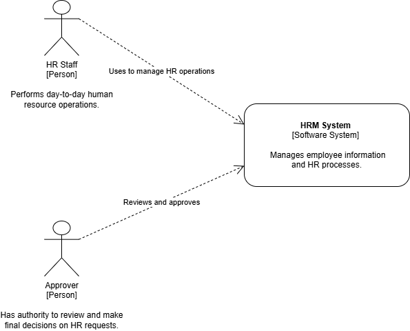

# C4 Model Diagrams

Architecture diagrams for the HRM System, drawn using the [C4 model](https://c4model.com/) with draw.io.

The C4 model shows the system at 4 levels, from most general to most detailed:

1. **System Context** — the system and who/what uses it. ✅ Done
2. **Container** — the main parts inside the system (e.g. web app, API, database). Not yet
3. **Component** — the main parts inside one container. Not yet
4. **Code** — class/code level detail. Not yet

## 1. System Context Diagram

- [`System-context-diagram.drawio`](System-context-diagram.drawio) — editable source file (open with [draw.io](https://app.diagrams.net/) / diagrams.net).
- [`System-context-diagram.png`](System-context-diagram.png) — exported image.

Shows the HRM System and its 2 main users:

- **HR Staff** — performs day-to-day HR operations.
- **Approver** — has authority to review and make final decisions on HR requests.

## Notes

- Diagrams 2–4 (Container, Component, Code) will be added later.
