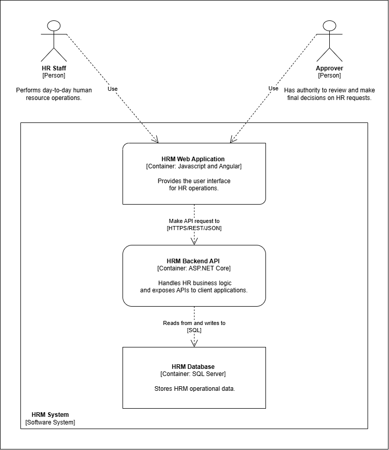
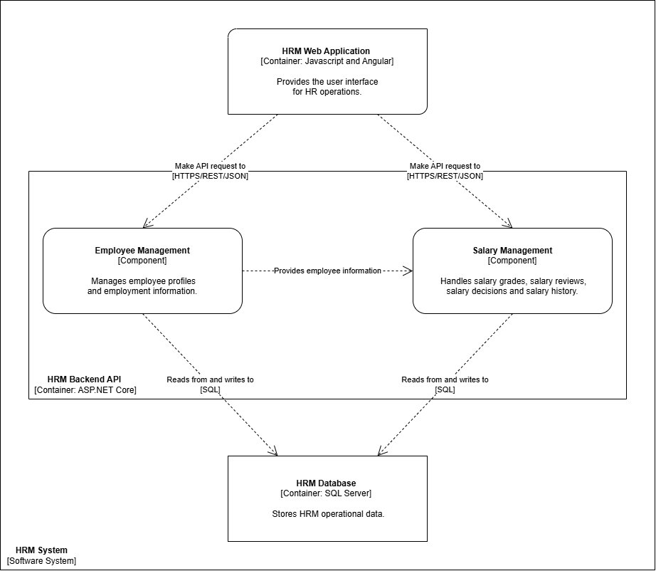
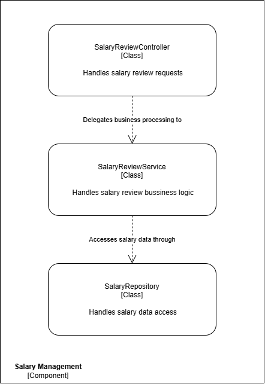

# C4 Model Diagrams

Architecture diagrams for the HRM System, drawn using the [C4 model](https://c4model.com/) with draw.io.

The C4 model shows the system at 4 levels, from most general to most detailed:

1. **System Context** — the system and who/what uses it. ✅ Done
2. **Container** — the main parts inside the system (e.g. web app, API, database). ✅ Done
3. **Component** — the main parts inside one container. ✅ Done
4. **Code** — class/code level detail. ✅ Done

## 1. System Context Diagram

- [`System-context-diagram.drawio`](System-context-diagram.drawio) — editable source file (open with [draw.io](https://app.diagrams.net/) / diagrams.net).
- [`System-context-diagram.png`](System-context-diagram.png) — exported image.

Shows the HRM System and its 2 main users:

- **HR Staff** — performs day-to-day HR operations.
- **Approver** — has authority to review and make final decisions on HR requests.

## 2. Container Diagram

- [`Container-diagram.drawio`](Container-diagram.drawio) — editable source file.
- [`Container-diagram.png`](Container-diagram.png) — exported image.

Shows the 3 main containers inside the HRM System:

- **HRM Web Application** (JavaScript / Angular) — provides the user interface for HR operations.
- **HRM Backend API** (ASP.NET Core) — handles HR business logic and exposes APIs to client applications.
- **HRM Database** (SQL Server) — stores HRM operational data.

The Web Application calls the Backend API over HTTPS/REST/JSON, and the Backend API reads/writes the Database over SQL.

## 3. Component Diagram

- [`Component-diagram.drawio`](Component-diagram.drawio) — editable source file.
- [`Component-diagram.png`](Component-diagram.png) — exported image.

Shows the 2 main components inside the **HRM Backend API** container:

- **Employee Management** — manages employee profiles and employment information.
- **Salary Management** — handles salary grades, salary reviews, salary decisions, and salary history.

Both components are called by the Web Application over HTTPS/REST/JSON and read/write the Database over SQL. Salary Management also reads employee information from Employee Management.

## 4. Code Diagram

- [`Code-diagram.drawio`](Code-diagram.drawio) — editable source file.
- [`Code-diagram.png`](Code-diagram.png) — exported image.

Zooms into the **Salary Management** component, showing its main classes:

- **SalaryReviewController** — handles salary review requests.
- **SalaryReviewService** — handles salary review business logic.
- **SalaryRepository** — handles salary data access.

The flow is: Controller delegates to Service, Service accesses data through Repository.
