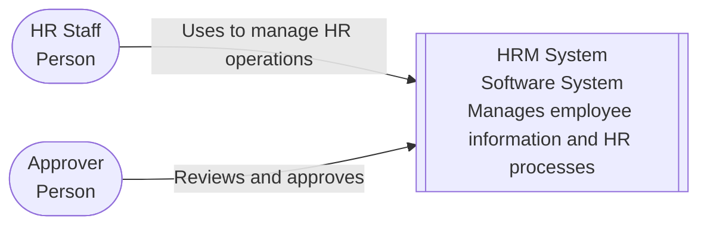
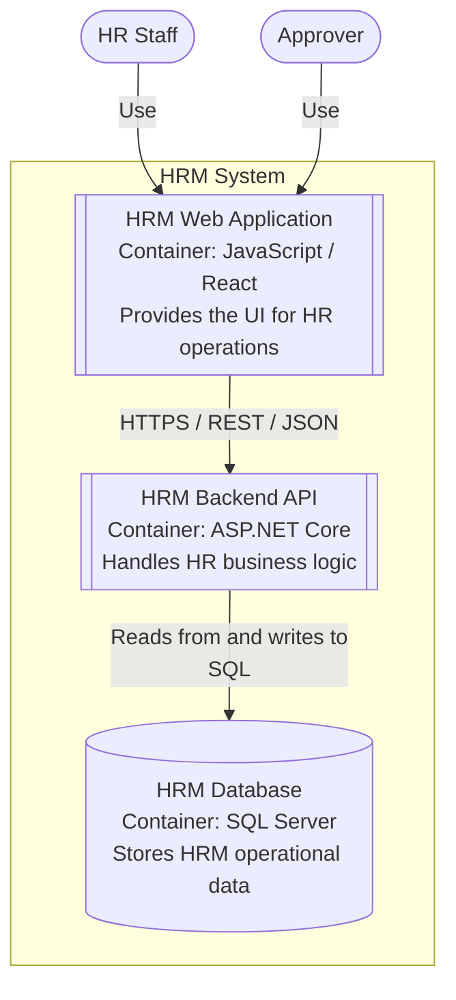
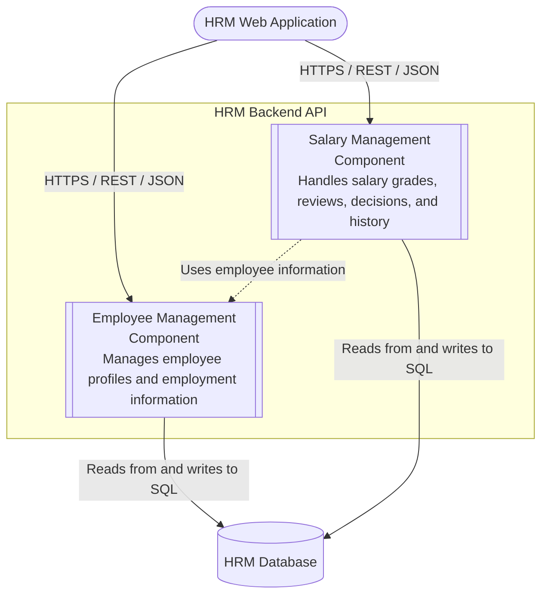
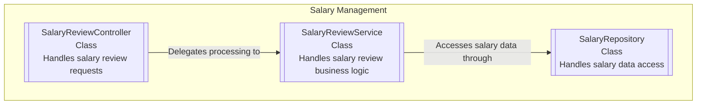
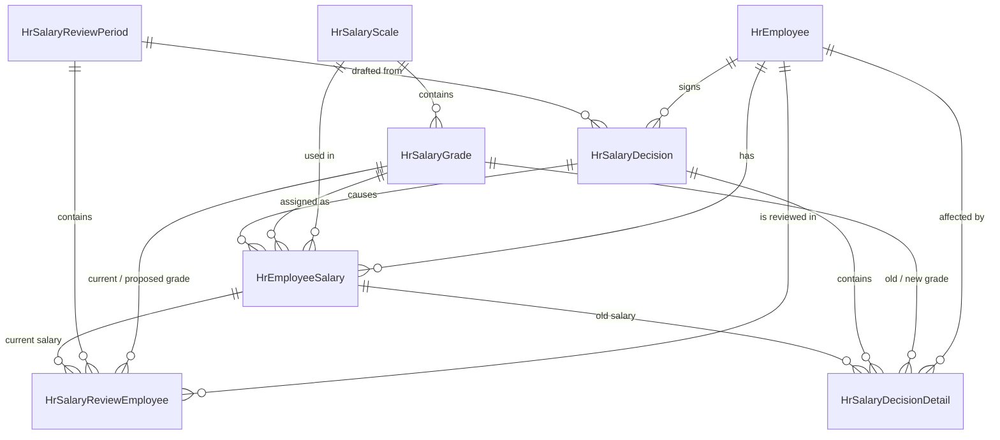

# HRM (Human Resource Management) System

This project covers the analysis, design, and implementation of a Human Resource Management (HRM) system.

The overall HRM scope is organized into six functional areas:

1. Employee Profile Management
2. Department / Unit Management
3. Reward / Discipline Management
4. Attendance Management
5. Contract Management
6. Salary Management

The current repository provides detailed requirements and design artifacts for **Employee Profile**, **Organization Management**, **Salary Master Data**, and **Salary Grade Promotion**.

**Salary Grade Promotion** ("Xét nâng bậc lương") is the primary implementation focus and is developed through the full workflow from requirements and UI/UX design to architecture, database/API design, backend implementation, and automated testing.

The repository is organized by development phase, from requirements and design to implementation and testing.

---

## 1. Requirements — User Stories & Use Cases

Requirements start from a high-level mind map that decomposes the HRM system into its main functional areas and features.

User stories are written using **INVEST principles**, with business rules and Given/When/Then acceptance criteria where applicable.

Use cases are modeled with **UML diagrams** and documented using **Cockburn-style use case specifications**. Traceability is maintained between user stories, use cases, and business rules.

Key documents:

* [`UserStories_SalaryGradePromotion.md`](Docs/Requirements/UserStories_SalaryGradePromotion.md) — user stories, business rules, and acceptance criteria
* [`UseCase_SalaryGradePromotion.md`](Docs/Requirements/UseCase_SalaryGradePromotion.md) — use case model and specifications

→ Full folder: [`Docs/Requirements/`](Docs/Requirements/README.md)

The folder also contains requirements for Employee Profile, Organization Management, and Salary Master Data.

---

## 2. Screen Design — Information Architecture → Screens Hierarchy → UI/UX

Screen design is developed progressively from information structure to detailed visual design:

1. **Information Architecture** — page-level information organization and sitemap across the currently specified HRM modules.
2. **Screens Hierarchy** — pages, modals, dialogs, and key transitions required by each module.
3. **Wireframes & Screen Behavior** — screen structure, behavior, validation, and actor interactions.
4. **UI/UX Design** — interactive HTML prototypes for all four modules, sharing one common design system.

### Salary Grade Promotion

### Employee Profile & Organization Management

Key documents:

* [`InformationArchitecture_HRM.md`](Docs/UI-UX/InformationArchitecture_HRM.md) — HRM information architecture and sitemap
* [`ScreensHierarchy_SalaryGradePromotion.md`](Docs/UI-UX/ScreensHierarchy_SalaryGradePromotion.md) — pages, dialogs, and screen transitions for Salary Grade Promotion
* [`Wireframe_SalaryGradePromotion.md`](Docs/UI-UX/Wireframe_SalaryGradePromotion.md) — form fields, list columns, and data sources per screen for Salary Grade Promotion
* [`SalaryGradePromotion_Screens.html`](Docs/UI-UX/NewDesign/SalaryGradePromotion_Screens.html) — interactive HTML prototype for Salary Grade Promotion
* [`EmployeeProfile_Screens.html`](Docs/UI-UX/NewDesign/EmployeeProfile_Screens.html), [`OrganizationManagement_Screens.html`](Docs/UI-UX/NewDesign/OrganizationManagement_Screens.html), [`SalaryMasterData_Screens.html`](Docs/UI-UX/NewDesign/SalaryMasterData_Screens.html) — interactive HTML prototypes for the other three modules, cross-linked with the one above

→ Full folder: [`Docs/UI-UX/`](Docs/UI-UX/README.md)

---

## 3. Architecture — C4 Model

The system architecture is documented using the **C4 model**, covering System Context, Container, Component, and a code-level view of Salary Management.

The diagrams are written in **Mermaid** so they can be viewed and versioned directly in the repository.

### System Context

### Container

### Component

Inside the HRM Backend API:

### Code-Level View

Inside the Salary Management component:

→ Full folder: [`Docs/c4/`](Docs/c4/README.md)

Architectural decisions, quality requirements, constraints, and risks are documented separately using **Arc42**:

* Start here: [`01-introduction-and-goals.md`](Docs/Arc42/01-introduction-and-goals.md)

→ Full report: [`Docs/Arc42/`](Docs/Arc42/README.md)

---

## 4. Database Design & API Documentation

The database design covers the core data required by Salary Grade Promotion, including employees, salary scales and grades, salary history, review periods, and salary decisions.

Key database documents:

* [`Gen_Table.sql`](Docs/Database/Gen_Table.sql) — SQL schema, keys, indexes, and foreign keys
* [`HRM_Salary_Grade_Promotion.dbml`](Docs/Database/HRM_Salary_Grade_Promotion.dbml) — DBML source

→ Full folder: [`Docs/Database/`](Docs/Database/README.md)

The REST API is documented using an **OpenAPI 3.0 (Swagger) specification**, with endpoints traced back to the relevant requirements.

* [`openapi.yaml`](Docs/API/openapi.yaml) — OpenAPI 3.0 (Swagger) spec

→ Full folder: [`Docs/API/`](Docs/API/README.md)

---

## 5. Code Structure — Frontend & Backend

The source structure is designed before implementation and aligned with the documented architecture.

### Frontend — React

The frontend uses a feature-oriented structure with areas such as:

* `components/`
* `pages/`
* `services/`
* `hooks/`

### Backend — ASP.NET Core

The backend is organized into four projects:

* `HRM.Api` — HTTP endpoints and controllers
* `HRM.Application` — application services and business rules
* `HRM.Domain` — domain entities and core models
* `HRM.Infrastructure` — EF Core, repositories, and infrastructure concerns

Detailed structure:

* [`FrontendStructure.md`](Docs/CodeStructure/FrontendStructure.md)
* [`BackendStructure.md`](Docs/CodeStructure/BackendStructure.md)

→ Full folder: [`Docs/CodeStructure/`](Docs/CodeStructure/README.md)

---

## 6. Detailed Design — Class, Sequence & State Diagrams

Detailed design covers the internal structure and interactions required by the backend implementation.

The diagrams are derived from the API contract, database design, requirements, and code structure.

Key documents:

* [`ClassDiagram.md`](Docs/DetailedDesign/ClassDiagram.md)
* [`SequenceDiagrams.md`](Docs/DetailedDesign/SequenceDiagrams.md)
* [`StateDiagrams.md`](Docs/DetailedDesign/StateDiagrams.md)

→ Full folder: [`Docs/DetailedDesign/`](Docs/DetailedDesign/README.md)

---

## 7. Implementation & Testing

The Salary Grade Promotion backend is implemented with **ASP.NET Core / .NET 8**, using the same 3-tier project layout (`HRM.Api` / `HRM.Application` / `HRM.Domain` / `HRM.Infrastructure`) described in section 5.

Automated tests are organized into:

* `tests/HRM.Application.Tests` — unit tests for application services and business rules using mocked dependencies.
* `tests/HRM.Api.Tests` — integration tests through the HTTP pipeline, including API routing, request handling, and response status behavior.

→ [`backend/`](backend/README.md)
