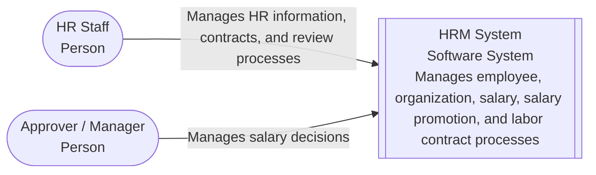
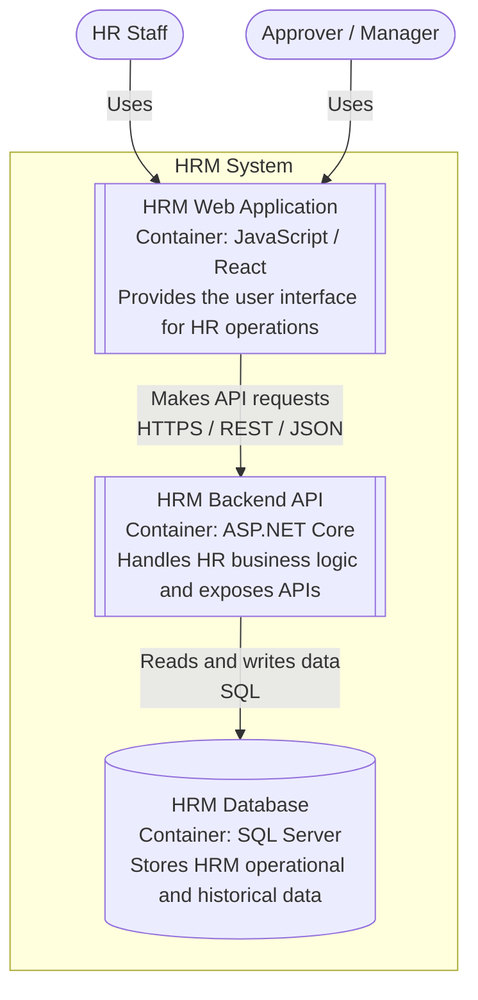
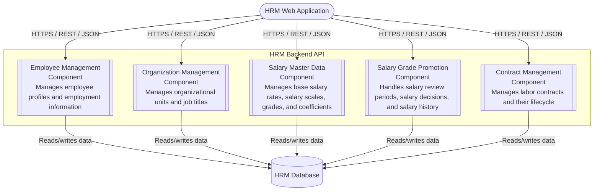
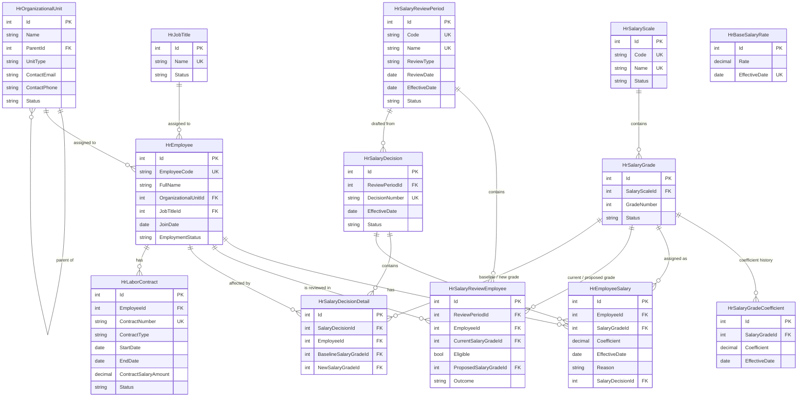

# HRM (Human Resource Management) System

> **Status:** Current · **Owner:** Sang2197 · **Last Reviewed:** 2026-09-22 · **Implementation Baseline Commit:** `77e5716`

This project covers the analysis, design, and implementation of a Human Resource Management (HRM) system.

The overall HRM scope is organized into six functional areas:

1. Employee Profile Management
2. Department / Unit Management
3. Reward / Discipline Management
4. Attendance Management
5. Contract Management
6. Salary Management

The current repository provides detailed requirements, design, and implementation artifacts for **Employee Profile**, **Organization Management**, **Salary Master Data**, **Salary Grade Promotion**, and **Contract Management**.

The repository is organized by development phase, from requirements and design to implementation and testing.

---

## Project Status

Scope tracked in this repository: **Employee Profile, Organization Management, Salary Master Data, Salary Grade Promotion, Contract Management** (5 of the 6 functional areas above; Reward/Discipline and Attendance are not yet started).

| # | Phase | Scope covered | Status |
|---|-------|----------------|--------|
| 1 | Requirements — User Stories (INVEST) & Use Cases | 5/5 specified modules | 100% |
| 2 | Screen Design — Information Architecture → Screens Hierarchy → UI/UX | IA, screens hierarchy, and wireframes for all 5 specified modules; final design images for the 11 key screens of Employee Profile, Organization, Salary Grade Promotion, and Contract Management | 100% |
| 3 | Architecture — C4 (Context, Container, Component) | 5/5 components implemented | 100% |
| 4 | Database Design & API Documentation (OpenAPI 3.0) | 13 tables implemented, 57 endpoints across 11 tags implemented | 100% |
| 5 | Code Structure Design — Frontend & Backend | Both cover 5/5 modules; backend structure matches the implementation below for 5/5 | 100% |
| 6 | Detailed Design — Class, Sequence & State Diagrams | 5/5 modules, 25 sequence diagrams | 100% |
| 7 | API Implementation & Unit Testing | 5/5 modules, 287 tests passing (191 unit + 96 integration), 0 build warnings | 100% |

Frontend implementation (React) is design-only at this stage — no application code has been written yet, only the structure design (item 5) and the screen designs (item 2).

Every folder README and Arc42 section carries review metadata (**Status**, **Owner**, **Last Reviewed**, **Implementation Baseline Commit** — the commit of `backend/` that the documents were checked against). Known gaps between the documents and the implementation (no authentication, no health-check endpoint, no tests against SQL Server, …) are tracked in the [Risk Register and Technical Debt](Docs/Arc42/11-risks-and-technical-debt.md).

---

## 1. Requirements — User Stories & Use Cases

Requirements start from a high-level mind map that decomposes the HRM system into its main functional areas and features.

User stories are written using **INVEST principles**, with business rules and Given/When/Then acceptance criteria where applicable.

Use cases are modeled with **UML diagrams** and documented using **Cockburn-style use case specifications**. Traceability is maintained between user stories, use cases, and business rules.

Key documents:

* [`UserStories_SalaryGradePromotion.md`](Docs/Requirements/UserStories_SalaryGradePromotion.md) — user stories, business rules, and acceptance criteria
* [`UseCase_SalaryGradePromotion.md`](Docs/Requirements/UseCase_SalaryGradePromotion.md) — use case model and specifications

→ Full folder: [`Docs/Requirements/`](Docs/Requirements/README.md)

The folder also contains requirements for Employee Profile, Organization Management, Salary Master Data, and Contract Management.

---

## 2. Screen Design — Information Architecture → Screens Hierarchy → UI/UX

Screen design is developed progressively from information structure to detailed visual design:

1. **Information Architecture** — page-level information organization and sitemap across the currently specified HRM modules.
2. **Screens Hierarchy** — pages, modals, dialogs, and key transitions required by each module.
3. **Wireframes & Screen Behavior** — screen structure, behavior, validation, and actor interactions.
4. **UI/UX Design** — final screen designs as PNG images (the images below are the authoritative visual design).

### Salary Grade Promotion

#### Review Period List

#### Review Period Detail

#### Employee Review Detail

#### Salary Decision List

#### Salary Decision Detail

#### Employee Salary History

### Employee Profile & Organization Management

#### Employee List

#### Organization Structure

### Contract Management

#### Contract List

#### Contract Detail

#### Create Contract

Key documents:

* [`InformationArchitecture_HRM.md`](Docs/UI-UX/InformationArchitecture_HRM.md) — HRM information architecture and sitemap
* [`ScreensHierarchy_SalaryGradePromotion.md`](Docs/UI-UX/ScreensHierarchy_SalaryGradePromotion.md) — pages, dialogs, and screen transitions for Salary Grade Promotion
* [`Wireframe_SalaryGradePromotion.md`](Docs/UI-UX/Wireframe_SalaryGradePromotion.md) — form fields, list columns, and data sources per screen for Salary Grade Promotion

→ Full folder: [`Docs/UI-UX/`](Docs/UI-UX/README.md)

---

## 3. Architecture — C4 Model

The system architecture is documented using the **C4 model**, covering System Context, Container, and Component. The Code level is intentionally not included — detailed application structure is covered separately by Class Diagrams and Sequence Diagrams (see [Detailed Design](Docs/DetailedDesign/README.md)).

The diagrams are written in **Mermaid** so they can be viewed and versioned directly in the repository.

### System Context

### Container

### Component

Inside the HRM Backend API:

All five components are implemented in `backend/`, each split by capability across all layers (`HRM.Domain` → `HRM.Application` → `HRM.Infrastructure` → `HRM.Api`) per [`Docs/CodeStructure/BackendStructure.md`](Docs/CodeStructure/BackendStructure.md) — see [`Docs/c4/README.md`](Docs/c4/README.md#3-component-diagram). Cross-component data dependencies (e.g. Salary Grade Promotion reading employee/organizational unit/salary grade data) are documented in prose there rather than as call arrows — see [Cross-component Data Dependencies](Docs/c4/README.md#cross-component-data-dependencies); in code, this is a Service-to-Service-interface call, never a direct cross-domain repository access.

→ Full folder: [`Docs/c4/`](Docs/c4/README.md)

Architectural decisions, quality requirements, constraints, and risks are documented separately using **Arc42**:

* Start here: [`01-introduction-and-goals.md`](Docs/Arc42/01-introduction-and-goals.md)

→ Full report: [`Docs/Arc42/`](Docs/Arc42/README.md)

---

## 4. Database Design & API Documentation

The database design covers the full HRM system as analyzed — Employee Profile, Organization Management, Salary Master Data, Salary Grade Promotion, and Contract Management — 13 tables traced back to the Business Rules in each module's requirements. All 13 are implemented in `backend/`.

`HrBaseSalaryRate` has no relationships to other tables — it is a single organization-wide effective-dated value, not joined per employee or grade. `HrLaborContract` (Contract Management) has no relationship to the salary tables; see [`Docs/Database/README.md`](Docs/Database/README.md).

Key database documents:

* [`HRM_System.dbml`](Docs/Database/HRM_System.dbml) — DBML source, the single source of truth for the schema alongside the Mermaid diagram above

→ Full folder: [`Docs/Database/`](Docs/Database/README.md)

The REST API is documented using an **OpenAPI 3.0 (Swagger) specification**, with endpoints traced back to the relevant requirements.

* [`openapi.yaml`](Docs/API/openapi.yaml) — OpenAPI 3.0 (Swagger) spec (57 endpoints across 11 tags, all implemented)

→ Full folder: [`Docs/API/`](Docs/API/README.md)

---

## 5. Code Structure — Frontend & Backend

The source structure is designed before implementation and aligned with the documented architecture.

### Frontend — React

The frontend structure is **design-only** (no `frontend/` code exists yet). It uses a feature-oriented structure with areas such as:

* `components/`
* `pages/`
* `services/`
* `hooks/`

### Backend — ASP.NET Core

The backend is organized into four projects:

* `HRM.Api` — HTTP endpoints and controllers
* `HRM.Application` — application services and business rules
* `HRM.Domain` — domain entities and core models
* `HRM.Infrastructure` — EF Core, repositories, and infrastructure concerns

Each project is split by business domain (`EmployeeManagement`, `OrganizationManagement`, `SalaryMasterData`, `SalaryGradePromotion`); a service may call another domain only through that domain's service interface, never its repository.

Detailed structure:

* [`FrontendStructure.md`](Docs/CodeStructure/FrontendStructure.md)
* [`BackendStructure.md`](Docs/CodeStructure/BackendStructure.md)

→ Full folder: [`Docs/CodeStructure/`](Docs/CodeStructure/README.md)

---

## 6. Detailed Design — Class, Sequence & State Diagrams

Detailed design covers the internal structure and interactions required by the backend implementation.

The diagrams are derived from the API contract, database design, requirements, and code structure.

Key documents:

* [`ClassDiagram.md`](Docs/DetailedDesign/ClassDiagram.md)
* [`SequenceDiagrams.md`](Docs/DetailedDesign/SequenceDiagrams.md)
* [`StateDiagrams.md`](Docs/DetailedDesign/StateDiagrams.md)

→ Full folder: [`Docs/DetailedDesign/`](Docs/DetailedDesign/README.md)

---

## 7. Implementation & Testing

The full HRM backend — all five modules (Employee Management, Organization Management, Salary Master Data, Salary Grade Promotion, Contract Management) — is implemented with **ASP.NET Core / .NET 8**, using the project layout (`HRM.Api` / `HRM.Application` / `HRM.Domain` / `HRM.Infrastructure`) described in section 5.

Automated tests are organized into:

* `tests/HRM.Application.Tests` — unit tests for application services and business rules using mocked dependencies.
* `tests/HRM.Api.Tests` — integration tests through the HTTP pipeline, including API routing, request handling, and response status behavior.

287 tests passing (191 unit + 96 integration), 0 build warnings.

→ [`backend/`](backend/README.md)
